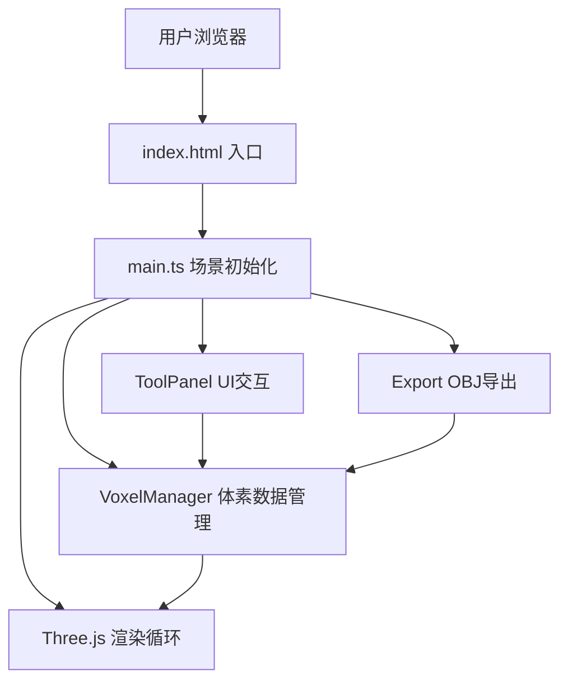

## 1. 架构设计



## 2. 技术描述
- 前端：TypeScript + Three.js + Vite
- 构建工具：Vite
- 无后端，纯前端应用
- 依赖包：three, @types/three, vite, typescript

## 3. 文件结构
| 文件路径 | 用途 |
|-------|---------|
| package.json | 项目依赖和脚本 |
| index.html | 入口HTML |
| vite.config.js | Vite配置 |
| tsconfig.json | TypeScript严格模式配置 |
| src/main.ts | 初始化场景、相机、渲染器，挂载DOM，启动动画循环 |
| src/voxelManager.ts | 体素数据管理（放置、涂色、擦除、撤销） |
| src/toolPanel.ts | 侧边工具面板DOM及交互事件 |
| src/export.ts | OBJ格式导出 |

## 4. 数据模型

### 4.1 体素数据结构
```typescript
interface Voxel {
  x: number;
  y: number;
  z: number;
  color: string;
  mesh?: THREE.Mesh;
}

type ToolMode = 'place' | 'paint' | 'erase';
```

### 4.2 操作历史栈
```typescript
interface HistoryAction {
  type: 'place' | 'paint' | 'erase';
  voxel: Voxel;
  previousColor?: string;
}
```

## 5. 核心API（模块方法）

### VoxelManager
- `placeVoxel(x, y, z, color): boolean` - 在指定位置放置体素
- `paintVoxel(x, y, z, color): boolean` - 修改体素颜色
- `eraseVoxel(x, y, z): boolean` - 擦除体素（带动画）
- `undo(): boolean` - 撤销上一步操作
- `clear(): void` - 清空所有体素
- `getVoxelAt(x, y, z): Voxel | null` - 获取指定位置体素

### Export
- `exportToOBJ(voxels: Voxel[]): string` - 生成OBJ格式字符串
- `downloadOBJ(filename: string): void` - 触发浏览器下载
