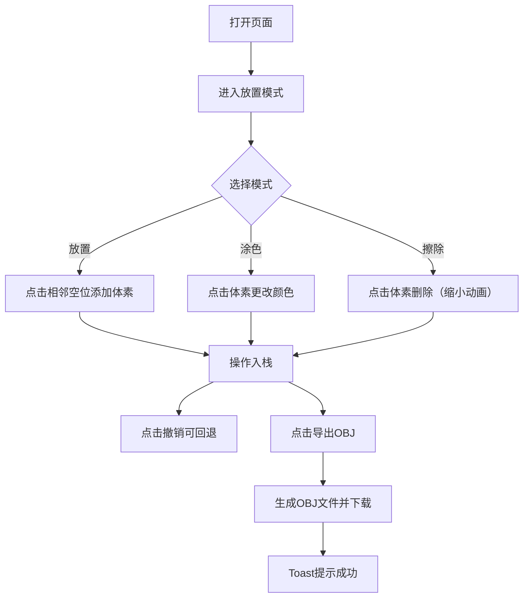

## 1. 产品概述
VoxelArtist是一款轻量级的浏览器端体素3D建模工具，让用户以类似乐高积木的方式自由搭建3D模型，无需安装大型建模软件。
- 核心价值：提供便捷、直观的体素建模体验，支持放置、涂色、擦除操作，最终可导出为通用OBJ格式
- 目标用户：3D爱好者、游戏开发者、教育场景下的创意人群

## 2. 核心功能

### 2.1 用户角色
| 角色 | 注册方式 | 核心权限 |
|------|----------|----------|
| 普通用户 | 无需注册，直接使用 | 所有建模功能、导出OBJ |

### 2.2 功能模块
1. **主画布（3D场景）**：可旋转缩放的3D空间，包含地面网格和体素边界框
2. **左侧工具面板**：模式切换（放置/涂色/擦除）、色板选择
3. **右上角操作按钮组**：清空场景、撤销、导出OBJ
4. **Toast提示系统**：操作反馈提示

### 2.3 页面详情
| 页面名称 | 模块名称 | 功能描述 |
|-----------|-------------|---------------------|
| 主页面 | 3D画布 | 36x36x36体素空间，默认视角(10,8,10)看向原点，左键旋转、右键平移、滚轮缩放 |
| 主页面 | 工具面板 | 三种建模模式切换、16色色板（12预设+2自定义） |
| 主页面 | 操作按钮 | 清空、撤销、导出OBJ，带悬停和点击动效 |
| 主页面 | Toast提示 | 导出成功后3秒自动消失 |

## 3. 核心流程
用户打开页面后默认进入放置模式，通过点击已有体素相邻空位添加体素；可切换至涂色模式修改体素颜色，或擦除模式删除体素；所有操作支持撤销；完成后可导出为OBJ文件。

## 4. 用户界面设计

### 4.1 设计风格
- 主色调：深色科技风，背景#1a1a2e，面板#16213e（不透明度0.7）
- 强调色：#e94560（按钮、面板发光条），过渡色#0f3460
- 文字：白色，按钮文字16px
- 按钮风格：高40px，圆角8px，悬停变亮20%，点击内陷动画0.1秒
- 面板：宽240px，圆角12px，内边距16px，右侧渐变发光条
- 色块：30x30px，2px圆角，悬停scale(1.1)过渡0.2秒

### 4.2 页面设计概览
| 页面名称 | 模块名称 | UI元素 |
|-----------|-------------|-------------|
| 主页面 | 3D画布 | 半透明浅灰地面网格，白色虚线边界框，背景#1a1a2e |
| 主页面 | 工具面板 | 三模式按钮组、8x2色板网格、面板右侧渐变发光条 |
| 主页面 | 操作按钮组 | 右上角悬浮三个功能按钮，#e94560背景 |
| 主页面 | Toast | 半透明黑底白字，圆角10px，居中显示 |

### 4.3 响应式
- 桌面端优先，工具面板固定左侧
- 画布自适应窗口大小

### 4.4 3D场景指引
- 背景色：#1a1a2e
- 光照：环境光 + 方向光，确保体素色彩还原准确
- 相机：PerspectiveCamera，初始位置(10,8,10)，lookAt原点
- 地面：半透明浅灰网格线
- 边界框：36x36x36白色虚线立方体
- 动画：擦除体素时缩小消失动画（0.15秒），放置即时显示
- 性能：≤600个体素时交互响应<50ms，帧率≥55FPS
