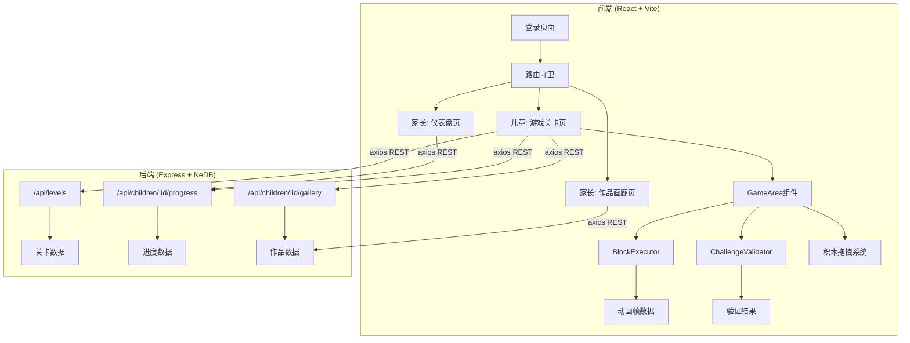
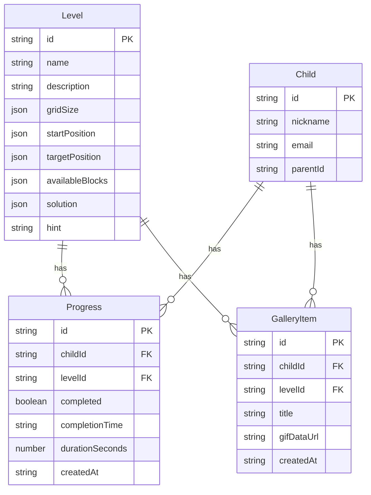

## 1. 架构设计



## 2. 技术说明

- 前端：React@18 + TypeScript + Vite + Tailwind CSS + Zustand
- 初始化工具：vite-init（react-express-ts 模板）
- 后端：Express@4 + TypeScript（ESM格式）
- 数据库：NeDB（nedb-promises），文件存储，无需外部数据库服务
- HTTP通信：axios（RESTful API）
- GIF生成：gif.js（浏览器端录制动画为GIF）
- 图标库：lucide-react

## 3. 路由定义

| 路由 | 用途 |
|------|------|
| /login | 登录页面，区分儿童/家长角色 |
| /game | 儿童游戏主页面，包含关卡选择和游戏区域 |
| /dashboard | 家长仪表盘，统计卡片+闯关记录表格 |
| /gallery | 家长作品画廊，瀑布流展示+筛选 |

## 4. API定义

### 4.1 关卡接口

```typescript
GET /api/levels
Response: Level[]
interface Level {
  id: string;
  name: string;
  description: string;
  gridSize: { rows: number; cols: number };
  startPosition: { x: number; y: number; direction: number };
  targetPosition: { x: number; y: number };
  availableBlocks: BlockType[];
  solution: Block[];
  hint: string;
}

type BlockType = 'move' | 'loop' | 'event';

interface Block {
  id: string;
  type: BlockType;
  label: string;
  params?: { repeat?: number; angle?: number; steps?: number };
}
```

### 4.2 进度接口

```typescript
GET /api/children/:id/progress
Response: Progress[]
interface Progress {
  id: string;
  childId: string;
  levelId: string;
  completed: boolean;
  completionTime: string;
  durationSeconds: number;
  createdAt: string;
}

POST /api/children/:id/progress
Body: { levelId: string; completed: boolean; durationSeconds: number; blocks: Block[] }
Response: Progress
```

### 4.3 作品接口

```typescript
GET /api/children/:id/gallery
Response: GalleryItem[]
interface GalleryItem {
  id: string;
  childId: string;
  levelId: string;
  title: string;
  gifDataUrl: string;
  createdAt: string;
}

POST /api/children/:id/gallery
Body: { levelId: string; title: string; gifDataUrl: string }
Response: GalleryItem
```

## 5. 服务器架构图

```mermaid
graph LR
    "Express Router" --> "Levels Controller"
    "Express Router" --> "Progress Controller"
    "Express Router" --> "Gallery Controller"
    "Levels Controller" --> "Levels Service"
    "Progress Controller" --> "Progress Service"
    "Gallery Controller" --> "Gallery Service"
    "Levels Service" --> "NeDB (levels.db)"
    "Progress Service" --> "NeDB (progress.db)"
    "Gallery Service" --> "NeDB (gallery.db)"
```

## 6. 数据模型

### 6.1 数据模型定义



### 6.2 数据初始化

- 关卡数据：启动时自动插入3个预设关卡（小猫走到星星、搭建小房子、蝴蝶螺旋路径）
- 用户数据：预设家长账户 parent@test.com 和儿童账户
- NeDB数据文件存储在 server/data/ 目录下
