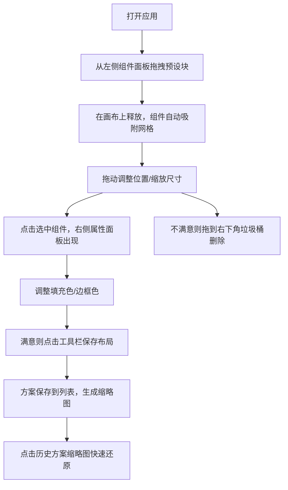

## 1. 产品概述

博客布局可视化搭建工具，帮助博主在撰写文章前快速设计和预览博客整体布局。通过拖拽式操作，用户无需编写代码即可自由组合文章卡片、侧边栏和页脚等组件，实时调整配色方案并保存多种布局版本。

- 核心价值：解决传统编辑器无法预览全局视觉风格的痛点，大幅减少反复调整布局的时间成本
- 目标用户：独立博主、内容创作者、前端设计师

## 2. 核心功能

### 2.1 功能模块

1. **组件面板**：提供预设布局块（文章卡片、侧边栏、页脚），支持拖拽添加到画布
2. **画布编辑器**：1200x800px网格画布，支持布局块的拖拽摆放、缩放、选中与删除
3. **属性面板**：颜色选择器（RGB滑块+16进制输入）、尺寸信息展示，实时更新配色
4. **方案管理**：保存/加载JSON格式布局方案，缩略图预览，一键还原

### 2.2 功能详情

| 模块名称 | 子功能 | 功能描述 |
|---------|-------|---------|
| 组件面板 | 预设组件展示 | 显示三种预设布局块缩略图及说明 |
| 组件面板 | 拖拽添加 | 从面板拖拽组件到画布，拖拽时半透明+旋转3度动画 |
| 画布编辑器 | 网格背景 | 20px间距网格吸附，浅灰背景 #f3f4f6 |
| 画布编辑器 | 拖拽移动 | 布局块自由拖动，自动对齐20px网格 |
| 画布编辑器 | 缩放操作 | 右下角拖拽手柄，最小100px，最大不超过画布 |
| 画布编辑器 | 选中状态 | 点击显示2px蓝色边框 #3b82f6，再次点击取消 |
| 画布编辑器 | 删除功能 | 拖拽到右下角垃圾桶图标删除，悬停变红放大 |
| 属性面板 | 颜色选择器 | RGB三个滑块 + 16进制输入框，原生input type=color |
| 属性面板 | 过渡动画 | 颜色变化0.3秒ease-in-out缓动 |
| 方案管理 | 保存方案 | 导出所有块的位置、大小、配色为JSON |
| 方案管理 | 缩略图列表 | 128x96px缩略图预览，圆角8px |
| 方案管理 | 加载方案 | 点击缩略图一键还原对应布局 |

## 3. 核心流程

## 4. 用户界面设计

### 4.1 设计风格

- 主色调：深灰 #111827（左侧导航）、中灰 #1f2937（工具栏/页脚块）、亮灰 #f3f4f6（画布背景）
- 强调色：蓝色 #3b82f6（选中边框）、浅蓝 #dbeafe（侧边栏块）、红色 #ef4444（垃圾桶激活）
- 字体：系统默认无衬线字体，项目名字重600、字号20px
- 圆角规范：组件面板12px、布局块16px、按钮8px、垃圾桶40px、缩略图8px、工具栏12px
- 图标风格：Lucide简洁线条图标
- 动效：所有过渡动画0.3秒ease-in-out

### 4.2 页面设计概览

| 区域 | 模块名称 | UI要素说明 |
|-----|---------|-----------|
| 左侧导航栏（80px宽） | 项目名称+功能按钮 | 深灰背景#111827，顶部白色项目名，下方垂直图标按钮间距16px，悬停半透明白色背景#ffffff1a |
| 顶部工具栏（56px高） | 操作按钮区 | 浅灰背景#e5e7eb，圆角12px，左右内边距24px，三个灰色按钮：撤销、重做、添加组件（带+号） |
| 主内容区左侧（80%） | 画布+组件面板+垃圾桶 | 画布1200x800px浅灰#f3f4f6背景，左上组件面板240px白色圆角12px，右下垃圾桶48x48px浅红#fee2e2 |
| 主内容区右侧（20%） | 属性面板+方案列表 | 属性面板280px宽背景#f9fafb，选中块时显示颜色选择器；下方方案列表128x96px缩略图 |

### 4.3 响应式设计

- Desktop优先：最小宽度1024px时保持完整左右布局
- 宽度<1024px时：左侧80px导航栏折叠为汉堡菜单按钮
- 触摸优化：拖拽区域、缩放手柄、垃圾桶均≥48x48px触控热区

### 4.4 性能要求

- 拖拽操作持续保持60FPS
- 颜色重绘使用CSS transition，避免重排
- CPU占用≤45%
- 使用transform而非top/left进行拖拽定位
