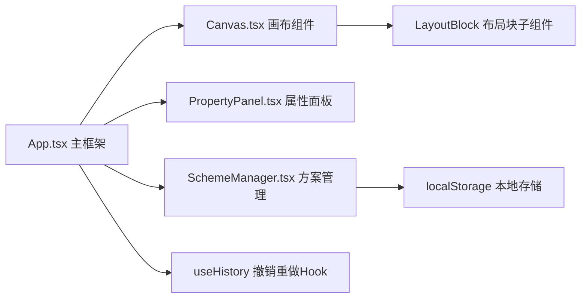

## 1. 架构设计



## 2. 技术描述

- 前端框架：React 18 + TypeScript 5
- 构建工具：Vite 5 + @vitejs/plugin-react
- 状态管理：React useState + useReducer（撤销重做）+ Context API
- 拖拽实现：HTML5 Drag and Drop API + 自定义鼠标事件（画布内移动/缩放）
- 样式方案：原生CSS（CSS Modules）+ CSS Variables
- 图标库：lucide-react
- 缩略图生成：html2canvas
- 持久化存储：localStorage

## 3. 项目文件结构

```
/
├── package.json
├── vite.config.js
├── tsconfig.json
├── index.html
├── src/
│   ├── App.tsx          # 主组件，整体布局与状态管理
│   ├── App.css          # 全局样式与CSS变量
│   ├── Canvas.tsx       # 画布组件：网格背景、布局块渲染、拖拽、缩放、删除
│   ├── Canvas.css
│   ├── PropertyPanel.tsx # 属性面板：颜色选择器、尺寸信息
│   ├── PropertyPanel.css
│   ├── SchemeManager.tsx # 方案管理：保存/加载JSON、缩略图列表
│   ├── SchemeManager.css
│   ├── types.ts         # TypeScript类型定义
│   └── main.tsx         # React入口
```

## 4. 核心数据结构定义

```typescript
// src/types.ts

export type BlockType = 'article-card' | 'sidebar' | 'footer';

export interface Position {
  x: number;
  y: number;
}

export interface Size {
  width: number;
  height: number;
}

export interface LayoutBlock {
  id: string;
  type: BlockType;
  position: Position;
  size: Size;
  fillColor: string;
  borderColor: string;
  zIndex: number;
}

export interface Scheme {
  id: string;
  name: string;
  blocks: LayoutBlock[];
  thumbnail: string; // base64 PNG
  createdAt: number;
}

export interface AppState {
  blocks: LayoutBlock[];
  selectedBlockId: string | null;
  history: LayoutBlock[][];
  historyIndex: number;
  schemes: Scheme[];
}
```

## 5. 核心实现策略

### 5.1 拖拽系统
- 从组件面板添加：使用HTML5 Drag and Drop API，`draggable=true`，`dataTransfer`传递block类型
- 画布内移动：监听`mousedown/mousemove/mouseup`，计算位移后设置`transform: translate()`
- 缩放：右下角手柄监听鼠标事件，最小100px，最大不超过画布尺寸
- 网格吸附：位置/尺寸计算后对20px取整

### 5.2 撤销重做
- 使用状态快照数组`history` + `historyIndex`指针
- 每次操作（添加/移动/缩放/删除/修改颜色）后将当前blocks数组推入history
- 撤销：index前移；重做：index后移

### 5.3 颜色选择器
- 原生`<input type="color">` + 三个RGB range滑块 + HEX输入框
- HEX↔RGB双向转换工具函数
- 颜色变化直接修改对应block的fillColor/borderColor
- CSS transition: `background-color .3s ease-in-out, border-color .3s ease-in-out`

### 5.4 方案保存与加载
- "保存布局" → 遍历blocks生成JSON → html2canvas截画布生成缩略图 → 存入localStorage
- "加载方案" → 从localStorage读取对应scheme → 替换当前blocks数组 → 清空选中状态

### 5.5 性能优化
- 拖拽中使用`transform`而非`top/left`定位，触发GPU合成层
- 使用`requestAnimationFrame`节流鼠标移动事件
- React.memo包装LayoutBlock子组件避免不必要重渲染
- useCallback包装事件处理函数
