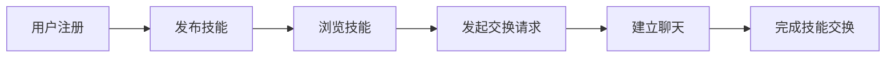

## 1. 产品概述

SkillSwap是一个在线技能交换与互助平台，让用户可以发布自己擅长的技能，浏览他人的技能需求，并通过即时消息系统发起技能交换请求。平台致力于建立一个互帮互助的学习社区，让知识和技能在人与人之间自由流动。

- 核心价值：打破技能学习的门槛，实现"以技易技"的对等交换
- 目标用户：所有有一技之长并希望学习新技能的人群
- 市场定位：轻量级、社区驱动的技能共享平台

## 2. 核心功能

### 2.1 用户角色

| 角色 | 注册方式 | 核心权限 |
|------|----------|----------|
| 普通用户 | 邮箱+昵称注册 | 发布技能、浏览技能、发起交换、即时聊天、查看个人主页 |

### 2.2 功能模块

1. **主页**：Hero区域、技能瀑布流网格、发布技能入口
2. **聊天页面**：联系人列表、实时聊天窗口、消息通知
3. **个人主页**：用户信息展示、已发布技能、已接收交换请求
4. **用户系统**：注册登录、本地存储登录态
5. **技能系统**：技能发布、技能浏览、技能详情
6. **交换系统**：发起交换请求、交换状态管理
7. **即时消息**：WebSocket实时通信、消息历史

### 2.3 页面详情

| 页面名称 | 模块名称 | 功能描述 |
|----------|----------|----------|
| 主页 | Hero区域 | 平台标语展示、两张CTA按钮（浏览技能/发布技能） |
| 主页 | 技能瀑布流 | 3列网格布局、卡片悬停动画、滚动加载更多 |
| 主页 | 技能卡片 | 用户头像、技能名称、短描述、标签、点击弹窗 |
| 主页 | 发布技能模态框 | 技能名称、描述、3个标签输入 |
| 聊天页 | 联系人列表 | 对方昵称、最新消息摘要、未读消息徽标 |
| 聊天页 | 聊天窗口 | 消息气泡、实时滚动、输入框、发送按钮 |
| 个人主页 | 用户信息 | 头像、昵称、注册日期 |
| 个人主页 | Tab切换 | 已发布技能/已接收交换请求，淡入淡出过渡 |
| 个人主页 | 交换请求列表 | 状态标签（待确认/已确认/已完成） |
| 导航栏 | 用户信息 | 昵称显示、头像占位、下拉菜单 |
| 导航栏 | 消息入口 | 铃铛图标、未读消息徽标 |

## 3. 核心流程

### 3.1 用户注册流程
用户输入昵称和邮箱 → 格式校验 → 调用注册API → 保存用户ID到localStorage → 自动跳转主页

### 3.2 技能发布流程
点击发布技能按钮 → 弹出模态框 → 输入技能信息 → 提交到后端 → 技能显示在瀑布流中

### 3.3 技能交换流程
浏览技能卡片 → 点击查看详情 → 点击发起交换 → 后端创建交换请求 → Toast提示成功 → 跳转聊天

### 3.4 即时消息流程
进入聊天页面 → 建立WebSocket连接 → 选择联系人 → 发送/接收消息 → 实时更新UI

## 4. 用户界面设计

### 4.1 设计风格
- **主色调**：靛蓝色 #6366f1
- **辅助色**：紫色 #8b5cf6，珊瑚色 #f472b6
- **成功色**：绿色 #10b981，警告色：黄色 #f59e0b，信息色：蓝色 #3b82f6
- **整体风格**：浅色主题，清爽现代，卡片式布局
- **按钮样式**：圆角设计，悬停缩放（scale: 1.03），过渡动画0.2s
- **字体**：选择现代优雅的无衬线字体，区分标题和正文字号层级
- **布局**：最大宽度1280px居中，导航栏固定顶部（64px高）
- **图标**：使用react-icons，线性风格，简洁统一

### 4.2 页面设计概述

| 页面名称 | 模块名称 | UI元素 |
|----------|----------|--------|
| 主页 | Hero区域 | 大标题、副标题、双CTA按钮、渐变背景装饰 |
| 主页 | 技能卡片 | 圆形头像（48px）、标题、描述、圆角标签、卡片悬停上浮4px |
| 主页 | 发布模态框 | 480px宽、圆角16px、表单输入、提交按钮 |
| 聊天页 | 联系人列表 | 头像、昵称、消息摘要、红色未读徽标 |
| 聊天页 | 消息气泡 | 自己：右对齐蓝色#3b82f6背景白字，对方：左对齐灰色#f3f4f6背景深字，淡入动画 |
| 个人主页 | Tab切换 | 下划线标识、内容淡入淡出0.2s过渡 |
| 个人主页 | 状态标签 | 待确认黄色#f59e0b、已确认蓝色#3b82f6、已完成绿色#10b981 |
| 导航栏 | 下拉菜单 | 圆角8px、阴影、个人主页/退出登录选项 |

### 4.3 响应式设计
- **桌面端**（>768px）：瀑布流3列，完整导航栏
- **平板/移动端**（<768px）：瀑布流2列，汉堡菜单导航
- 所有模态框和弹窗：打开时从中心缩放（scale 0.8→1.0），关闭时淡出0.2s
- 输入框聚焦：边框变为主色#6366f1，浅蓝色外发光

### 4.4 动画与交互
- 页面加载：瀑布流卡片错峰淡入（staggered reveal）
- 卡片悬停：上浮4px，阴影加深（0 6px 20px rgba(0,0,0,0.15)），过渡0.3s
- 新消息：淡入动画，底部自动滚动
- Toast提示：滑入滑出动画，3秒自动消失

## 5. 非功能性需求

### 5.1 性能要求
- 技能列表加载时间 ≤ 2秒
- 后端API分页（每页12条），滚动到底部自动加载
- WebSocket消息延迟 ≤ 200ms
- 前端包体积 ≤ 200KB（gzip）

### 5.2 技术约束
- 前端：React + TypeScript + Vite
- 后端：Node.js + Express + nedb
- 实时通信：WebSocket（ws库）
- 避免引入不必要的第三方库
