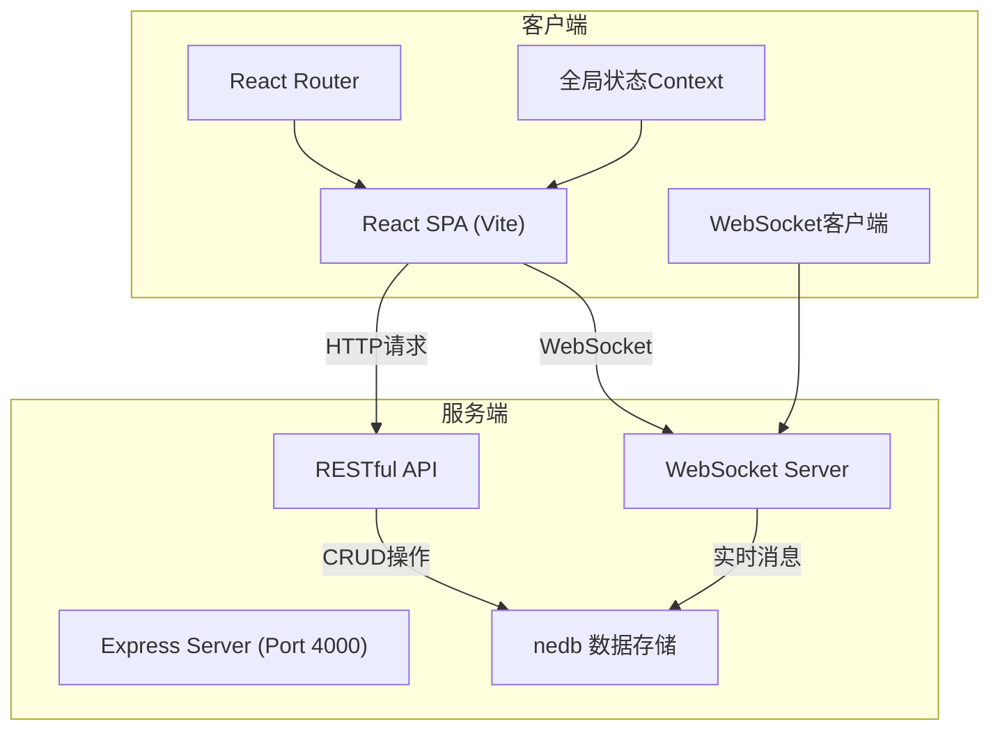
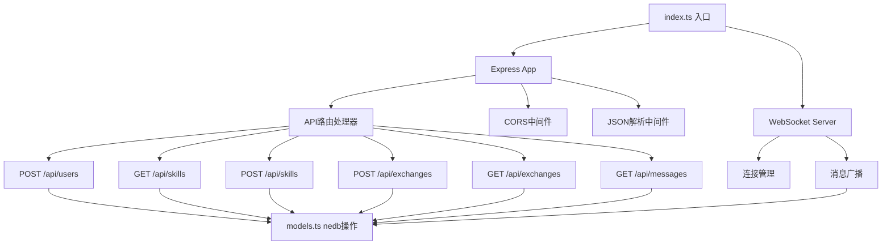
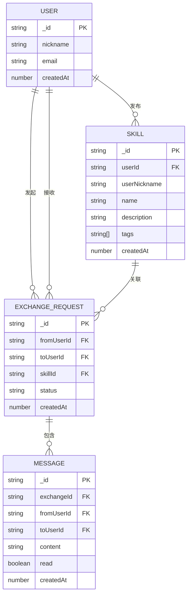

## 1. 架构设计



## 2. 技术描述

### 2.1 技术栈
- **前端框架**：React 18 + TypeScript
- **构建工具**：Vite 5
- **路由管理**：React Router v6
- **状态管理**：React Context API（避免引入Redux等重型库）
- **图标库**：react-icons
- **后端框架**：Express 4
- **数据库**：nedb-promises（嵌入式NoSQL数据库）
- **实时通信**：ws（WebSocket库）
- **ID生成**：uuid

### 2.2 初始化方式
- 使用 Vite 初始化 React + TypeScript 项目
- 后端独立目录 server/，使用 ts-node 或 tsc 编译运行

### 2.3 项目结构
```
SkillSwap/
├── package.json
├── index.html
├── vite.config.ts
├── tsconfig.json
├── server/
│   ├── index.ts          # Express入口，REST API + WebSocket
│   └── models.ts         # 数据模型与nedb集合定义
└── client/
    └── src/
        ├── App.tsx       # 根组件，路由与全局Context
        ├── main.tsx      # 入口文件
        ├── pages/
        │   ├── HomePage.tsx
        │   ├── ChatPage.tsx
        │   └── ProfilePage.tsx
        ├── components/
        │   ├── SkillCard.tsx
        │   ├── Navbar.tsx
        │   ├── Modal.tsx
        │   └── Toast.tsx
        ├── context/
        │   └── AppContext.tsx
        └── types/
            └── index.ts
```

## 3. 路由定义

| 路由路径 | 页面组件 | 用途 |
|----------|----------|------|
| / | HomePage | 主页，展示技能瀑布流 |
| /chat | ChatPage | 聊天页面，实时消息 |
| /p/:userId | ProfilePage | 用户个人主页 |
| * | HomePage | 404重定向到主页 |

## 4. API 定义

### 4.1 类型定义

```typescript
// 用户
interface User {
  _id: string;
  nickname: string;
  email: string;
  createdAt: number;
  avatar?: string;
}

// 技能
interface Skill {
  _id: string;
  userId: string;
  userNickname: string;
  name: string;
  description: string;
  tags: string[];
  createdAt: number;
}

// 交换请求
interface ExchangeRequest {
  _id: string;
  fromUserId: string;
  toUserId: string;
  skillId: string;
  status: 'pending' | 'confirmed' | 'completed';
  createdAt: number;
}

// 消息
interface Message {
  _id: string;
  exchangeId: string;
  fromUserId: string;
  toUserId: string;
  content: string;
  read: boolean;
  createdAt: number;
}
```

### 4.2 REST API 接口

| 方法 | 路径 | 请求参数 | 响应 | 描述 |
|------|------|----------|------|------|
| POST | /api/users | { nickname: string, email: string } | User | 用户注册 |
| GET | /api/skills | ?page=1&limit=12 | { skills: Skill[], total: number } | 分页获取技能列表 |
| POST | /api/skills | { userId: string, name: string, description: string, tags: string[] } | Skill | 发布新技能 |
| POST | /api/exchanges | { fromUserId: string, toUserId: string, skillId: string } | ExchangeRequest | 创建交换请求 |
| GET | /api/exchanges | ?userId=xxx | ExchangeRequest[] | 获取用户相关的交换请求 |
| GET | /api/messages | ?exchangeId=xxx | Message[] | 获取交换的消息历史 |

### 4.3 WebSocket 消息协议

客户端发送：
```json
{
  "type": "join",
  "exchangeId": "xxx"
}
```

```json
{
  "type": "message",
  "exchangeId": "xxx",
  "fromUserId": "xxx",
  "toUserId": "xxx",
  "content": "xxx"
}
```

服务端广播：
```json
{
  "type": "message",
  "data": Message
}
```

## 5. 服务端架构



## 6. 数据模型

### 6.1 ER 图



### 6.2 nedb 集合配置

```typescript
// server/models.ts
import Datastore from 'nedb-promises';

export const db = {
  users: Datastore.create({ filename: './data/users.db', autoload: true }),
  skills: Datastore.create({ filename: './data/skills.db', autoload: true }),
  exchanges: Datastore.create({ filename: './data/exchanges.db', autoload: true }),
  messages: Datastore.create({ filename: './data/messages.db', autoload: true }),
};

// 索引
db.users.ensureIndex({ fieldName: 'email', unique: true });
db.skills.ensureIndex({ fieldName: 'userId' });
db.exchanges.ensureIndex({ fieldName: 'fromUserId' });
db.exchanges.ensureIndex({ fieldName: 'toUserId' });
db.messages.ensureIndex({ fieldName: 'exchangeId' });
```

### 6.3 初始数据

启动时自动插入示例技能数据，便于测试：
- PS修图、Python编程、吉他教学、摄影技巧、英语辅导等常见技能
- 至少10条示例数据，覆盖不同用户和技能类型
