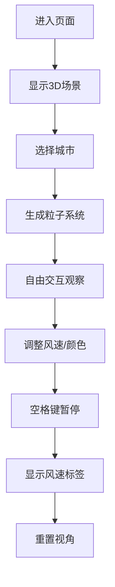

## 1. 产品概述

CloudFlow 是一个沉浸式3D气流可视化应用，通过粒子系统直观展现不同城市上空的气流运动，为气象爱好者和学生提供比平面箭头图更震撼的观察体验。

- **核心价值**：将抽象的气象数据转化为可交互的3D视觉体验，让用户能够自由拖拽视角观察风的轨迹和强度变化。

## 2. 核心功能

### 2.1 用户角色

| 角色 | 注册方式 | 核心权限 |
|------|----------|----------|
| 访客用户 | 无需注册 | 浏览3D场景、选择城市、调整参数 |

### 2.2 功能模块

1. **3D场景模块**：全屏3D粒子系统，星空渐变背景，2000个粒子模拟气流运动

2. **城市选择模块**：5个预设城市（北京、上海、伦敦、悉尼、里约），点击切换风场数据

3. **交互控制模块**：鼠标拖拽旋转视角、滚轮缩放、空格键暂停显示风速标签

4. **控制面板模块**：风速强度滑块、粒子颜色主题切换、重置视角按钮

### 2.3 页面详情

| 页面名称 | 模块名称 | 功能描述 |
|-----------|----------|--------------|
| 主页 | 3D场景区域 | 全屏星空渐变背景，粒子系统实时渲染气流运动，支持OrbitControls交互 |
| 主页 | 城市选择栏 | 顶部横向排列5个城市按钮，点击切换粒子风场 |
| 主页 | 风速标签 | 空格键暂停时显示各区域瞬时风速标签 |
| 主页 | 控制面板 | 左下角半透明毛玻璃面板，包含风速滑块、颜色切换、重置视角 |

## 3. 核心流程

用户进入页面 → 看到默认城市选择栏和3D场景 → 点击城市按钮 → 场景生成对应风场粒子 → 拖拽/缩放观察 → 调整控制面板参数 → 空格键暂停查看风速 → 切换颜色主题 → 重置视角

## 4. 用户界面设计

### 4.1 设计风格

- **设计主题**：现代暗色科幻风，星空渐变背景 #0a0a2e 到 #1a1a3e

- **主色调**：深空蓝紫渐变背景

- **强调色**：极光蓝白 (#87ceeb → #ffffff)、火焰红橙 (#ff4500 → #ffd700)、霓虹紫绿 (#a855f7 → #22c55e)

- **按钮样式**：圆角6px，半透明深色背景，悬停/点击有0.2秒缩放和颜色变化

- **字体**：无衬线现代字体，白色为主

- **布局**：全屏3D场景为主，UI元素悬浮叠加

### 4.2 页面设计概述

| 页面名称 | 模块名称 | UI元素 |
|-----------|----------|--------|
| 主页 | 3D场景 | 星空渐变背景、2000个运动粒子、半透明轨迹线 |
| 主页 | 城市选择栏 | 顶部5个城市按钮，横向排列，激活状态高亮 |
| 主页 | 风速标签 | 白色14px字体，半透明黑圆角背景，附着在区域上方 |
| 主页 | 控制面板 | 240px宽，半透明深色 #00000080，圆角16px，毛玻璃效果，风速滑块（轨道4px高，手柄20px直径），颜色切换按钮，重置按钮 |

### 4.3 响应性

- 桌面端优先设计，窗口大小变化时3D场景自动适配宽高比

### 4.4 3D场景指引

- **环境与氛围**：深空星空渐变背景，营造宇宙俯瞰地球大气层的沉浸感

- **光照**：环境光 + 轻微粒子自发光

- **相机设置**：PerspectiveCamera，初始位置俯瞰视角，支持OrbitControls控制

- **构图**：粒子在3D空间中分布，形成流动的气流轨迹

- **交互与动画**：

  - 粒子沿三次贝塞尔曲线运动，6秒循环

  - 每秒更新一次方向

  - 拖出60px长半透明轨迹线

  - 空格键暂停动画平滑过渡

- **后期处理**：粒子颜色1秒渐变过渡

- **性能预算**：

  - 目标30FPS以上

  - 低于25FPS自动降级：粒子数量减半，关闭轨迹线
