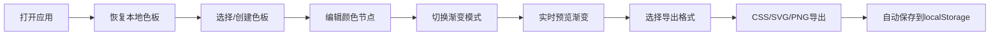

## 1. 产品概述

PaletteForge是一款面向独立插画师、图形设计师的在线渐变色板生成与导出工具，解决现有工具功能单一或需登录使用的痛点。用户可通过调整颜色节点和混合模式，实时生成并保存由2到6种颜色组成的线性或径向渐变主题色板，支持多种格式导出。

- **目标用户**：独立插画师、图形设计师、前端开发者
- **核心价值**：快速创建风格统一的渐变色板，本地存储无需登录，多格式导出便于项目复用

## 2. 核心功能

### 2.1 用户角色

| 角色 | 注册方式 | 核心权限 |
|------|----------|----------|
| 普通用户 | 无需注册 | 创建、编辑、删除、导出色板，本地存储 |

### 2.2 功能模块

1. **色板管理**：色板列表展示、添加、删除、重命名、选中切换
2. **渐变编辑器**：颜色节点拖拽、添加、删除，渐变模式切换，实时预览
3. **导出面板**：CSS代码复制、SVG图片下载、PNG图片下载
4. **数据持久化**：localStorage自动保存与恢复

### 2.3 页面详情

| 页面名称 | 模块名称 | 功能描述 |
|----------|----------|----------|
| 主界面 | 左侧色板列表 | 圆形缩略图展示色板，添加/删除色板，选中高亮，小屏折叠为顶部栏 |
| 主界面 | 中央渐变编辑区 | 渐变预览条（80px高，12px圆角），颜色节点（圆形16px），节点拖拽，添加/删除节点，渐变模式切换（线性/径向），色板重命名 |
| 主界面 | 右侧导出面板 | CSS代码导出（复制到剪贴板）、SVG导出（300x60px）、PNG导出（600x120px透明背景） |

## 3. 核心流程

用户打开应用 → 从localStorage恢复色板列表 → 选择或创建色板 → 在编辑区调整颜色节点和渐变模式 → 实时预览渐变效果 → 选择导出格式（CSS/SVG/PNG）→ 导出成功 → 数据自动保存

## 4. 用户界面设计

### 4.1 设计风格

- **主色调**：深紫色主题（#818cf8），选中态边框色#6366f1
- **背景色**：主背景#1e1e2e，次要背景#2a2a3e，分割线#3a3a4e
- **文字颜色**：#e0e0f0
- **按钮风格**：圆角8px，字体14px，悬停时背景色从#3a3a4e变为#4a4a5e，0.2秒淡入过渡
- **字体**：采用现代无衬线字体（Inter或系统字体栈），标题16px字重600，正文14px
- **布局风格**：三栏卡片式布局，圆角柔和阴影，深色静谧专业氛围
- **图标**：使用lucide-react图标库，线条风格统一

### 4.2 页面设计概述

| 页面名称 | 模块名称 | UI元素 |
|----------|----------|--------|
| 主界面 | 左侧面板 | 宽280px，圆形色板缩略图（未选中48px/0.6透明度，选中56px/2px主题色边框/高亮阴影），"+"添加按钮 |
| 主界面 | 中央编辑区 | 占剩余宽度65%，渐变预览条（80px高，12px圆角，0.3秒模式切换过渡），颜色节点拖拽放大120%+浅阴影，标题双击编辑 |
| 主界面 | 右侧面板 | 固定宽260px，导出按钮组，CSS代码预览区 |
| 主界面 | 分隔线 | 2px宽#3a3a4e，悬停显示拖拽光标，可调整宽度 |
| 主界面 | Toast提示 | 顶部居中，白色背景，圆角8px，显示2秒 |

### 4.3 响应式

- **桌面端优先**：最小宽度1024px，三栏布局
- **小屏适配**：窗口宽度<1024px时，左侧面板折叠为顶部水平菜单栏（高56px），色板缩略图水平排列，点击展开弹窗显示完整列表
- **触控优化**：按钮最小点击区域44x44px，节点拖拽支持触控事件

### 4.4 动画与交互

- 节点删除：0.15秒缩小消失动画后移除，剩余节点重新均匀分布
- 渐变模式切换：0.3秒平滑过渡
- 按钮悬停：0.2秒淡入效果
- 颜色选择器：半透明黑色遮罩（opacity 0.3），点击遮罩关闭
