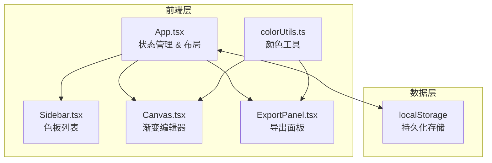

## 1. 架构设计



## 2. 技术描述

- **前端框架**：React@18 + TypeScript + Vite@5
- **状态管理**：React useState/useEffect（轻量级，无额外状态管理库）
- **UI库**：纯CSS实现（按需求不使用Tailwind），lucide-react图标
- **数据存储**：浏览器localStorage（无后端依赖）
- **构建工具**：Vite，使用@vitejs/plugin-react
- **包管理器**：npm
- **类型安全**：TypeScript严格模式，ESNext模块

### 文件结构与调用关系

```
package.json              # 项目依赖与脚本
vite.config.js            # Vite构建配置
tsconfig.json             # TypeScript配置
index.html                # 入口HTML
src/
├── main.tsx              # 应用入口 → 渲染App
├── App.tsx               # 主组件 → 状态管理，协调Sidebar/Canvas/ExportPanel
├── components/
│   ├── Sidebar.tsx       # 左侧列表 → 接收palettes数组，发出add/select/delete事件
│   ├── Canvas.tsx        # 中央编辑区 → 接收当前palette，发出edit事件
│   ├── ExportPanel.tsx   # 右侧导出 → 接收当前palette，调用导出逻辑
│   └── Toast.tsx         # 提示组件
└── utils/
    └── colorUtils.ts     # 颜色工具 → 被Canvas和ExportPanel调用
```

### 数据流向

1. `App.tsx` 从localStorage加载色板列表，管理当前选中色板
2. 色板列表 → `Sidebar.tsx` 渲染缩略图
3. 当前选中色板 → `Canvas.tsx` 显示渐变预览和可编辑节点
4. 用户编辑节点 → `Canvas.tsx` 发出update事件 → `App.tsx` 更新状态 → 自动保存到localStorage
5. 当前色板 → `ExportPanel.tsx` → 调用colorUtils生成导出内容

## 3. 核心数据类型定义

```typescript
// 颜色节点
interface ColorStop {
  id: string;           // uuid
  color: string;        // hex颜色值
  position: number;     // 0-1之间的位置
}

// 渐变类型
type GradientType = 'linear' | 'radial';

// 线性渐变方向
type LinearDirection = 'to right' | 'to bottom' | 'diagonal';

// 径向渐变形状
type RadialShape = 'circle' | 'ellipse';

// 色板
interface Palette {
  id: string;                     // uuid
  name: string;                   // 色板名称
  type: GradientType;             // 渐变类型
  direction?: LinearDirection;    // 线性渐变方向
  shape?: RadialShape;            // 径向渐变形状
  colorStops: ColorStop[];        // 颜色节点数组（2-6个）
  createdAt: number;              // 创建时间戳
  updatedAt: number;              // 更新时间戳
}

// App状态
interface AppState {
  palettes: Palette[];
  selectedId: string | null;
}
```

## 4. 性能约束实现方案

| 约束 | 实现方案 |
|------|----------|
| 拖拽帧率≥50fps | 使用requestAnimationFrame，CSS transform定位，React.memo包裹节点组件 |
| PNG导出≤500ms | 离屏Canvas预渲染，避免重复计算 |
| localStorage读写≤10ms | 防抖写入（debounce 300ms），批量更新 |
| 列表渲染优化 | React.memo包裹Sidebar列表项，使用唯一id作为key |

## 5. 关键工具函数（colorUtils.ts）

| 函数 | 签名 | 用途 |
|------|------|------|
| hexToRgb | `(hex: string) => {r:number,g:number,b:number}` | 十六进制转RGB |
| rgbToHex | `(r:number,g:number,b:number) => string` | RGB转十六进制 |
| interpolateColor | `(color1:string, color2:string, t:number) => string` | 颜色插值计算 |
| generateCSSGradient | `(palette: Palette) => string` | 生成CSS渐变字符串 |
| generateSVG | `(palette: Palette, width:number, height:number) => string` | 生成SVG渐变代码 |
| exportPNG | `(palette: Palette, width:number, height:number) => Promise<void>` | Canvas渲染导出PNG |
| copyToClipboard | `(text: string) => Promise<boolean>` | 复制到剪贴板 |

## 6. 开发与构建脚本

| 命令 | 说明 |
|------|------|
| `npm run dev` | 启动开发服务器 |
| `npm run build` | 生产构建 |
| `npm run preview` | 预览构建产物 |
