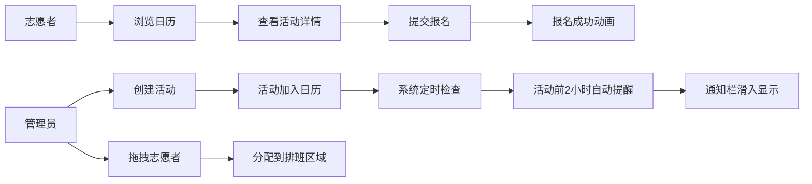

## 1. 产品概述

本应用为小型公益组织提供志愿者排班与活动报名预约的在线管理解决方案，解决手动Excel排班冲突、报名状态不透明、活动提醒遗漏等核心痛点。

- **目标用户**：公益组织管理员与志愿者
- **核心价值**：高效管理活动排班、实时确认报名状态、自动化活动提醒

## 2. 核心功能

### 2.1 用户角色

| 角色 | 注册方式 | 核心权限 |
|------|----------|----------|
| 管理员 | 系统内置 | 创建/管理活动、查看排班统计、导出报表、拖拽分配志愿者排班 |
| 志愿者 | 公共页面访问 | 浏览活动日历、查看活动详情、报名参与活动、接收活动提醒 |

### 2.2 功能模块

1. **管理员仪表板**：排班完成率趋势图、活动报名统计卡片、创建活动弹窗、导出排班报表
2. **志愿者公共日历**：月份切换日历、活动日期标记、活动详情卡片、在线报名
3. **通知系统**：活动开始前自动提醒、报名成功动画反馈、通知栏滑入动画
4. **排班分配**：侧边栏志愿者列表、拖拽分配、排班区域管理

### 2.3 页面详情

| 页面名称 | 模块名称 | 功能描述 |
|----------|----------|----------|
| 管理员仪表板 | 趋势折线图 | 展示过去7天排班完成率，亮橙色折线，节点半径6px |
| 管理员仪表板 | 统计卡片列表 | 活动报名统计卡片，280×160px，悬停上浮动画 |
| 管理员仪表板 | 创建活动按钮 | 青绿色圆角按钮，点击弹性缩放动画 |
| 管理员仪表板 | 创建活动模态窗 | 居中弹窗420px宽，填写活动信息后提交 |
| 管理员仪表板 | 导出报表按钮 | 导出月度CSV报表，带下载进度条动画 |
| 管理员侧边栏 | 志愿者列表 | 深蓝背景，可拖拽志愿者姓名项 |
| 排班分配区域 | 拖拽放置区 | 虚线边框半透明白色区域，接收拖入志愿者 |
| 志愿者公共页 | 月份日历视图 | 可切换月份，活动日期显示淡绿色圆点 |
| 志愿者公共页 | 活动详情卡片 | 320px宽白色卡片，展示活动信息与报名按钮 |
| 志愿者公共页 | 报名按钮 | 紫色按钮，悬停变色，报名后变灰禁用 |
| 志愿者公共页 | 报名成功动画 | 绿色对勾弹出放大淡出动画 |
| 全局通知栏 | 通知面板 | 右上角固定定位，滑入动画，最多3条同时显示 |
| 全局通知栏 | 活动提醒卡片 | 左边框绿色4px，可关闭，活动开始前2小时自动触发 |

## 3. 核心流程

### 3.1 管理员创建活动流程
管理员进入仪表板 → 点击"创建活动"按钮 → 弹出模态窗填写活动信息 → 提交表单 → 活动自动加入日历视图 → 触发占位提醒通知

### 3.2 志愿者报名流程
志愿者访问公共页面 → 浏览日历视图切换月份 → 点击有活动标记的日期 → 弹出活动详情卡片 → 点击"我要报名"按钮 → 按钮变灰禁用 → 顶部显示报名成功动画

### 3.3 管理员分配排班流程
管理员进入仪表板 → 从左侧边栏拖拽志愿者姓名 → 拖放到活动卡片的排班区域 → 区域显示志愿者标签 → 可再次拖出移除

### 3.4 活动提醒流程
系统定时检查即将开始的活动 → 活动开始前2小时触发通知 → 通知从右侧滑入通知栏 → 志愿者点击关闭按钮可移除通知

### 3.5 流程示意图

## 4. 用户界面设计

### 4.1 设计风格

- **主色调**：深蓝渐变 `#1e3a5f → #2d6a9f`，辅助色青绿色 `#00b894`，强调色亮橙色 `#ff9f43`、紫色 `#6c5ce7`
- **背景色**：整体浅灰 `#f4f6f9`，卡片白色 `#ffffff`
- **按钮风格**：统一圆角8px，带悬停/点击过渡动画，点击弹性缩放
- **卡片风格**：圆角12px/16px，白色背景带浅阴影 `box-shadow: 0 2px 8px rgba(0,0,0,0.08)`
- **字体**：采用现代无衬线字体，标题字重600
- **布局**：管理端左右分栏（侧边栏280px + 主内容自适应），公共页顶部导航+日历视图
- **动画**：悬停平移、按钮弹性缩放、通知滑入、报名成功弹出、进度条填充

### 4.2 页面设计概览

| 页面名称 | 模块名称 | UI元素 |
|----------|----------|--------|
| 管理员仪表板 | 趋势折线图 | Chart.js绘制，亮橙色#ff9f43折线，节点6px |
| 管理员仪表板 | 统计卡片 | 280×160px，圆角16px，白色阴影，悬停上浮4px，0.2s过渡 |
| 管理员仪表板 | 创建活动按钮 | 圆角8px，高44px，#00b894背景，白字600重，点击0.95缩放弹性动画 |
| 管理员仪表板 | 创建活动模态窗 | 宽420px，圆角20px，白色背景，遮罩rgba(0,0,0,0.4) |
| 管理员仪表板 | 下载进度条 | 240×8px，圆角4px，#dfe6e9背景，#00b894进度色，0.5s填充 |
| 管理员侧边栏 | 志愿者列表项 | 高48px，圆角8px，白字，悬停#2d6a9f高亮 |
| 排班分配区域 | 放置区 | 圆角12px，虚线边框，#ffffff30半透明白背景 |
| 排班分配区域 | 志愿者标签 | 圆角16px，#6c5ce7背景，白字，4px 12px内边距 |
| 志愿者公共页 | 日历格子 | 44×44px，活动日期显示#a8e6cf淡绿色圆点 |
| 志愿者公共页 | 活动详情卡片 | 宽320px，圆角16px，白色轻阴影，8px内边距 |
| 志愿者公共页 | 报名按钮 | 圆角8px，高40px，#6c5ce7背景，悬停#5a4bd1，0.2s过渡 |
| 志愿者公共页 | 已报名按钮 | #b2bec3灰色背景，白字，禁用状态 |
| 志愿者公共页 | 报名成功动画 | 32px直径绿色对勾，放大1.2倍恢复，0.3s淡出 |
| 全局通知栏 | 通知卡片 | 圆角12px，白色背景，左边框#00b894 4px |
| 全局通知栏 | 关闭按钮 | 圆形20px直径，#dfe6e9灰色 |
| 全局通知栏 | 滑入动画 | 从右向左滑入，0.4s ease-out |

### 4.3 响应式适配

- **桌面优先设计**：默认适配大屏显示器
- **平板适配**：屏幕<768px时，管理端侧边栏收缩为顶部汉堡菜单
- **日历适配**：移动设备下日历格子缩小为36×36px，卡片宽度改为100%自适应
- **触摸优化**：按钮最小可点击区域不小于40×40px，拖拽操作适配触摸手势

### 4.4 性能指标

| 操作 | 性能要求 |
|------|----------|
| 日历切换月份渲染 | ≤ 200ms |
| 报名操作响应 | ≤ 150ms |
| 通知滑入动画流畅度 | 60fps |
