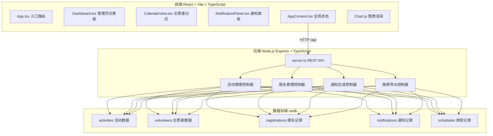
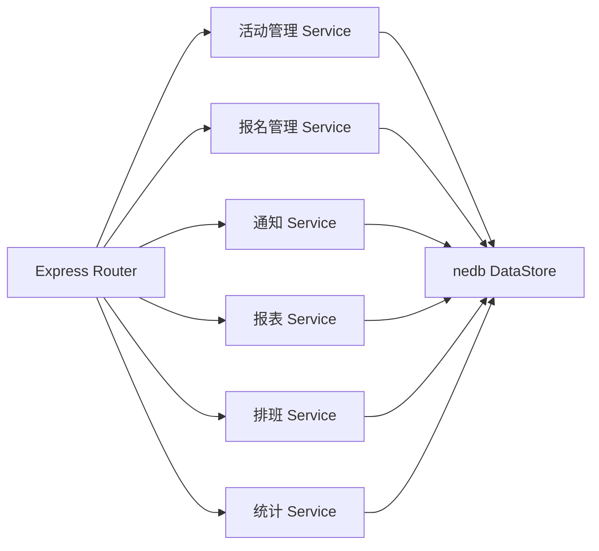
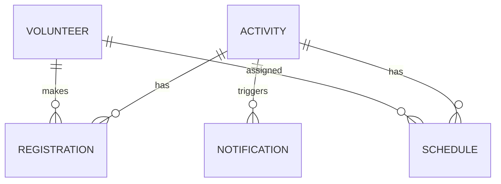

## 1. 架构设计



## 2. 技术描述

- **前端框架**：React 18 + TypeScript 5
- **构建工具**：Vite 5 + @vitejs/plugin-react
- **状态管理**：React Context API（AppContext）
- **图表库**：Chart.js + react-chartjs-2
- **CSV导出**：csv-stringify
- **后端框架**：Express 4 + TypeScript
- **数据存储**：nedb-promises（嵌入式文档数据库）
- **ID生成**：uuid
- **端口配置**：前端Vite开发服务器端口5173，后端Express端口3001
- **代理配置**：Vite将`/api`请求代理到`http://localhost:3001`

## 3. 路由定义

| 路由 | 用途 |
|------|------|
| `/` | 志愿者公共日历视图页面 |
| `/admin` | 管理员仪表板页面 |

## 4. API 定义

### 4.1 TypeScript 类型定义

```typescript
interface Activity {
  _id: string;
  name: string;
  dateTime: string;
  location: string;
  maxParticipants: number;
  description: string;
  createdAt: string;
}

interface Volunteer {
  _id: string;
  name: string;
}

interface Registration {
  _id: string;
  activityId: string;
  volunteerName: string;
  registeredAt: string;
}

interface ScheduleAssignment {
  _id: string;
  activityId: string;
  volunteerId: string;
  volunteerName: string;
}

interface Notification {
  _id: string;
  activityId: string;
  activityName: string;
  message: string;
  type: 'reminder' | 'success';
  createdAt: string;
  dismissed?: boolean;
}
```

### 4.2 REST API 端点

| 方法 | 路径 | 请求参数 | 响应 | 描述 |
|------|------|----------|------|------|
| GET | `/api/activities` | `?month=YYYY-MM` | `Activity[]` | 获取活动列表，可选按月筛选 |
| GET | `/api/activities/:id` | - | `Activity` | 获取单个活动详情 |
| POST | `/api/activities` | `{name, dateTime, location, maxParticipants, description}` | `Activity` | 创建新活动 |
| GET | `/api/activities/:id/registrations` | - | `Registration[]` | 获取活动的报名列表 |
| POST | `/api/activities/:id/register` | `{volunteerName}` | `Registration` | 志愿者报名活动 |
| GET | `/api/volunteers` | - | `Volunteer[]` | 获取志愿者列表 |
| GET | `/api/schedules` | `?activityId=xxx` | `ScheduleAssignment[]` | 获取排班分配，可选按活动筛选 |
| POST | `/api/schedules` | `{activityId, volunteerId, volunteerName}` | `ScheduleAssignment` | 创建排班分配 |
| DELETE | `/api/schedules/:id` | - | `{success: true}` | 删除排班分配 |
| GET | `/api/notifications` | - | `Notification[]` | 获取通知列表 |
| POST | `/api/notifications/check` | - | `Notification[]` | 检查并生成即将开始的活动提醒 |
| DELETE | `/api/notifications/:id` | - | `{success: true}` | 标记通知已关闭 |
| GET | `/api/report/schedule` | `?year=YYYY&month=MM` | `CSV文件` | 导出指定月份排班CSV报表 |
| GET | `/api/stats/completion-rate` | - | `[{date, rate}]` | 获取过去7天排班完成率 |

## 5. 服务端架构图



## 6. 数据模型

### 6.1 ER图



### 6.2 数据集合定义

**activities（活动集合）**
| 字段 | 类型 | 描述 |
|------|------|------|
| _id | string | 主键，uuid |
| name | string | 活动名称 |
| dateTime | string | ISO格式日期时间 |
| location | string | 活动地点 |
| maxParticipants | number | 最大参与人数 |
| description | string | 活动描述 |
| createdAt | string | 创建时间 |

**volunteers（志愿者集合）**
| 字段 | 类型 | 描述 |
|------|------|------|
| _id | string | 主键，uuid |
| name | string | 志愿者姓名 |

**registrations（报名记录集合）**
| 字段 | 类型 | 描述 |
|------|------|------|
| _id | string | 主键，uuid |
| activityId | string | 关联活动ID |
| volunteerName | string | 报名志愿者姓名 |
| registeredAt | string | 报名时间 |

**schedules（排班分配集合）**
| 字段 | 类型 | 描述 |
|------|------|------|
| _id | string | 主键，uuid |
| activityId | string | 关联活动ID |
| volunteerId | string | 关联志愿者ID |
| volunteerName | string | 志愿者姓名 |

**notifications（通知集合）**
| 字段 | 类型 | 描述 |
|------|------|------|
| _id | string | 主键，uuid |
| activityId | string | 关联活动ID |
| activityName | string | 活动名称 |
| message | string | 通知消息 |
| type | string | 类型：reminder/success |
| createdAt | string | 创建时间 |
| dismissed | boolean | 是否已关闭 |

### 6.3 初始数据

启动时自动初始化以下mock数据：
- 5名预设志愿者
- 3个示例活动（包含过去和未来日期）
- 若干报名记录和排班记录
