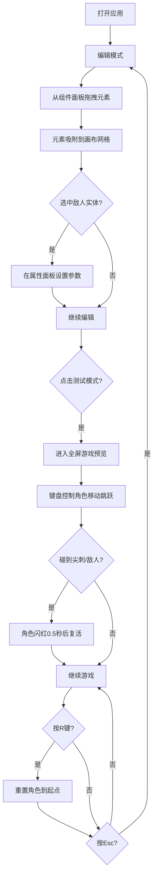

## 1. 产品概述

LevelForge 是一款面向独立游戏开发者的2D平台跳跃关卡设计器，运行于浏览器中。它解决的核心问题是：开发者手动拼图测试关卡效率低、缺乏即时反馈。通过可视化拖拽编辑和一键测试模式，帮助开发者快速验证关卡的可玩性和难度曲线。

## 2. 核心功能

### 2.1 用户角色

| 角色 | 使用方式 | 核心权限 |
|------|----------|----------|
| 关卡设计师 | 直接访问网页 | 编辑关卡、测试关卡、导出关卡数据 |

### 2.2 功能模块

1. **关卡编辑页面**：组件面板、编辑画布、属性面板三大区域，支持拖拽放置平台元素和敌人实体
2. **测试模式**：全屏游戏预览，键盘控制角色在搭建的关卡中移动跳跃

### 2.3 页面详情

| 页面名称 | 模块名称 | 功能描述 |
|----------|----------|----------|
| 关卡编辑页面 | 组件面板 | 左侧240px宽，渲染可拖拽的预设元素（地面块、移动平台、尖刺、终点旗、史莱姆、飞龙），使用HTML5 Drag and Drop API |
| 关卡编辑页面 | 编辑画布 | 中央1200x800画布，深灰背景带40px网格，接收拖拽放置元素并吸附到网格交点，支持选中元素 |
| 关卡编辑页面 | 属性面板 | 右侧260px宽，展示选中敌人实体的属性（移动路径、移动速度、巡逻间隔），修改即时生效 |
| 测试模式 | 游戏画布 | 全屏Canvas，键盘方向键控制蓝色方块角色跳跃移动，碰撞检测，角色死亡闪红复活，R键重置，右上角实时帧率显示 |

## 3. 核心流程

用户打开应用后进入编辑模式，从左侧组件面板拖拽元素到画布上搭建关卡。可点击选中敌人实体在右侧属性面板设置参数。放置完毕后点击"测试模式"按钮切换到游戏预览，使用键盘操控角色体验关卡。按Esc返回编辑模式继续调整。

## 4. 用户界面设计

### 4.1 设计风格

- **主色调**：深灰科技风，主背景 #1e1e24
- **辅助色**：面板背景半透明 #1b1b21，毛玻璃效果（backdrop-blur 8px）
- **强调色**：蓝色 #3b82f6（按钮），绿色渐变（地面块），橙色渐变（移动平台），红色（尖刺/飞龙），金色（终点旗）
- **按钮风格**：圆角8px，悬停变深，0.2秒过渡
- **字体**：思源黑体或系统默认无衬线
- **布局**：三栏布局（左面板 + 中画布 + 右面板）
- **交互**：所有可交互元素悬停手型指针，0.2秒平滑过渡动画

### 4.2 页面设计概览

| 页面名称 | 模块名称 | UI元素 |
|----------|----------|--------|
| 关卡编辑页面 | 组件面板 | 深色半透明背景，毛玻璃效果，圆角8px，元素卡片带图标和名称，可拖拽 |
| 关卡编辑页面 | 编辑画布 | 1200x800画布，深灰背景#1e1e24，网格线#2c2c34，格距40px |
| 关卡编辑页面 | 属性面板 | 白色背景#ffffff，圆角12px，阴影，滑块/输入框/路径点选择器 |
| 关卡编辑页面 | 测试模式按钮 | 圆角8px，背景色#3b82f6，悬停#2563eb，0.2秒过渡 |
| 测试模式 | 游戏画布 | 全屏深灰背景，角色蓝色方块，右上角白色帧率文字12px |

### 4.3 响应式设计

- 桌面优先设计，画布尺寸小于1024px时组件面板和属性面板自动折叠为图标按钮
- 面板折叠/展开带0.2秒过渡动画

### 4.4 元素视觉规格

| 元素 | 视觉规格 |
|------|----------|
| 地面块 | 绿色渐变 #4ade80→#22c55e，宽80px高24px |
| 移动平台 | 橙色渐变 #fb923c→#f97316，宽120px高16px，路径点用浅蓝色小圆点 |
| 尖刺 | 红色三角 #dc2626，底宽32px高24px |
| 终点旗 | 金色旗帜 #fbbf24，宽20px高40px |
| 史莱姆 | 绿色圆形，半径16px，带眼睛点缀 |
| 飞龙 | 红色椭圆形，宽32px高20px，带翅膀动画 |
| 角色 | 蓝色方块，边长24px，圆角4px，白色眼圈 |

## 5. 性能要求

- 测试模式下保持至少50FPS
- 角色移动每帧计算量不超过0.5ms
- 敌人巡逻路径计算不超过0.2ms
