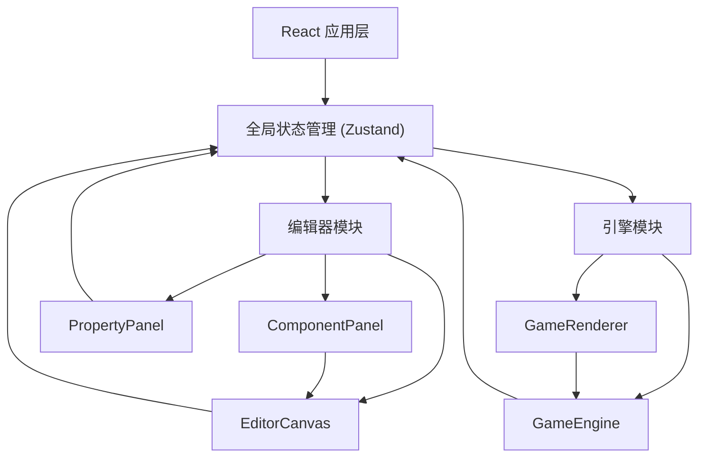
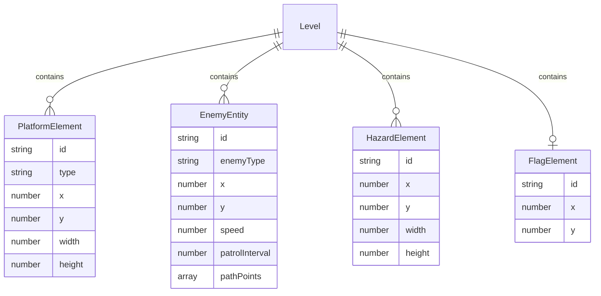

## 1. 架构设计



应用采用纯前端架构，无后端服务。React负责UI渲染和交互，Zustand管理全局状态，Canvas 2D API负责游戏渲染。

## 2. 技术说明

- **前端框架**：React 18 + TypeScript
- **构建工具**：Vite
- **状态管理**：Zustand
- **画布渲染**：Canvas 2D API
- **拖拽交互**：HTML5 Drag and Drop API
- **样式方案**：CSS Modules + 内联样式
- **后端**：无

## 3. 路由定义

| 路由 | 用途 |
|------|------|
| / | 主编辑页面，包含编辑模式和测试模式 |

应用为单页面，编辑模式和测试模式通过状态切换而非路由切换。

## 4. 文件结构

```
project/
├── package.json
├── index.html
├── tsconfig.json
├── vite.config.ts
├── src/
│   ├── main.tsx
│   ├── App.tsx
│   ├── store/
│   │   └── useLevelStore.ts
│   ├── types/
│   │   └── index.ts
│   ├── editor/
│   │   ├── EditorCanvas.tsx
│   │   ├── ComponentPanel.tsx
│   │   └── PropertyPanel.tsx
│   └── engine/
│       ├── GameEngine.ts
│       └── GameRenderer.ts
```

## 5. 数据模型

### 5.1 数据模型定义



### 5.2 核心类型定义

```typescript
type ElementType = 'ground' | 'movingPlatform' | 'spike' | 'flag' | 'slime' | 'dragon'

interface LevelElement {
  id: string
  type: ElementType
  x: number
  y: number
  width: number
  height: number
}

interface EnemyEntity extends LevelElement {
  enemyType: 'slime' | 'dragon'
  speed: number
  patrolInterval: number
  pathPoints: { x: number; y: number }[]
}

interface PlayerState {
  x: number
  y: number
  velocityX: number
  velocityY: number
  isGrounded: boolean
  isDead: boolean
}

interface LevelState {
  elements: LevelElement[]
  selectedId: string | null
  isTestMode: boolean
  player: PlayerState
}
```

## 6. 关键技术方案

### 6.1 拖拽与吸附

- 组件面板使用HTML5 Drag and Drop API的dragstart事件传递元素类型
- 画布监听dragover和drop事件，drop时计算最近的网格交点（格距40px）作为元素位置
- 公式：`snapX = Math.round(x / 40) * 40`

### 6.2 物理引擎

- 角色：重力0.15px/帧²，跳跃初速度由目标高度80px反算，水平移动3px/帧
- 碰撞检测：AABB矩形碰撞，每帧检测角色与所有平台/尖刺/敌人的碰撞
- 敌人巡逻：沿路径点循环移动，速度由属性面板参数控制

### 6.3 渲染循环

- 测试模式使用requestAnimationFrame驱动游戏循环
- GameEngine.update()计算物理和碰撞，每帧耗时<0.5ms
- GameRenderer.render()绘制所有元素，目标50+FPS

### 6.4 响应式面板

- 监听窗口resize事件，画布宽度<1024px时折叠面板
- 折叠状态下面板变为图标按钮，点击展开
