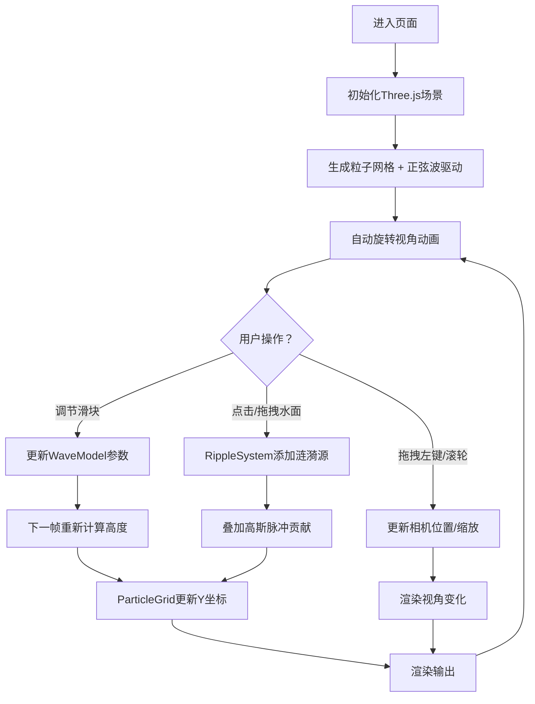

## 1. 产品概述

WaveField 是一款基于 WebGL 的 3D 粒子波浪可视化模拟器，通过交互式粒子网格实时展示水面波浪的传播、干涉与叠加物理现象。用户通过点击/拖拽水面激起涟漪，直观感受波动物理原理，服务于物理教学、创意可视化与交互艺术场景。

## 2. 核心功能

### 2.1 用户角色

| 角色 | 注册方式 | 核心权限 |
|------|----------|----------|
| 普通用户 | 直接访问 | 浏览粒子网格、调节波浪参数、生成涟漪、操控视角 |

### 2.2 功能模块

1. **3D粒子网格渲染模块**：400x400尺寸、2500+粒子的实时水面模拟，正弦波驱动高度变化
2. **涟漪生成与干涉模块**：点击/拖拽产生高斯脉冲涟漪源，多涟漪自动干涉叠加
3. **参数控制面板**：全局振幅、频率、衰减系数三个滑块实时调节
4. **视角交互模块**：自动Y轴旋转、鼠标拖拽自由旋转、滚轮缩放
5. **性能自适应模块**：粒子数量阈值触发渲染精度降级，保证30fps以上

### 2.3 页面详情

| 页面名称 | 模块名称 | 功能描述 |
|----------|----------|----------|
| 主场景页 | 3D粒子网格 | 浅蓝色发光粒子、正弦波高度动画、光晕泛光效果 |
| 主场景页 | 涟漪生成系统 | 点击/拖拽生成3秒涟漪源、高斯脉冲扩散、波峰叠加干涉 |
| 主场景页 | 右侧控制面板 | 220px半透明深蓝面板、振幅(0-50)、频率(0.5-5Hz)、衰减(0.9-1)滑块 |
| 主场景页 | 视角控制 | 自动12°/s绕Y旋转、左键拖拽旋转、滚轮0.5-3x缩放 |
| 主场景页 | 性能监控 | 粒子>3000时自动降级：半径减半、透明度降至0.5 |

## 3. 核心流程

用户进入页面后，默认看到自动旋转的粒子网格与面板。用户可调节滑块改变全局波浪形态，也可在3D场景中点击或拖拽鼠标生成涟漪。涟漪随时间向外扩散并与其他涟漪发生干涉，3秒后自动消散。整个过程中用户可随时旋转/缩放视角观察干涉图案。

## 4. 用户界面设计

### 4.1 设计风格

- **主色调**：冷色海洋系，背景渐变 `#0c1929 → #1a3a5c`
- **粒子色**：浅蓝色渐变 `#38bdf8 → #0ea5e9`，透明度 0.7
- **面板色**：半透明深蓝 `#0f172a`，圆角 12px
- **视觉效果**：点光源 + 泛光(PostProcessing Bloom)，粒子带微弱光晕
- **布局**：全屏沉浸式 3D 场景，右侧悬浮控制面板（z-index 上层）

### 4.2 页面设计概览

| 页面名称 | 模块名称 | UI元素 |
|----------|----------|--------|
| 主场景页 | 3D粒子网格 | 2500个发光圆点、正弦波起伏、光晕泛光、冷色调统一 |
| 主场景页 | 控制面板 | 220px宽悬浮面板、三个range滑块、当前数值实时显示、标题标签 |
| 主场景页 | 视角交互 | 无可见UI、鼠标光标反馈、拖拽时旋转感 |

### 4.3 响应式

桌面端优先设计，全屏 canvas 自适应窗口尺寸；控制面板固定右侧 20px 外边距，垂直居中。触控设备支持双指缩放与单指拖拽生成涟漪。

### 4.4 3D 场景指引

- **环境氛围**：深海冷色渐变背景，营造水下/夜空感
- **光照**：环境光(0.4强度) + 蓝色点光源(粒子位置上方偏移)，Bloom泛光阈值0.5，强度0.8
- **相机**：PerspectiveCamera，fov 60°，初始位置 (0, 150, 300)，lookAt 原点
- **相机运动**：Y轴自动旋转 12°/s，用户拖拽覆盖自动旋转，滚轮缩放距离 150~900
- **后处理**：UnrealBloomPass，半径0.5，阈值0.3，强度0.6
- **性能预算**：目标30fps+，粒子上限3000触发降级（PointsMaterial尺寸50%，透明度0.5）
