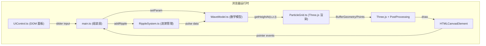
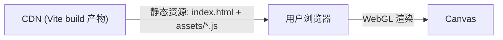
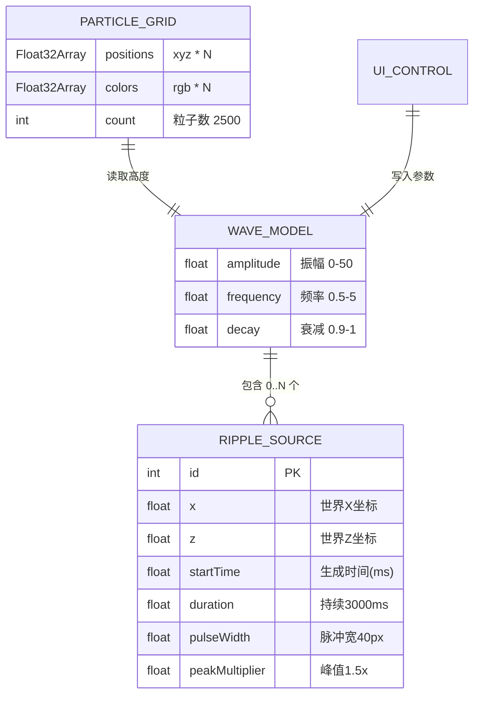

## 1. 架构设计



## 2. 技术说明

- **前端框架**：无 UI 框架，原生 TypeScript + DOM API
- **3D 引擎**：three@0.160.x（配合 @types/three）
- **构建工具**：Vite@5.x
- **语言**：TypeScript@5.x，严格模式 `strict: true`
- **后处理**：three/examples/jsm/postprocessing/（EffectComposer + RenderPass + UnrealBloomPass）
- **数学库**：原生 Math API + 自实现高斯函数、正弦叠加
- **后端/数据库**：无（纯前端静态应用）

## 3. 路由定义

| 路由 | 用途 |
|------|------|
| / | 单页应用入口，加载 main.ts，直接渲染 WaveField 主场景 |

## 4. API 定义（无后端）

### 4.1 内部模块接口

**WaveModel.ts**

```typescript
export interface WaveParams {
  amplitude: number;   // 0-50 px
  frequency: number;   // 0.5-5 Hz
  decay: number;       // 0.9-1
}

export class WaveModel {
  params: WaveParams;
  ripples: RippleSource[];
  constructor(params?: Partial<WaveParams>);
  setParams(p: Partial<WaveParams>): void;
  addRipple(r: RippleSource): void;
  updateRipples(time: number): void;
  getHeightAt(x: number, z: number, time: number): number;
}
```

**RippleSystem.ts**

```typescript
export interface RippleSource {
  id: number;
  x: number;
  z: number;
  startTime: number;
  duration: number;  // 3000 ms
  pulseWidth: number; // 40 px
  peakMultiplier: number; // 1.5
}

export class RippleSystem {
  ripples: RippleSource[];
  add(x: number, z: number, time: number): RippleSource;
  update(time: number): void;
  getContribution(x: number, z: number, time: number, baseAmp: number): number;
}
```

**ParticleGrid.ts**

```typescript
export class ParticleGrid {
  points: THREE.Points;
  geometry: THREE.BufferGeometry;
  constructor(gridSize: number, spacing: number);
  update(model: WaveModel, time: number): void;
  setQualityLevel(level: 'high' | 'low'): void;
}
```

**UIControl.ts**

```typescript
export type ParamKey = 'amplitude' | 'frequency' | 'decay';
export class UIControl {
  onParamChange?: (key: ParamKey, value: number) => void;
  constructor(container: HTMLElement);
  setValue(key: ParamKey, v: number): void;
}
```

## 5. 服务器架构图（无后端）

纯前端静态部署架构：



## 6. 数据模型（运行时内存）

### 6.1 数据模型定义



### 6.2 物理公式定义

**基础正弦波高度**（叠加多方向平面波模拟水面基础波动）：
```
H_base(x,z,t,A,f) = A * [ sin(2πft + 0.5x) + sin(2π*1.3ft + 0.7z) + sin(2π*0.7ft + 0.3x+0.4z) ] / 3
```

**单个涟漪高斯脉冲贡献**（距离 r = √(dx²+dz²)，扩散速度 v，时间经过 Δt）：
```
spread = v * Δt
H_ripple(r,Δt) = peak * exp( -(r-spread)² / (2σ²) ) * cos( 2π*(r-spread)/λ ) * decay^Δt
```

**最终粒子高度 = H_base + Σ H_ripple(i)**
