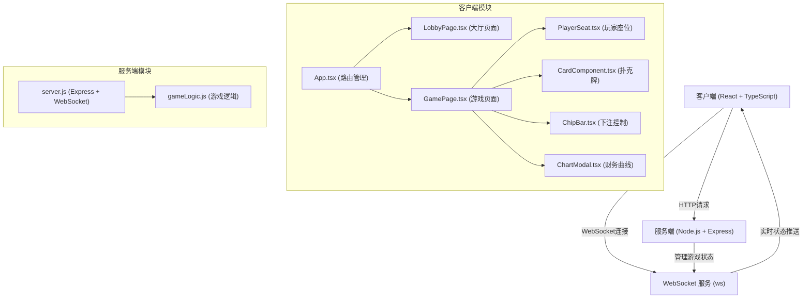
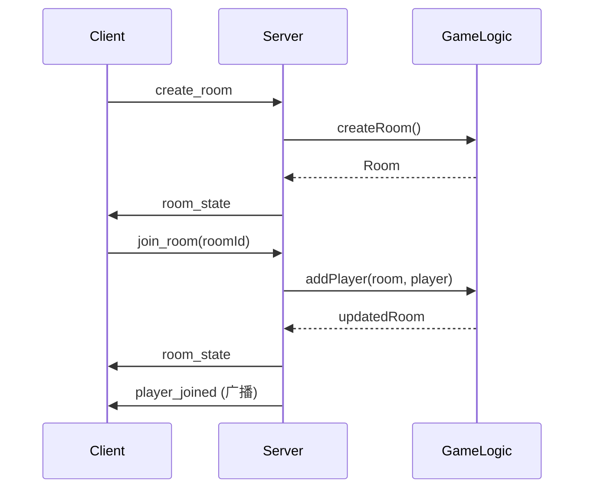
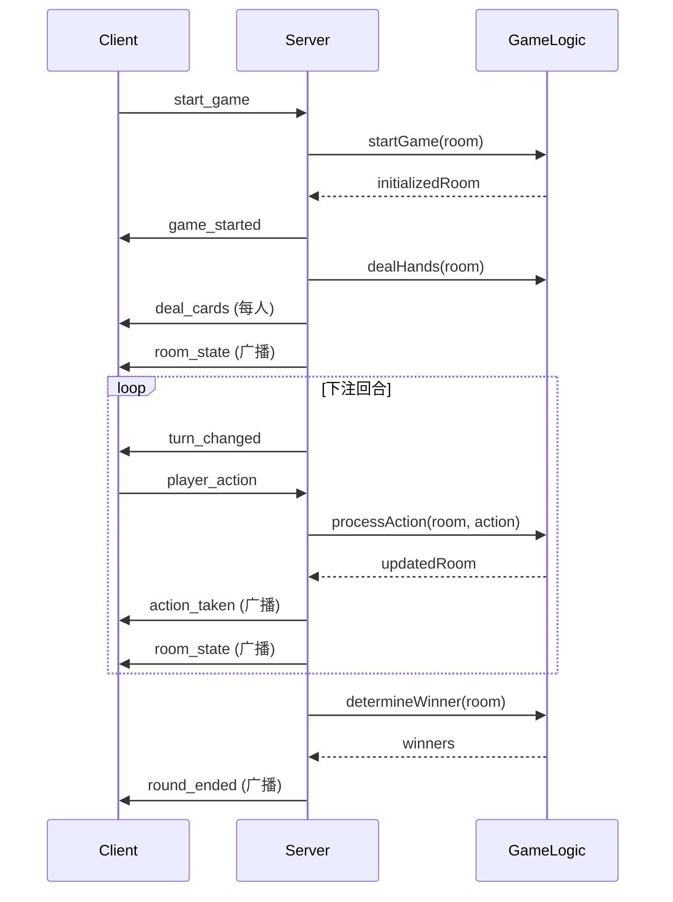

# BubblePoker 技术架构文档

## 1. 系统架构总览

### 1.1 架构图



### 1.2 技术选型说明

| 模块 | 技术选型 | 说明 |
|------|----------|------|
| 前端框架 | React 18 + TypeScript | 类型安全，组件化开发 |
| 构建工具 | Vite | 快速冷启动，HMR |
| 路由 | React Router v6 | 单页应用路由管理 |
| 图表 | Chart.js + react-chartjs-2 | 财务曲线可视化 |
| 实时通信 | WebSocket (原生) | 双向实时通信 |
| 后端 | Node.js + Express | 轻量级HTTP服务 |
| WebSocket | ws | 高性能WebSocket库 |
| ID生成 | uuid | 房间ID唯一标识 |

---

## 2. 数据模型设计

### 2.1 玩家数据结构

```typescript
interface Player {
  id: string;
  name: string;
  seat: number; // 0-3
  chips: number;
  hand: Card[];
  currentBet: number;
  isFolded: boolean;
  isAllIn: boolean;
  isActive: boolean;
}
```

### 2.2 扑克牌数据结构

```typescript
interface Card {
  suit: 'hearts' | 'diamonds' | 'clubs' | 'spades';
  rank: number; // 2-14 (2-A)
  id: string;
}
```

### 2.3 房间数据结构

```typescript
interface Room {
  id: string;
  players: Player[];
  maxPlayers: number;
  status: 'waiting' | 'playing' | 'finished';
  communityCards: Card[];
  pot: number;
  currentBet: number;
  currentPlayerIndex: number;
  dealerIndex: number;
  smallBlind: number;
  bigBlind: number;
  round: 'preflop' | 'flop' | 'turn' | 'river' | 'showdown';
  chipHistory: ChipHistoryEntry[];
}

interface ChipHistoryEntry {
  handNumber: number;
  players: { [playerId: string]: number };
}
```

### 2.4 WebSocket 消息协议

#### 客户端 → 服务端

```typescript
// 加入大厅
{ type: 'join_lobby', name: string }

// 创建房间
{ type: 'create_room', playerName: string }

// 加入房间
{ type: 'join_room', roomId: string, playerName: string }

// 开始游戏
{ type: 'start_game', roomId: string }

// 玩家行动
{ type: 'player_action', roomId: string, action: 'fold' | 'call' | 'raise' | 'allin', amount?: number }

// 获取在线人数
{ type: 'get_online_count' }
```

#### 服务端 → 客户端

```typescript
// 在线人数更新
{ type: 'online_count', count: number }

// 房间列表更新
{ type: 'room_list', rooms: Room[] }

// 房间状态更新
{ type: 'room_state', room: Room, playerId: string }

// 玩家加入
{ type: 'player_joined', player: Player }

// 玩家离开
{ type: 'player_left', playerId: string }

// 游戏开始
{ type: 'game_started', room: Room }

// 发牌
{ type: 'deal_cards', cards: Card[], playerId: string }

// 公共牌更新
{ type: 'community_cards', cards: Card[] }

// 玩家行动
{ type: 'action_taken', playerId: string, action: string, amount: number }

// 回合切换
{ type: 'turn_changed', playerId: string }

// 回合结束
{ type: 'round_ended', winners: Player[], pot: number }

// 游戏结束
{ type: 'game_ended', chipHistory: ChipHistoryEntry[] }

// 错误信息
{ type: 'error', message: string }
```

---

## 3. 前端架构

### 3.1 状态管理

使用 React Hooks (useState, useEffect, useContext, useCallback) 管理状态：

- **App.tsx**：全局状态（用户信息、WebSocket连接）
- **LobbyPage.tsx**：大厅状态（房间列表、在线人数）
- **GamePage.tsx**：游戏状态（房间状态、游戏流程）

### 3.2 WebSocket 连接管理

```typescript
// WebSocketContext 管理连接
const WebSocketContext = createContext<{
  ws: WebSocket | null;
  sendMessage: (message: any) => void;
} | null>(null);

// 连接建立后保持心跳
const HEARTBEAT_INTERVAL = 30000;
```

### 3.3 性能优化策略

1. **组件懒加载**：使用 React.lazy 按需加载页面
2. **Memo优化**：使用 React.memo 避免不必要重渲染
3. **useCallback**：缓存事件处理函数
4. **requestAnimationFrame**：动画使用 RAF 保证60FPS
5. **CSS动画优先**：使用 transform 和 opacity 动画，避免重排

### 3.4 动画实现

- **CSS Transitions**：卡牌翻转、按钮悬停、页面切换
- **CSS Animations**：发牌弧线、胜利光环、闪烁效果
- **transform 3D**：卡牌翻转3D效果

---

## 4. 后端架构

### 4.1 服务分层

```
server/
├── server.js          # Express + WebSocket 服务入口
└── gameLogic.js       # 游戏逻辑纯函数
```

### 4.2 核心流程

#### 房间管理流程



#### 游戏流程



### 4.3 游戏逻辑模块 (gameLogic.js)

纯函数导出，便于测试：

```javascript
// 洗牌算法 (Fisher-Yates)
function shuffleDeck(deck) { /* ... */ }

// 发牌
function dealHands(players, deck) { /* ... */ }

// 评估牌型 (返回牌型等级和关键牌)
function evaluateHand(cards) {
  // 等级: 8-同花顺, 7-四条, 6-葫芦, 5-同花, 
  //       4-顺子, 3-三条, 2-两对, 1-一对, 0-高牌
}

// 比较两手牌
function compareHands(hand1, hand2) { /* ... */ }

// 判定赢家
function determineWinners(players, communityCards) { /* ... */ }

// 处理下注
function processBet(room, player, action, amount) { /* ... */ }

// 检查回合是否结束
function isRoundComplete(room) { /* ... */ }
```

### 4.4 牌型简化比较逻辑

由于是简化版德州扑克，牌型判断简化为：

```javascript
const HAND_RANKS = {
  HIGH_CARD: 0,
  PAIR: 1,
  TWO_PAIR: 2,
  THREE_OF_A_KIND: 3,
  STRAIGHT: 4,
  FLUSH: 5,
  FULL_HOUSE: 6,
  FOUR_OF_A_KIND: 7,
  STRAIGHT_FLUSH: 8
};
```

---

## 5. 部署与运行

### 5.1 启动脚本

```json
{
  "scripts": {
    "dev": "concurrently \"vite\" \"node server/server.js\"",
    "build": "tsc && vite build",
    "server": "node server/server.js"
  }
}
```

### 5.2 开发环境端口

- **前端开发服务器**：5173 (Vite 默认)
- **后端服务**：3001 (Express + WebSocket)
- **代理配置**：`/api` 和 `/ws` 代理到 `localhost:3001`

---

## 6. 错误处理

### 6.1 前端错误处理

- WebSocket 连接断开自动重连
- 网络错误提示用户
- 游戏状态异常时重置

### 6.2 后端错误处理

- 无效消息格式忽略
- 玩家行动验证（筹码不足、非当前回合等）
- 房间不存在时返回错误

---

## 7. 安全考虑

1. **输入验证**：所有用户输入进行长度和格式验证
2. **状态验证**：服务端验证所有玩家行动的合法性
3. **防作弊**：牌堆在服务端生成，仅发送必要数据给客户端
4. **XSS防护**：React 默认转义用户输入
