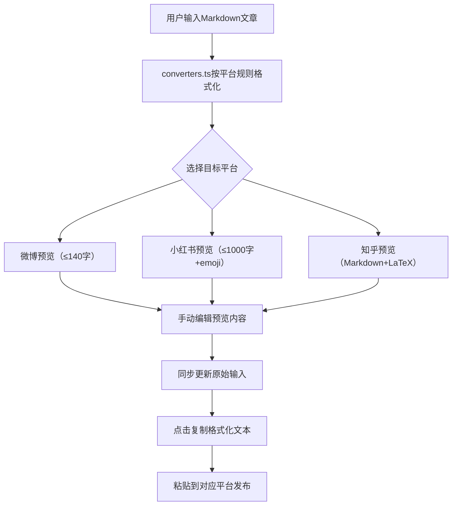

## 1. 产品概述

CrossPoster 是一款面向独立内容创作者的跨平台内容格式化与发布辅助工具，解决在微博、小红书、知乎三个社交平台重复发布文章时手动调整格式和标签耗时易错的问题。用户输入一篇 Markdown 原始文章，系统自动预览各平台渲染效果，支持手动编辑和一键复制，所有逻辑在前端完成，无需后端。

## 2. 核心功能

### 2.1 用户角色

| 角色 | 注册方式 | 核心权限 |
|------|----------|----------|
| 内容创作者 | 无需注册 | 输入文章、预览、编辑、复制 |

### 2.2 功能模块

1. **输入页面**：Markdown 文本输入、字数统计、粘贴按钮、实时预览小窗
2. **预览页面**：平台切换标签、三平台渲染预览、手动编辑、一键复制

### 2.3 页面详情

| 页面名称 | 模块名称 | 功能描述 |
|----------|----------|----------|
| 主页面 | 输入区 | 至少2000字文本域，深灰背景，实时字数统计（微博超140字红色闪烁），粘贴按钮自动粘贴剪贴板并清空原有内容 |
| 主页面 | 平台切换标签 | 微博/小红书/知乎三标签横向排列，激活标签底色为平台主色，切换滑入滑出动画0.3秒 |
| 主页面 | 预览区 | 选中平台预览卡片，使用marked渲染Markdown并通过DOMPurify过滤XSS，微博显示字数统计（超140红闪），小红书支持emoji，知乎支持LaTeX |
| 主页面 | 手动编辑 | 预览区为contentEditable元素，编辑后同步更新原始输入，光标位置浅蓝高亮 |
| 主页面 | 一键复制 | 每平台复制按钮，点击后复制格式化文本，按钮变绿1.5秒恢复，顶部绿色提示条2秒消失带滑出动画 |

## 3. 核心流程

用户打开应用 → 在左栏输入Markdown文章（或粘贴剪贴板内容） → 右栏默认显示微博预览 → 点击标签切换到小红书/知乎查看预览 → 在预览区内直接编辑微调 → 点击"复制格式化文本"按钮复制到剪贴板 → 粘贴到对应平台发布

## 4. 用户界面设计

### 4.1 设计风格

- 主色：深蓝渐变横幅（#1e3a5f到#2d6a9f），平台色分别为微博橙#ff6600、小红书红#ff2442、知乎蓝#056de8
- 按钮风格：圆角8px扁平按钮，悬停过渡0.2秒
- 字体：系统字体，标题加粗，正文常规
- 布局：左右两栏（45%/55%），响应式800px以下上下排列
- 整体风格：简洁扁平，浅阴影，圆角统一

### 4.2 页面设计概览

| 页面名称 | 模块名称 | UI元素 |
|----------|----------|--------|
| 主页面 | 顶部横幅 | 深蓝渐变背景，高度80px，居中显示"CrossPoster"白色28px字重600 |
| 主页面 | 输入区 | 深灰背景#1f2937，白色文字，圆角8px，内边距16px，右下角灰色字数统计 |
| 主页面 | 平台标签 | 三标签横向排列，激活标签平台主色背景，未激活浅灰#e5e7eb，圆角8px，滑入滑出动画 |
| 主页面 | 预览卡片 | 白色背景，圆角16px，浅阴影，最大高度600px超出滚动，图片圆角8px最大宽100% |
| 主页面 | 复制按钮 | 圆角8px，平台主色背景，白色文字，宽度120px，复制后变绿1.5秒 |
| 主页面 | 提示条 | 背景#ecfdf5，边框#10b981，圆角8px，2秒后滑出消失 |

### 4.3 响应式

- 桌面优先，视口≥800px：左右两栏布局
- 视口<800px：上下排列，输入区高度固定300px，预览区自适应
- 整体最大宽度1400px居中，两侧留白

### 4.4 3D场景指导

不适用
