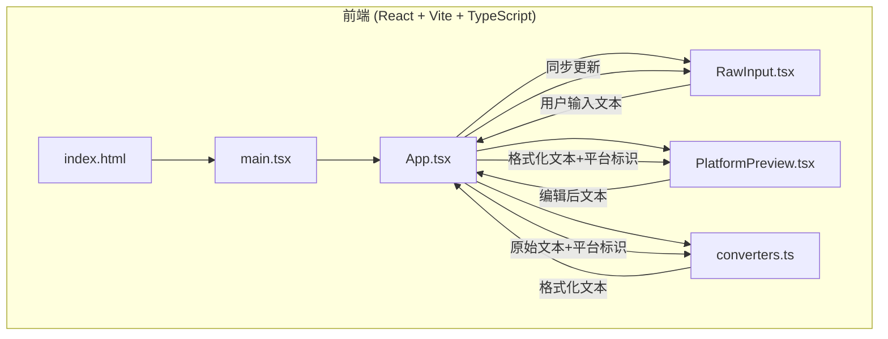
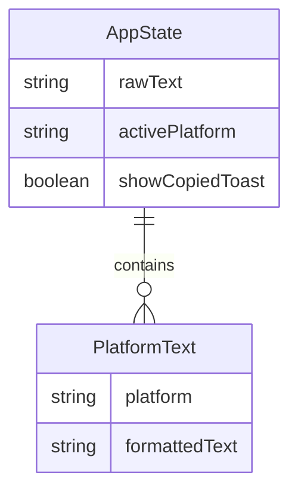

## 1. 架构设计



## 2. 技术说明

- 前端：React 18 + TypeScript（严格模式）+ Vite
- 初始化工具：vite-init（react-ts 模板）
- 后端：无（纯前端应用）
- 数据库：无（所有数据在前端内存中处理）
- 核心依赖：marked（Markdown解析）、dompurify（XSS过滤）
- 样式方案：CSS Modules / 内联样式（无Tailwind，用户指定依赖中无Tailwind）

## 3. 路由定义

| 路由 | 用途 |
|------|------|
| / | 单页面应用，所有功能在同一页面 |

## 4. API定义

无后端API，所有逻辑在前端完成。

## 5. 服务器架构图

不适用（纯前端应用）

## 6. 数据模型

### 6.1 数据模型定义



### 6.2 核心类型定义

```typescript
type Platform = 'weibo' | 'xiaohongshu' | 'zhihu';

interface PlatformConfig {
  id: Platform;
  name: string;
  color: string;
  maxChars: number;
  supportsEmoji: boolean;
  supportsLatex: boolean;
  supportsMarkdown: boolean;
}
```

## 7. 文件结构与调用关系

```
├── package.json              # 依赖和启动脚本
├── vite.config.js            # Vite配置，React插件
├── tsconfig.json             # TypeScript严格模式配置
├── index.html                # 入口页面，加载main.tsx
└── src/
    ├── main.tsx              # 应用入口，渲染App组件
    ├── App.tsx               # 主组件，维护全局状态，调用转换器和子组件
    ├── utils/
    │   └── converters.ts     # 纯函数，接收Markdown+平台标识→返回格式化文本
    └── components/
        ├── RawInput.tsx      # 输入组件，用户输入→通知App更新原始文本
        └── PlatformPreview.tsx # 预览组件，接收格式化文本+平台标识→渲染预览
```

### 数据流向

1. **输入流**：用户在RawInput输入 → App.tsx更新rawText状态 → converters.ts根据当前平台格式化 → PlatformPreview渲染预览
2. **编辑流**：用户在PlatformPreview中编辑contentEditable → App.tsx接收编辑后文本 → 更新rawText → RawInput同步显示
3. **复制流**：用户点击复制按钮 → navigator.clipboard.writeText → 显示提示条 → 1.5秒恢复按钮 / 2秒消失提示

## 8. 性能约束

- Markdown渲染防抖200ms
- 复制操作延迟不超过50ms
- 首屏加载时间（DOMContentLoaded）不超过1.5秒
