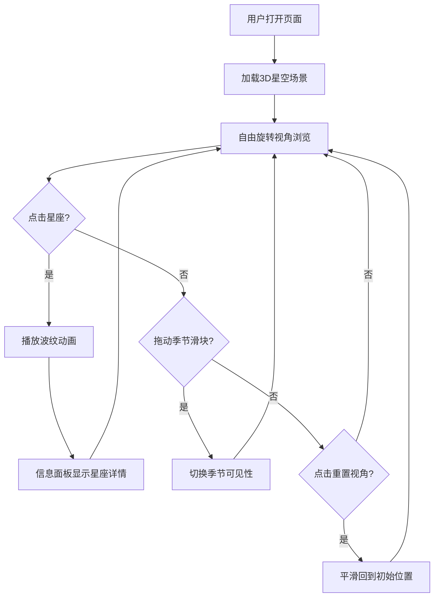

## 1. 产品概述

SkyExplorer 是一款基于 3D 场景的夜空星座探索应用，旨在为天文爱好者与学生提供沉浸式的星座学习与交互体验。通过 Three.js 构建的真实感夜空场景，用户可以自由旋转视角、点击星座查看详情，并观察星座在不同季节的可见性变化，比传统星图更具沉浸感和交互性。

- 目标用户：天文爱好者、天文课程学生、科普教育工作者
- 核心价值：以 3D 交互方式替代平面星图，提升星座学习的沉浸感和趣味性

## 2. 核心功能

### 2.1 功能模块

1. **星空主场景**：3D 深空背景 + 500 颗随机星星 + 6 个预置星座的连线与主星标记
2. **星座交互**：点击星座查看详情、悬停主星放大高亮、波纹动画反馈
3. **信息面板**：右侧面板展示选中星座的名称、亮星数、最佳观测季节、神话故事
4. **季节切换**：底部滑块控制季节，动态改变星座可见性与样式
5. **导航栏**：项目名称 + 重置视角按钮

### 2.2 页面详情

| 页面名称 | 模块名称 | 功能描述 |
|----------|----------|----------|
| 星空主页面 | 3D 星空场景 | 深空渐变背景（#05051a→#0f0f2e），500颗随机星星（半径0.5-2px，透明度0.3-0.9），6个星座连线与主星标记 |
| 星空主页面 | 星座交互 | 鼠标拖拽旋转（OrbitControls，缩放0.5x-5x），点击星座显示波纹动画，悬停主星放大变色 |
| 星空主页面 | 信息面板 | 右侧280px宽，深蓝半透明毛玻璃背景，显示星座详情；窄屏变为底部抽屉 |
| 星空主页面 | 季节滑块 | 底部横向滑块，宽400px，切换季节时星座可见性变化（夏季星座高亮+黄色连线，非当季星座变暗） |
| 星空主页面 | 导航栏 | 顶部50px高，半透明深蓝背景，左侧项目名，右侧重置视角按钮 |

## 3. 核心流程

用户打开页面 → 看到北半球夜空3D场景 → 可拖拽旋转视角浏览星空 → 点击星座触发波纹动画并显示信息面板 → 拖动季节滑块切换季节 → 对应星座高亮/变暗 → 点击"重置视角"回到初始位置

## 4. 用户界面设计

### 4.1 设计风格

- 主色调：深空蓝紫渐变（#05051a → #0f0f2e → #1e1b4b）
- 强调色：靛蓝紫 #a5b4fc、亮蓝 #60a5fa、亮黄 #fbbf24
- 按钮风格：圆角8px，深紫背景 #312e81，悬停变亮 #4338ca
- 字体：无衬线体，主标题16px加粗，正文14px常规
- 布局：全屏3D画布 + 浮动UI面板叠加

### 4.2 页面设计概述

| 页面名称 | 模块名称 | UI要素 |
|----------|----------|--------|
| 星空主页面 | 导航栏 | 高度50px，半透明深蓝背景#0f172a，底部1px边框#334155，左侧标题"SkyExplorer"，右侧重置按钮 |
| 星空主页面 | 3D星空 | 深空渐变背景，白色小圆点星星，蓝色发光主星，白色半透明连线 |
| 星空主页面 | 信息面板 | 宽280px，背景#1e1b4b半透明毛玻璃，圆角16px，内边距20px |
| 星空主页面 | 季节滑块 | 宽400px，轨道#312e81，滑块#a5b4fc带白色光晕，下方季节文字 |
| 星空主页面 | 波纹动画 | 白色圆环0→80px，透明度0.6→0，持续0.5秒 |

### 4.3 响应式

- 桌面优先设计，保持16:9比例填充
- 最小适配宽度800px
- 窄屏设备（宽度<768px）：右侧信息面板变为底部抽屉（高度300px，圆角20px向上收拢）

### 4.4 3D场景指引

- 环境：深空渐变背景模拟夜空，无HDRI，纯色+渐变
- 光照：无方向光，使用自发光材质（MeshBasicMaterial）模拟星空
- 相机：PerspectiveCamera，FOV 60°，初始位置面向北半球星空
- 构图：星座分布在球面内，用户可自由旋转
- 交互：OrbitControls拖拽旋转，Raycaster点击检测，悬停高亮
- 动画：主星发光脉冲、波纹扩散、季节切换过渡
- 性能：500粒子+6组连线+40主星，目标60FPS，加载<2秒

## 5. 星座数据

| 星座名称 | 主星数 | 最佳观测季节 | 神话故事简述 |
|----------|--------|------------|------------|
| 大熊座 | 7 | 春季 | 宙斯爱上了美丽的仙女卡利斯托，将她化为大熊放在天上保护 |
| 猎户座 | 7 | 冬季 | 猎人俄里翁被毒蝎蛰死后被宙斯升上天空成为星座 |
| 仙后座 | 5 | 秋季 | 埃塞俄比亚王后卡西奥佩亚因自负被罚永远在天空旋转 |
| 天鹅座 | 6 | 夏季 | 宙斯化身天鹅去接近斯巴达王后勒达 |
| 武仙座 | 7 | 夏季 | 大力神赫拉克勒斯完成十二项功绩后被升入星空 |
| 天琴座 | 5 | 夏季 | 俄耳甫斯的竖琴，他的音乐能让万物动容 |
