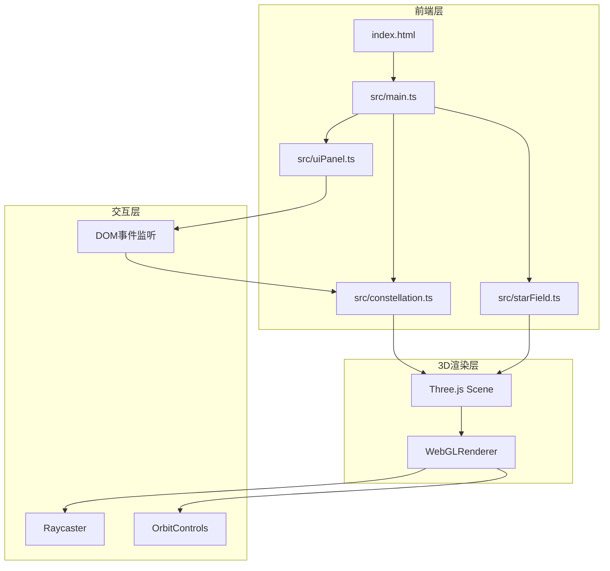

## 1. 架构设计



## 2. 技术说明

- 前端框架：纯 TypeScript + Three.js（无React/Vue）
- 构建工具：Vite
- 3D引擎：Three.js + OrbitControls
- 模块系统：ES Module（TypeScript strict模式，moduleResolution: bundler）
- 无后端服务，所有数据前端内嵌

## 3. 路由定义

单页应用，无路由。所有功能在一个3D场景页面内完成。

## 4. 文件结构

```
skyexplorer/
├── package.json          # 依赖：three, vite, typescript, @types/three
├── vite.config.js        # Vite配置，serve与resolve别名
├── tsconfig.json         # strict模式，moduleResolution bundler
├── index.html            # 入口HTML，引入src/main.ts
└── src/
    ├── main.ts           # 场景初始化、相机、渲染器、OrbitControls、resize、主循环
    ├── starField.ts      # 500颗随机星星粒子系统
    ├── constellation.ts  # 星座数据、连线、主星、季节切换、点击交互、波纹动画
    └── uiPanel.ts        # 右侧信息面板、底部季节滑块、DOM事件
```

## 5. 模块职责

### 5.1 main.ts
- 创建 Scene、PerspectiveCamera（FOV 60°）、WebGLRenderer
- 初始化 OrbitControls（旋转无限制，缩放0.5x-5x）
- 调用 starField 和 constellation 模块初始化星空
- 调用 uiPanel 模块初始化UI
- 监听 window resize，保持16:9比例适配
- requestAnimationFrame 主循环：render + 更新动画

### 5.2 starField.ts
- 导出 `createStarField(scene: THREE.Scene): THREE.Points`
- 生成500颗随机分布的星星（球面坐标，半径范围0-500）
- 每颗星星属性：半径0.5-2px、透明度0.3-0.9
- 使用 Points + BufferGeometry + PointsMaterial

### 5.3 constellation.ts
- 定义6个星座的数据结构（名称、主星坐标、连线关系、亮星数、季节、神话故事）
- 导出 `createConstellations(scene: THREE.Scene): ConstellationGroup[]`
- 每个星座：Line连线（#a5b4fc，透明度0.6，线宽2px）+ 主星Mesh（蓝色发光球体，半径6px，径向渐变#60a5fa→透明）
- 悬停效果：主星放大到8px，变为白色#ffffff，0.3秒过渡
- 导出 `updateSeason(season: Season): void`
  - 当季星座：主星高亮增大到10px，连线变粗3px变为亮黄色#fbbf24
  - 非当季星座：透明度降至0.2
- 点击交互：Raycaster检测主星点击，触发选中事件
- 波纹动画：点击时创建白色圆环，0→80px，透明度0.6→0，0.5秒

### 5.4 uiPanel.ts
- 导出 `initUIPanel(onSeasonChange, onConstellationSelect): void`
- 创建右侧信息面板（280px宽，#1e1b4b半透明毛玻璃，圆角16px，内边距20px）
- 创建导航栏（50px高，#0f172a半透明，重置视角按钮）
- 创建底部季节滑块（400px宽，轨道#312e81，滑块#a5b4fc带光晕）
- 监听滑块变化，回调通知星座模块更新可见性
- 响应式：宽度<768px时信息面板变为底部抽屉（300px高）

## 6. 数据模型

### 6.1 星座数据定义

```typescript
type Season = 'spring' | 'summer' | 'autumn' | 'winter';

interface ConstellationData {
  name: string;
  nameZh: string;
  starCount: number;
  bestSeason: Season;
  mythStory: string;
  stars: THREE.Vector3[];
  connections: [number, number][];
}

interface ConstellationGroup {
  data: ConstellationData;
  stars: THREE.Mesh[];
  lines: THREE.Line[];
}
```

### 6.2 季节映射

| 季节 | 英文 | 对应高亮星座 |
|------|------|------------|
| 春季 | spring | 大熊座 |
| 夏季 | summer | 天鹅座、武仙座、天琴座 |
| 秋季 | autumn | 仙后座 |
| 冬季 | winter | 猎户座 |
