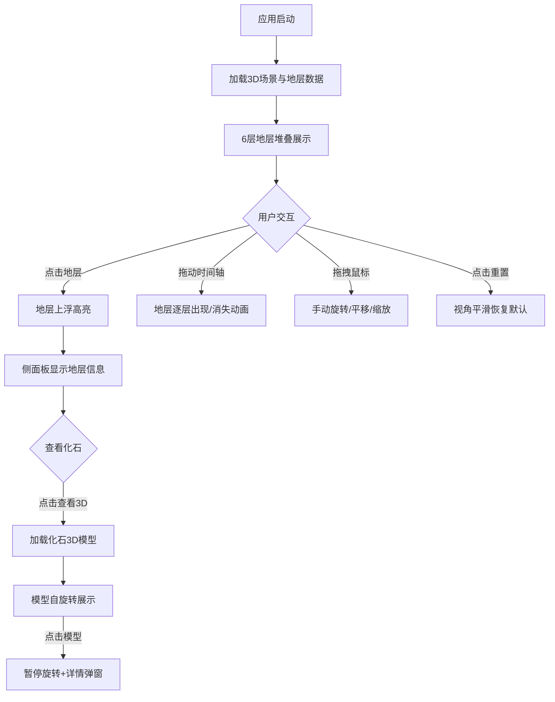

## 1. 产品概述

StrataViewer 是一款面向地质学/建筑学教育场景的交互式3D地层剖面可视化与教学工具，旨在替代实体模型或2D示意图，让学生能在浏览器中自由剥离不同地质年代的地层，查看每层包含的化石与矿物标本。
- 目标用户：地质学/建筑学专业学生、教育工作者
- 核心价值：通过沉浸式3D交互，直观理解沉积盆地的地层结构、地质年代序列和古生物化石分布

## 2. 核心功能

### 2.1 用户角色
| 角色 | 注册方式 | 核心权限 |
|------|----------|----------|
| 学生/教育者 | 无需注册 | 浏览地层、交互剥离、查看化石3D模型 |

### 2.2 功能模块
1. **主3D场景页**：沉积盆地地层模型、时间轴滑块、信息面板、FPS计数器、重置视角

### 2.3 页面详情
| 页面名称 | 模块名称 | 功能描述 |
|----------|----------|----------|
| 主3D场景 | 地层切片堆叠模型 | 6层不同地质年代的半透明地层切片堆叠，点击选中高亮上浮 |
| 主3D场景 | 时间轴滑块 | 拖动滑块控制地层按沉积顺序逐层出现/消失，支持速度调节 |
| 主3D场景 | 侧边信息面板 | 显示选中地层详情与化石列表，化石可3D预览 |
| 主3D场景 | 化石3D查看器 | 在场景中心加载化石几何体模型，自旋转，可暂停查看详情 |
| 主3D场景 | FPS计数器 | 左上角实时帧率显示，低于30帧变红 |
| 主3D场景 | 重置视角按钮 | 右上角圆形按钮，点击恢复默认视角并平滑过渡 |

## 3. 核心流程

用户打开应用 → 3D场景加载6层地层模型 → 场景自动缓慢旋转 → 用户通过鼠标拖拽旋转/平移/缩放 → 用户点击某地层 → 地层上浮高亮 → 侧面板显示地层信息与化石列表 → 用户点击化石"查看3D" → 场景中心显示化石3D模型（自旋转） → 用户点击化石模型暂停旋转并显示详情弹窗 → 用户拖动时间轴滑块 → 地层按年代顺序逐层出现/消失动画 → 用户点击重置视角按钮恢复默认视角

## 4. 界面设计

### 4.1 设计风格
- 主色调：深空灰 #0f172a（主背景）、次级背景 #1e293b
- 强调色：亮蓝 #3b82f6（进度条、辉光）、绿 #4ade80（FPS）、蓝 #60a5fa（化石轮廓线）
- 按钮风格：圆角8px，悬停放大1.05倍并加深阴影，点击0.1秒缩放反馈
- 字体：标题白色粗体20px，正文浅灰色
- 布局：左侧3D场景+顶部标题栏，右侧320px信息面板
- 图标风格：简洁线性图标（lucide-react）

### 4.2 页面设计概览
| 页面名称 | 模块名称 | UI元素 |
|----------|----------|--------|
| 主3D场景 | 顶部标题栏 | 左侧"StrataViewer"白色粗体标题+版本号，深色半透明背景 |
| 主3D场景 | 3D场景区 | 6层半透明地层切片堆叠，自动缓慢旋转，OrbitControls交互 |
| 主3D场景 | 侧边信息面板 | 320px宽，毛玻璃效果深灰背景，地层信息+化石卡片列表 |
| 主3D场景 | 时间轴滑块 | 深色#334155背景+亮蓝#3b82f6进度条，20px圆形拖动手柄，蓝色辉光 |
| 主3D场景 | 化石3D查看 | 场景中心化石模型+自发光边缘轮廓线，纯黑半透明遮罩 |
| 主3D场景 | FPS计数器 | 左上角绿色#4ade80 14px，低于30帧红色#ef4444 |
| 主3D场景 | 重置视角按钮 | 右上角圆形白色图标，点击0.5秒平滑过渡 |

### 4.3 响应式设计
- 桌面优先设计（≥768px）
- 宽度<768px时：信息面板变为底部浮动半透明抽屉（高度自适应，可上滑展开），时间轴移至场景底部中央

### 4.4 3D场景指引
- 环境：深色空旷空间，无HDRI，使用环境光+方向光
- 光照：AmbientLight（强度0.4）+ DirectionalLight（强度0.8，投射阴影）
- 相机：PerspectiveCamera，默认位置(0, 80, 200)，lookAt原点
- 交互：OrbitControls，阻尼0.1，缩放范围0.5-3，自动旋转0.1度/帧
- 动画：地层上浮0.3秒、时间轴1.5秒ease-in-out、视角重置0.5秒
- 后处理：无需额外后处理，保持45fps以上性能
