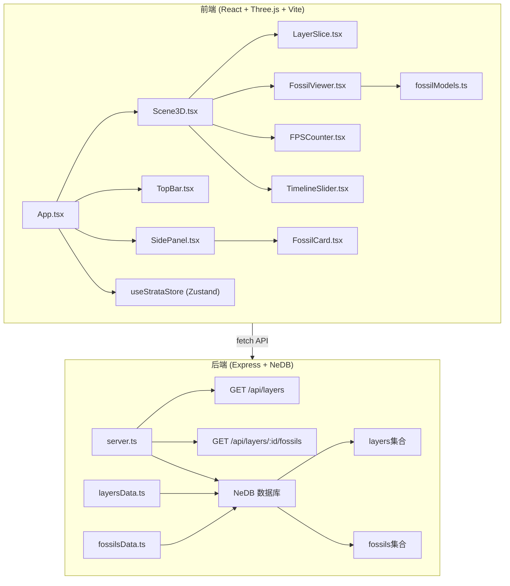
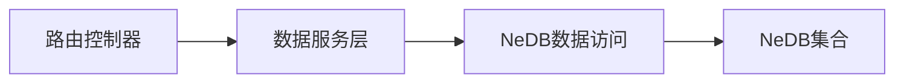
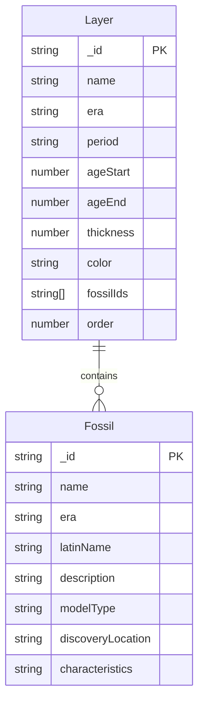

## 1. 架构设计



## 2. 技术说明
- 前端：React@18 + TypeScript + Vite + Three.js + @react-three/fiber + @react-three/drei
- 状态管理：Zustand（管理选中地层、时间轴进度、化石查看状态）
- 样式：CSS Modules + Tailwind CSS
- 后端：Express@4 + TypeScript + nedb-promises
- 数据库：NeDB（嵌入式，无需外部数据库服务）
- 初始化工具：vite-init (react-express-ts 模板)

## 3. 路由定义
| 路由 | 用途 |
|------|------|
| / | 主3D场景页，包含地层模型、时间轴、信息面板 |

## 4. API 定义

### 4.1 获取所有地层元数据
```
GET /api/layers
Response: Layer[]
```

```typescript
interface Layer {
  _id: string;
  name: string;
  era: string;
  period: string;
  ageStart: number;
  ageEnd: number;
  thickness: number;
  color: string;
  fossilIds: string[];
  order: number;
}
```

### 4.2 获取指定地层的化石标本详情
```
GET /api/layers/:id/fossils
Response: Fossil[]
```

```typescript
interface Fossil {
  _id: string;
  name: string;
  era: string;
  latinName: string;
  description: string;
  modelType: string;
  discoveryLocation: string;
  characteristics: string;
}
```

## 5. 服务器架构图



## 6. 数据模型

### 6.1 数据模型定义



### 6.2 数据定义语言

**layers集合初始数据：**

| 序号 | 名称 | 地质年代 | 年代范围(亿年前) | 厚度(m) | 主颜色 | 化石 |
|------|------|----------|-----------------|---------|--------|------|
| 1 | 寒武纪地层 | 古生代-寒武纪 | 5.41-4.85 | 随机100-400 | #8B4513 | 三叶虫、直角石、舌形贝 |
| 2 | 奥陶纪地层 | 古生代-奥陶纪 | 4.85-4.44 | 随机100-400 | #7B5B3A | 菊石、星珊瑚、直角石 |
| 3 | 志留纪地层 | 古生代-志留纪 | 4.44-4.19 | 随机100-400 | #8B7355 | 蝙蝠虫、舌形贝、星珊瑚 |
| 4 | 石炭纪地层 | 古生代-石炭纪 | 3.59-2.99 | 随机100-400 | #A0825A | 芦木、鳞木、科达叶 |
| 5 | 侏罗纪地层 | 中生代-侏罗纪 | 2.01-1.45 | 随机100-400 | #C4A35A | 楔叶、硅化木、菊石 |
| 6 | 第四纪地层 | 新生代-第四纪 | 0.026-0 | 随机100-400 | #F5DEB3 | 猛犸象牙齿 |

**fossils集合初始数据：**

| 名称 | 生存年代 | 拉丁学名 | 模型类型 |
|------|----------|----------|----------|
| 三叶虫 | 寒武纪-二叠纪 | Trilobita | trilobite |
| 菊石 | 泥盆纪-白垩纪 | Ammonoidea | ammonite |
| 直角石 | 奥陶纪-志留纪 | Orthoceras | orthoceras |
| 星珊瑚 | 志留纪-现代 | Favosites | coral |
| 蝙蝠虫 | 寒武纪 | Drepanura | batbug |
| 舌形贝 | 寒武纪-现代 | Lingula | lingula |
| 芦木 | 石炭纪-二叠纪 | Calamites | calamites |
| 鳞木 | 石炭纪-二叠纪 | Lepidodendron | lepidodendron |
| 科达叶 | 石炭纪-二叠纪 | Cordaites | cordaites |
| 楔叶 | 石炭纪-二叠纪 | Sphenophyllum | sphenophyllum |
| 硅化木 | 三叠纪-现代 | Petrified Wood | petrifiedwood |
| 猛犸象牙齿 | 更新世 | Mammuthus | mammothtusk |
