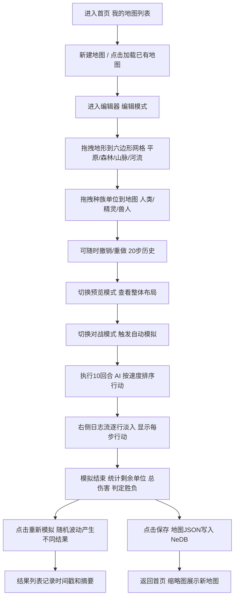

## 1. 产品概述

HexWar Map Studio 是一款面向棋盘游戏爱好者的浏览器端策略地图设计与平衡测试工具，解决手动绘制地图和用纸笔推演对战效率低下的问题。用户可以通过可视化编辑器快速布局六边形战场地形、放置三大种族（人类、精灵、兽人）的初始部队，并运行自动化对战模拟来验证种族间的平衡性设定。

### 核心价值
- 将数小时的手工绘图推演工作缩短至分钟级
- 提供可量化的平衡性测试数据，辅助桌游设计决策
- 支持地图保存与加载，便于迭代设计

## 2. 核心功能

### 2.1 用户角色
本产品为单角色桌面工具，无需登录注册，所有本地地图数据通过 localStorage + NeDB 持久化存储。

### 2.2 功能模块
1. **首页（我的地图）**：地图列表、缩略图预览、新建/加载/删除地图
2. **地图编辑器**：六边形网格画布、左侧组件面板、底部工具栏、右侧对战结果面板
3. **地形编辑系统**：拖拽放置四种地形（平原/森林/山脉/河流）、撤销重做、选中高亮
4. **单位部署系统**：三大种族单位拖拽放置、属性配置、脉冲选中动画
5. **对战模拟引擎**：10 回合自动 AI 对战、行动日志流式输出、战后统计与胜负判定
6. **结果历史记录**：多次模拟结果时间戳列表、一键重新模拟、平衡性对比

### 2.3 页面详情
| 页面名称 | 模块名称 | 功能描述 |
|---------|---------|---------|
| 首页 | 地图列表 | 显示已保存地图的卡片式列表，含 100×100 缩略图、名称、最后编辑时间 |
| 首页 | 操作区 | 新建地图按钮、删除地图按钮、搜索/筛选 |
| 编辑器 | 组件面板（左） | 地形元素拖拽区（4 种）、种族单位拖拽区（3 种族多种单位） |
| 编辑器 | 主画布 | 1000×800 六边形网格渲染、地形放置、单位放置、拖拽选中、预览模式缩放平移 |
| 编辑器 | 工具栏（底） | 编辑/预览/对战三模式切换、撤销/重做按钮（最多 20 步历史） |
| 编辑器 | 结果面板（右） | 对战日志流（逐行淡入）、统计卡片（剩余单位/总伤害）、历史结果列表、重新模拟按钮 |

## 3. 核心流程

用户从首页进入编辑器 → 在左侧面板拖拽地形元素到六边形网格上完成地形布局 → 拖拽三个种族的单位到地图对应位置 → 点击底部"对战模式"按钮触发 10 回合自动模拟 → 右侧面板实时显示每步行动日志和伤害数字 → 模拟结束后展示各回合统计、获胜方判定 → 可点击"重新模拟"基于相同地图再次测试（带随机波动）并保存到历史记录 → 点击保存按钮将地图写入后端 NeDB 存储。



## 4. 用户界面设计

### 4.1 设计风格
- **整体主题**：深色工业风 / 军事指挥室美学，深蓝灰为主色调，荧光绿和战术红为点缀
- **主背景**：#0f172a（深蓝黑），卡片背景 #1e293b（深蓝灰），文字 #cbd5e1（浅灰蓝）
- **交互过渡**：所有可点击元素 0.3s 淡入淡出（background-color + transform），hover 时轻微上浮 2px
- **选中动画**：六边形地形被选中或放置单位时 pulse 脉冲（scale 1→1.05→1，0.5s 循环 1 次）
- **结果日志**：逐行动态插入，每行带 0.2s 淡入 slide-down

### 4.2 色彩系统
| 用途 | 色值 | 说明 |
|-----|------|-----|
| 页面主背景 | #0f172a | 深蓝黑，营造指挥室氛围 |
| 卡片/面板背景 | #1e293b | 深蓝灰，毛玻璃模糊效果 |
| 网格线 | #334155 | 蜂巢网格辅助线 |
| 主文字 | #cbd5e1 | 浅灰蓝，保证对比度 |
| 平原地形 | #a3e635 | 荧光嫩绿 |
| 森林地形 | #16a34a | 深墨绿 |
| 山脉地形 | #6b7280 | 中性灰 |
| 河流地形 | #38bdf8 | 天蓝色，带动画流动线条 |
| 人类阵营 | #3b82f6 | 蓝色系 |
| 精灵阵营 | #a855f7 | 紫色系 |
| 兽人阵营 | #ef4444 | 红色系 |
| 主要按钮（重新模拟） | #22c55e → #16a34a | 绿色渐变，悬停变深 |

### 4.3 布局结构
```
┌─────────────────────────────────────────────────────────────────────────┐
│  顶部标题栏 HexWar Map Studio                                          │
├─────────────┬───────────────────────────────────────────┬───────────────┤
│             │                                           │               │
│  组件面板    │             主画布区域                    │   结果面板     │
│  220px      │         1000×800 Canvas                   │   300px       │
│  毛玻璃     │         flex-grow 自适应                 │  淡白背景     │
│             │                                           │  圆角8px      │
│  地形列表   │                                           │  日志滚动区   │
│  单位列表   │                                           │  统计卡片     │
│             │                                           │  历史列表     │
├─────────────┴───────────────────────────────────────────┴───────────────┤
│  底部工具栏 高60px  编辑模式 | 预览模式 | 对战模式   ↶撤销 ↷重做 保存   │
└─────────────────────────────────────────────────────────────────────────┘
```
整体采用 Flex 布局，左右面板固定宽度，中间画布区自适应缩放。

### 4.4 响应式
采用 Desktop-First 设计，最小窗口宽度 1600px（左220 + 中1000 + 右300 + 间距），当窗口缩小时通过 CSS Transform 等比缩放主画布以保证完整显示。

### 4.5 动画与微交互
- **河流地形**：蓝色流动线条，使用 requestAnimationFrame 循环偏移 SVG path 位置
- **放置单位**：pulse 脉冲动画（缩放 + 边框发光）
- **日志流入**：每行从 opacity 0 translateY(-4px) 过渡到 opacity 1 translateY(0)，0.2s
- **模式切换**：整个面板淡出→切换内容→淡入，0.25s
- **按钮悬停**：translateY(-1px) + 背景色渐变 0.3s
