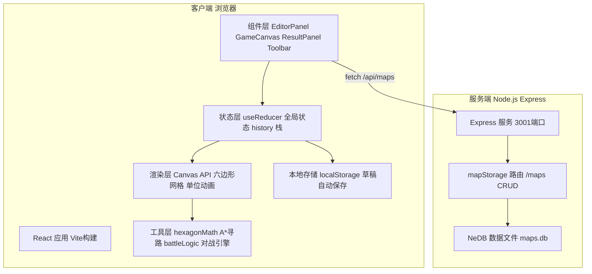
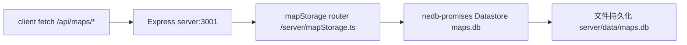
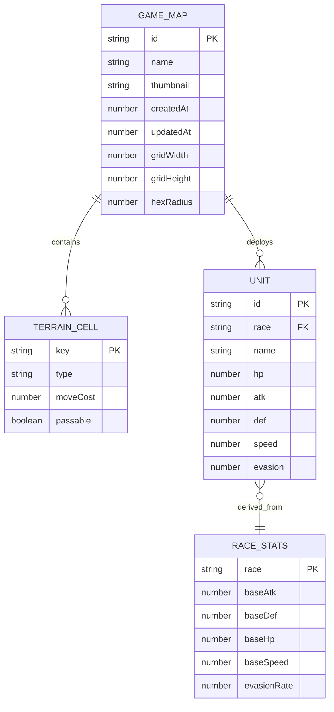

## 1. 架构设计

本项目采用前后端分离的轻量架构：前端为 React+Vite+TypeScript 单页应用负责画布渲染与交互，后端为 Node.js Express 提供地图 CRUD API，使用 NeDB（嵌入式文件数据库）持久化地图 JSON 数据。前端同时使用 localStorage 缓存当前编辑状态，实现快速恢复。



## 2. 技术选型说明

| 层级 | 技术栈 | 版本/说明 |
|------|--------|----------|
| 前端框架 | React 18 + React DOM | 函数组件 + Hooks，useReducer 管理复杂状态 |
| 构建工具 | Vite 5 | 热更新、ESM 构建、代理 /api 到后端 3001 |
| 语言 | TypeScript 5 | strict 严格模式，ESNext 模块 |
| 画布渲染 | Canvas 2D API | 直接操作像素，保证六边形绘制与动画帧率≥30FPS |
| 拖拽系统 | 原生 HTML5 Drag API + 自定义 drop 检测 | 不引入 react-dnd 以减少依赖 |
| 后端框架 | Express 4 | 轻量级 RESTful 服务 |
| 数据库 | nedb-promises | 嵌入式文件 DB，无需额外服务，JSON 格式持久化 |
| ID 生成 | uuid v4 | 地图与单位的唯一标识 |
| 进程管理 | concurrently | 同时启动 Vite 前端和 Express 后端 |
| HTTP 代理 | Vite server.proxy | /api → http://localhost:3001 |

## 3. 路由定义

| 前端路由 | 页面/组件 | 功能 |
|---------|----------|------|
| / | HomePage（地图列表页） | 显示我的地图列表、新建入口、加载/删除操作 |
| /editor/:mapId? | EditorPage（编辑器页） | 左侧面板+中央画布+右侧结果面板+底部工具栏 |

| 后端 API | 方法 | 参数 | 返回 | 功能 |
|---------|------|------|------|------|
| /api/maps | GET | - | Map[] | 获取所有地图列表（缩略图+元数据） |
| /api/maps/:id | GET | id | MapDetail | 根据 ID 获取地图完整数据 |
| /api/maps | POST | body: MapData | Map | 创建新地图 |
| /api/maps/:id | PUT | id + body: MapData | Map | 更新已有地图 |
| /api/maps/:id | DELETE | id | {success:true} | 删除指定地图 |

## 4. 核心类型定义

```typescript
// ===== 六边形与地形 =====
type HexCoord = { q: number; r: number }; // axial coordinates
type TerrainType = 'plain' | 'forest' | 'mountain' | 'river';

interface TerrainCell {
  coord: HexCoord;
  type: TerrainType;
  moveCost: number;       // 1/2/3/Infinity
  passable: boolean;      // river=false
}

// ===== 种族与单位 =====
type RaceType = 'human' | 'elf' | 'orc';

interface RaceStats {
  name: string;
  color: string;
  baseAtk: number;       // 人类8 精灵7 兽人10
  baseDef: number;       // 人类6 精灵5 兽人4
  baseHp: number;        // 人类30 精灵25 兽人35
  baseSpeed: number;     // 人类5 精灵7 兽人4
  evasionRate: number;   // 人类0.1 精灵0.3 兽人0.05
  atkWeight: number;     // 兽人高
  defWeight: number;     // 人类均衡
}

interface Unit {
  id: string;
  name: string;
  race: RaceType;
  coord: HexCoord;
  hp: number;
  maxHp: number;
  atk: number;
  def: number;
  speed: number;
  evasion: number;
}

// ===== 地图 =====
interface GameMap {
  id: string;
  name: string;
  thumbnail?: string;       // base64 100x100
  createdAt: number;
  updatedAt: number;
  gridWidth: number;        // 画布 1000
  gridHeight: number;       // 画布 800
  hexRadius: number;        // 40px
  terrains: Record<string, TerrainCell>;  // key = `${q},${r}`
  units: Unit[];
}

// ===== 对战 =====
interface BattleLogEntry {
  turn: number;
  timestamp: number;
  text: string;
  type: 'move' | 'attack' | 'damage' | 'kill' | 'info';
}

interface BattleStats {
  race: RaceType;
  remainingUnits: number;
  totalDamageDealt: number;
}

interface BattleResult {
  winner: RaceType | 'draw';
  logs: BattleLogEntry[];
  stats: BattleStats[];
  totalTurns: number;
}

interface HistoryRecord {
  id: string;
  timestamp: number;
  summary: string;          // "兽人获胜 剩余5单位"
  winner: RaceType | 'draw';
}
```

## 5. 服务端架构



| 文件 | 职责 |
|------|------|
| server/index.ts | Express 初始化，挂载 /api/maps 路由，CORS，静态托管，监听 3001 |
| server/mapStorage.ts | 定义 5 个 REST 端点，调用 NeDB 方法，处理错误 |

## 6. 数据模型

### 6.1 ER 图


### 6.2 文件结构

```
auto39/
├── .trae/documents/           # PRD & Tech Arch
├── server/
│   ├── index.ts               # Express 入口
│   └── mapStorage.ts          # /maps 路由 + NeDB
├── src/
│   ├── App.tsx                # 路由 & useReducer 全局状态
│   ├── components/
│   │   ├── EditorPanel.tsx    # 左侧拖拽面板
│   │   ├── GameCanvas.tsx     # Canvas 主画布
│   │   ├── ResultPanel.tsx    # 右侧日志+统计
│   │   └── Toolbar.tsx        # 底部工具栏
│   ├── utils/
│   │   ├── hexagonMath.ts     # 坐标转换 A*寻路 邻接
│   │   └── battleLogic.ts     # 种族属性 伤害计算 AI
│   └── main.tsx               # ReactDOM 挂载
├── index.html
├── package.json
├── tsconfig.json
└── vite.config.ts
```

## 7. 性能保障策略

| 场景 | 策略 |
|------|------|
| 编辑模式拖拽帧率≥30FPS | Canvas 仅重绘受影响六边形（脏矩形），requestAnimationFrame 批量渲染；离屏 canvas 缓存已绘制地形 |
| 日志流不卡顿 | 虚拟滚动+requestIdleCallback 插入 DOM；单页最多渲染最近 200 行，超出部分裁剪 |
| 单回合计算≤100ms | 纯同步 JS 计算 A*（最多 50 格），避免不必要的深拷贝；对象池复用战斗日志对象 |
| 缩略图生成 | 每次保存时离屏 canvas 以 100×100 尺寸重绘所有六边形并导出 base64 |
| 历史撤销/重做 | 深拷贝 terrains+units 快照存入数组，最多 20 条，超出自动丢弃最早项 |
