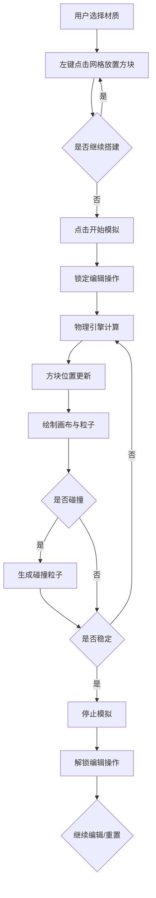

## 1. 产品概述

BlockForge是一款面向独立游戏制作人和物理爱好者的2D物理沙盒建造与模拟应用。用户可在浏览器中自由搭建由不同材质方块构成的建筑物或机关，通过真实物理引擎模拟重力和碰撞效果，验证结构的稳定性。

- 核心价值：提供直观易用的物理实验平台，降低物理模拟门槛
- 目标用户：独立游戏制作人、物理爱好者、教育工作者、学生

## 2. 核心功能

### 2.1 Feature Module
1. **主界面**：标题栏、工具栏、800x600网格画布
2. **方块系统**：木块、石块、铁块三种材质，各有不同物理属性
3. **物理模拟**：重力、碰撞、堆叠、稳定检测
4. **碰撞特效**：碰撞时产生粒子效果
5. **编辑控制**：放置/删除方块、撤销操作、清除全部
6. **模拟控制**：开始/暂停模拟、自动稳定检测

### 2.2 Page Details

| 页面名称 | 模块名称 | 功能描述 |
|----------|----------|----------|
| 主界面 | 标题栏 | 50px高度，居中显示"BlockForge"标题，深色背景 |
| 主界面 | 工具栏 | 左侧垂直排列（宽度200px），包含材质选择按钮、撤销、清除、模拟控制 |
| 主界面 | 网格画布 | 800x600像素，20x15网格线，支持左键放置、右键删除方块 |
| 主界面 | 粒子图层 | 独立Canvas图层，绘制碰撞粒子特效 |

## 3. 核心流程

用户选择方块材质 → 点击网格交叉点放置方块 → 重复搭建结构 → 点击开始模拟 → 物理引擎计算重力与碰撞 → 方块自由落体堆叠 → 碰撞产生粒子特效 → 系统检测稳定状态 → 自动停止模拟 → 可继续编辑或重置。

## 4. User Interface Design

### 4.1 Design Style
- **设计方向**：工业风/工程感，深色主题，突出物理实验氛围
- **主色调**：深紫蓝 #1e1e2e（工具栏背景）、深灰蓝 #282840（标题栏）
- **强调色**：蓝色 #3b82f6（选中外发光）、绿色 #22c55e（开始）、红色 #ef4444（清除）、橙色 #f59e0b（撤销）
- **方块材质色**：木块 #8B4513、石块 #808080、铁块 #333333
- **按钮风格**：圆角6-8px，悬停透明度0.2→0.3，点击缩放0.95→1.0（0.1s过渡）
- **字体**：使用JetBrains Mono等现代等宽字体，标题24px粗体，按钮文字清晰可读
- **布局**：左工具栏 + 右画布，标题栏置顶，整体居中对齐

### 4.2 Page Design Overview

| 页面名称 | 模块名称 | UI Elements |
|----------|----------|-------------|
| 主界面 | 标题栏 | 背景#282840，高度50px，文字#f0f0f0，24px粗体，居中 |
| 主界面 | 工具栏 | 背景#1e1e2e，宽度200px，内边距12px，按钮间距12px，垂直排列 |
| 主界面 | 材质按钮 | 40x40px，圆角6px，16x16px材质预览图标，选中时#3b82f6外发光 |
| 主界面 | 控制按钮 | 圆角8px，绿色/红色/橙色，悬停效果，点击缩放动画 |
| 主界面 | 画布区域 | 800x600px，背景#f0f0f0，2px#333边框，四周留白20px，网格线#d9d9d9 |
| 主界面 | 粒子图层 | 独立Canvas，z-index高于方块画布，透明背景 |

### 4.3 Responsiveness
- **设计原则**：Desktop-first，移动端自适应
- **断点1 < 900px**：工具栏变为顶部横条（高度60px），方块按钮水平排列
- **断点2 < 600px**：画布按比例缩放适应窗口宽度，保持4:3宽高比
- **触摸优化**：按钮最小尺寸44x44px，支持触摸放置方块

### 4.4 视觉细节
- 方块按y坐标升序绘制，营造堆叠层次感
- 碰撞粒子：白色，半径2-5px，透明渐变消失，持续0.3秒
- 模拟进行时按钮变灰禁用，提供明确状态反馈
- 所有过渡动画平滑自然，帧率锁定60FPS
