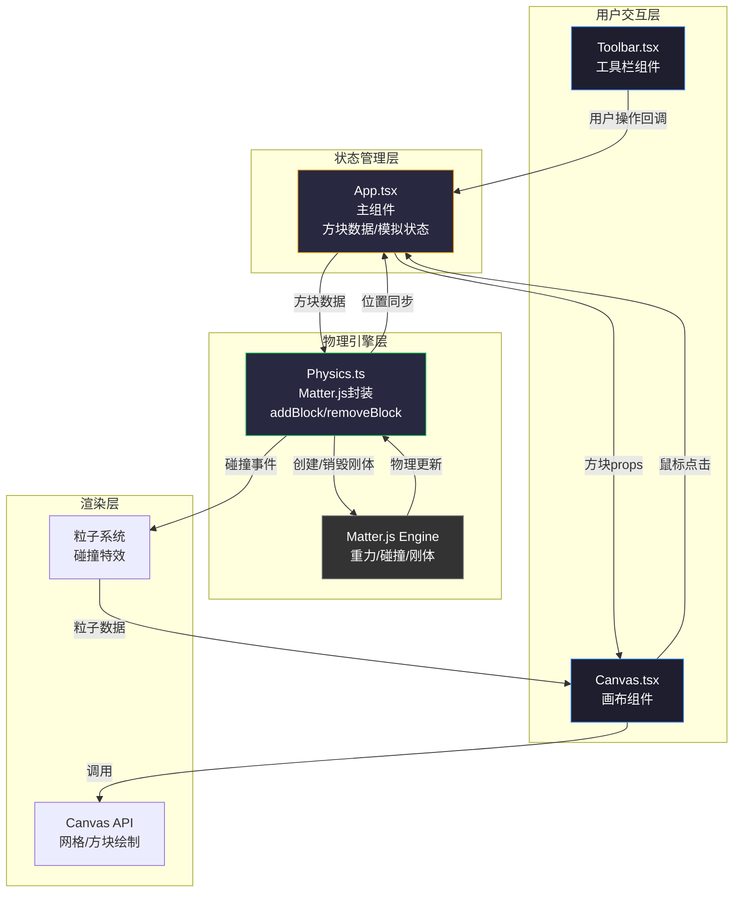

## 1. Architecture Design



**数据流向说明：**
1. 用户操作 → Toolbar/Canvas → App更新方块网格数据
2. App → Physics传递方块数据 → 创建/销毁Matter.js刚体
3. Matter.Engine.update → Physics回调 → App更新方块位置
4. App → Canvas传递最新props → 重绘画布
5. Physics碰撞事件 → 生成粒子 → Canvas叠加绘制

## 2. Technology Description

- **前端框架**: React@18 + TypeScript@5
- **构建工具**: Vite@5 + @vitejs/plugin-react@4
- **物理引擎**: matter-js@0.19 + @types/matter-js@0.19
- **状态管理**: React useState/useRef（轻量场景，无需zustand）
- **渲染方式**: Canvas 2D API（直接绘制，无需额外库）
- **样式方案**: 原生CSS + CSS变量，无Tailwind依赖
- **初始化方式**: vite-init react-ts模板

**文件结构与职责：**
```
src/
├── main.tsx          # 应用入口，渲染App到root
├── App.tsx           # 主组件：状态管理、模拟控制、数据流中枢
├── components/
│   ├── Canvas.tsx    # 画布组件：网格、方块、粒子绘制
│   └── Toolbar.tsx   # 工具栏组件：材质选择、控制按钮
├── physics/
│   └── Physics.ts    # 物理引擎模块：Matter.js封装
└── types/
    └── index.ts      # 类型定义：BlockType、BlockData、Particle等
```

**文件调用关系：**
- main.tsx → App.tsx
- App.tsx → Toolbar.tsx (props: selectedMaterial, isSimulating, callbacks)
- App.tsx → Canvas.tsx (props: blocks, particles, isSimulating, onClick)
- App.tsx → Physics.ts (methods: init, addBlock, removeBlock, reset)
- Physics.ts → App.tsx (callback: onPositionUpdate, onCollision, onStable)

## 3. Route Definitions

| 路由 | 页面 | 说明 |
|------|------|------|
| / | 主界面 | 唯一页面，包含完整沙盒功能 |

## 4. Data Model

### 4.1 类型定义

```typescript
// 方块材质类型
type BlockMaterial = 'wood' | 'stone' | 'iron';

// 方块物理属性配置
interface BlockMaterialConfig {
  density: number;      // 木块0.6, 石块2.0, 铁块3.5
  friction: number;     // 统一0.8
  restitution: number;  // 统一0.2
  color: string;        // 木块#8B4513, 石块#808080, 铁块#333333
  label: string;
}

// 方块数据（App状态）
interface BlockData {
  id: string;
  material: BlockMaterial;
  gridX: number;        // 网格坐标X (0-19)
  gridY: number;        // 网格坐标Y (0-14)
  x: number;            // 像素坐标X（模拟时更新）
  y: number;            // 像素坐标Y（模拟时更新）
  angle: number;        // 旋转角度（模拟时更新）
}

// 碰撞粒子
interface Particle {
  id: string;
  x: number;
  y: number;
  vx: number;
  vy: number;
  radius: number;       // 2-5px
  life: number;         // 剩余生命0-1
  maxLife: number;      // 0.3秒
}

// 历史记录（用于撤销）
interface HistoryAction {
  type: 'add' | 'remove';
  block: BlockData;
}

// 模拟状态
type SimulationState = 'idle' | 'simulating' | 'stable';
```

### 4.2 常量定义

```typescript
// 画布尺寸
const CANVAS_WIDTH = 800;
const CANVAS_HEIGHT = 600;

// 网格配置
const GRID_COLS = 20;
const GRID_ROWS = 15;
const CELL_SIZE = 40;  // 方块大小40x40px

// 物理配置
const GRAVITY = 1;
const FRICTION = 0.8;
const RESTITUTION = 0.2;

// 稳定检测
const STABLE_FRAME_THRESHOLD = 100;  // 连续100帧
const STABLE_TIMESTAMP_DELTA = 0.1;  // 时间戳变化小于0.1ms

// 粒子配置
const PARTICLES_PER_COLLISION = 10;
const PARTICLE_LIFETIME = 300;  // 0.3秒

// 撤销配置
const MAX_HISTORY_SIZE = 20;

// 材质配置表
const MATERIAL_CONFIGS: Record<BlockMaterial, BlockMaterialConfig> = {
  wood: { density: 0.6, friction: 0.8, restitution: 0.2, color: '#8B4513', label: '木块' },
  stone: { density: 2.0, friction: 0.8, restitution: 0.2, color: '#808080', label: '石块' },
  iron: { density: 3.5, friction: 0.8, restitution: 0.2, color: '#333333', label: '铁块' },
};
```

### 4.3 性能优化策略

1. **Canvas绘制优化**
   - 使用requestAnimationFrame控制60FPS
   - 方块按y坐标升序绘制，减少overdraw
   - 只在必要时重绘（模拟中每帧重绘，空闲时仅操作时重绘）

2. **物理引擎优化**
   - Matter.js引擎配置合适的时间步长
   - 限制最大方块数量200个
   - 稳定检测后及时停止模拟

3. **React渲染优化**
   - 使用useMemo缓存计算结果
   - 使用useCallback避免不必要的重渲染
   - Canvas组件接收简单props，避免复杂对象传递

4. **内存管理**
   - 粒子生命结束后及时清理
   - 撤销历史限制20步
   - 重置时完整清理物理引擎和状态
