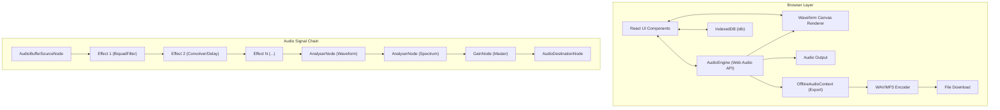

## 1. 架构设计

SoundCanvas 采用纯前端浏览器端架构，所有音频处理、可视化和数据存储均在客户端完成，无需后端服务。



## 2. 技术描述

- **前端框架**：React 18 + TypeScript 5 + Vite 5
- **UI 组件库**：Ant Design 5 + @ant-design/icons
- **音频处理**：原生 Web Audio API（AudioContext、BiquadFilterNode、ConvolverNode、DelayNode、GainNode、AnalyserNode、OfflineAudioContext）
- **数据持久化**：IndexedDB（通过 idb 库封装）
- **波形可视化**：原生 Canvas 2D API + requestAnimationFrame
- **状态管理**：React useState/useReducer + 自定义 hooks（无需额外状态库）
- **构建工具**：Vite 5，使用 @vitejs/plugin-react
- **样式方案**：原生 CSS（CSS Modules 或全局 CSS 变量），Ant Design 主题定制

## 3. 目录结构与路由定义

这是单页应用（SPA），无多路由配置。

### 核心文件结构
```
/
├── index.html
├── package.json
├── tsconfig.json
├── vite.config.js
└── src/
    ├── main.tsx              # 应用入口
    ├── App.tsx               # 根组件，布局与全局状态
    ├── index.css             # 全局样式，主题变量
    ├── core/
    │   └── AudioEngine.ts    # 音频引擎核心模块
    ├── components/
    │   ├── WaveformDisplay.tsx   # 波形+频谱显示
    │   ├── AudioTrack.tsx        # 音轨控制组件
    │   ├── EffectRack.tsx        # 效果器架（拖拽排序）
    │   └── AudioUploader.tsx     # 上传与录制组件
    └── utils/
        └── exportUtils.ts    # 导出工具（WAV/MP3 编码）
```

## 4. 核心模块接口定义

### 4.1 AudioEngine 类型定义

```typescript
type EffectType = 'lowpass' | 'reverb' | 'delay';

interface EffectParams {
  lowpass?: { frequency: number; Q: number };
  reverb?: { decay: number; wet: number };
  delay?: { time: number; feedback: number; wet: number };
}

interface EffectInstance {
  id: string;
  type: EffectType;
  enabled: boolean;
  params: EffectParams;
  order: number;
}

interface TrackState {
  id: string;
  name: string;
  duration: number;
  buffer: AudioBuffer | null;
  effects: EffectInstance[];
}

interface WaveformData {
  timeData: Float32Array;      // AnalyserNode 时域数据
  freqData: Uint8Array;        // AnalyserNode 频域数据
}

interface IAudioEngine {
  // 生命周期
  init(): Promise<void>;
  destroy(): void;
  
  // 音频加载
  loadAudioBuffer(file: File | ArrayBuffer): Promise<AudioBuffer>;
  loadFromArrayBuffer(buffer: ArrayBuffer): Promise<AudioBuffer>;
  setActiveBuffer(buffer: AudioBuffer, name: string): void;
  
  // 播放控制
  play(): void;
  pause(): void;
  stop(): void;
  seek(time: number): void;
  getCurrentTime(): number;
  getDuration(): number;
  isPlaying(): boolean;
  
  // 效果器管理
  addEffect(type: EffectType, index?: number): EffectInstance;
  removeEffect(id: string): void;
  reorderEffects(newOrder: string[]): void;
  toggleEffect(id: string): void;
  updateEffectParams(id: string, params: Partial<EffectParams>): void;
  getEffects(): EffectInstance[];
  
  // 可视化
  getWaveformData(): WaveformData;
  
  // 录制
  startRecording(): Promise<void>;
  stopRecording(): Promise<AudioBuffer>;
  isRecording(): boolean;
  
  // 导出
  exportAudio(format: 'wav' | 'mp3', sampleRate: 44100 | 48000): Promise<Blob>;
  
  // 事件
  on(event: 'play' | 'pause' | 'stop' | 'ended' | 'timeupdate', cb: () => void): void;
  off(event: string, cb: () => void): void;
}
```

### 4.2 IndexedDB Schema

```typescript
interface DBSchema {
  audioFiles: {
    key: string;       // 主键
    name: string;      // 文件名
    arrayBuffer: ArrayBuffer;  // 音频原始数据
    savedAt: number;   // 保存时间戳
  };
  effects: {
    key: string;       // 'current-effects'
    effects: EffectInstance[];
    savedAt: number;
  };
  settings: {
    key: string;
    sampleRate: number;
    format: string;
    savedAt: number;
  };
}
```

## 5. 性能优化策略

### 5.1 音频处理性能
- **效果器链复用**：播放时构建一次节点图，暂停/继续不重建
- **AnalyserNode 共享**：两个 AnalyserNode（时域+频域）串联避免重复处理
- **延迟节点使用 DelayNode**：不使用 ScriptProcessor（已废弃）
- **混响脉冲响应预生成**：首次使用时生成并缓存 ConvolverNode impulse response

### 5.2 渲染性能
- **Canvas 分层绘制**：波形静态数据预渲染到离屏 Canvas，仅更新播放进度遮罩
- **requestAnimationFrame 节流**：频谱数据每帧更新一次，波形数据每 2 帧更新一次
- **React.memo 优化**：纯展示组件使用 memo 避免不必要重渲染
- **拖拽排序使用 transform**：直接操作 DOM transform，不触发 React 重渲染

### 5.3 内存管理
- **AudioBuffer 及时释放**：切换音频时断开旧节点引用
- **IndexedDB 分块存储**：大音频文件分片存储，限制单个文件 50MB
- **离屏 Canvas 资源释放**：组件卸载时调用 canvas.width = 0 释放显存
