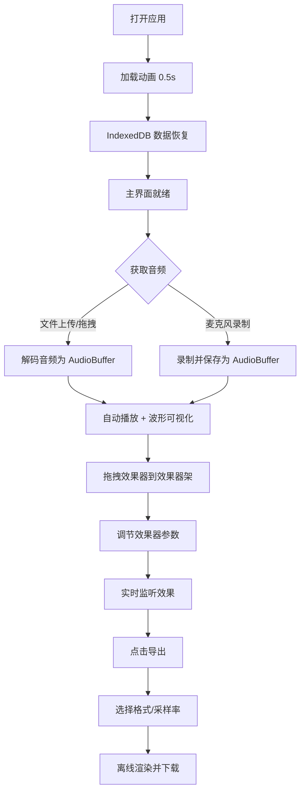

## 1. 产品概述
SoundCanvas 是一款基于 Web Audio API 的在线波形可视化与音效混合应用，允许用户在浏览器端完成音频录制、上传、可视化、效果处理和导出的全流程。
- 核心用途：为音乐爱好者、播客创作者提供轻量级的浏览器音频编辑工具
- 目标用户：音乐人、播客制作人、声音设计师、普通音频爱好者
- 产品价值：零安装、跨平台、即时可用的专业级音频处理体验

## 2. 核心功能

### 2.1 用户角色
| 角色 | 注册方式 | 核心权限 |
|------|----------|----------|
| 普通用户 | 无需注册（本地存储） | 上传音频、录制音频、添加效果器、导出音频 |

### 2.2 功能模块
1. **音频上传模块**：文件选择上传、拖拽上传、麦克风录制
2. **波形可视化模块**：实时波形曲线绘制、频谱柱状图、播放进度条
3. **音轨控制模块**：播放/暂停/停止按钮、进度条、录制功能、时长显示
4. **效果器架模块**：效果器拖拽添加、拖拽排序、启用/禁用开关、参数控制面板
5. **音频导出模块**：格式选择（WAV/MP3）、采样率选择、文件下载
6. **数据持久化模块**：IndexedDB 自动保存/恢复配置

### 2.3 页面详情
| 页面名称 | 模块名称 | 功能描述 |
|----------|----------|----------|
| 主编辑页 | 左侧效果器面板 | 展示可拖拽的效果器卡片（低通滤波、混响、延迟） |
| 主编辑页 | 中央音轨区 | 音轨信息展示、播放控制按钮、效果器架区域 |
| 主编辑页 | 右侧波形区 | 实时波形曲线、频谱柱状图、播放进度条 |
| 主编辑页 | 顶部工具栏 | 导出按钮、状态指示 |
| 主编辑页 | 上传/录制区 | 文件上传、拖放区域、麦克风录制 |

## 3. 核心流程

用户核心使用流程：
1. 用户打开应用 → 显示加载动画 → 从 IndexedDB 恢复已保存的音频和配置
2. 用户上传音频文件或点击录制按钮获取麦克风输入
3. 音频加载后自动播放，波形显示区实时绘制波形和频谱
4. 用户从左侧面板拖拽效果器卡片到效果器架
5. 用户点击效果器卡片打开参数面板，调节效果参数
6. 用户可拖拽效果器卡片重新排序，调整信号链顺序
7. 用户点击导出按钮，选择格式和采样率后下载处理后的音频

## 4. 用户界面设计

### 4.1 设计风格
- **主色调**：深色主题，主背景 `#0f172a`，内容区 `#1e293b`，卡片 `#334155`
- **强调色**：蓝色 `#38bdf8`、紫色 `#8b5cf6`
- **文本色**：主文本 `#f1f5f9`，次文本 `#94a3b8`
- **按钮风格**：圆角 8px，过渡动画 `transition: all 0.2s ease`
- **字体**：现代无衬线字体，标题 16-20px 粗体，正文 14px
- **布局风格**：三栏布局（左侧效果器面板 + 中央音轨区 + 右侧波形区）
- **动画**：按钮悬停缩放、卡片拖拽抬起、启用状态蓝色呼吸灯、录制按钮红色脉动、页面加载旋转 spinner
- **图标风格**：Ant Design Icons 线性图标

### 4.2 页面设计概述
| 页面名称 | 模块名称 | UI 元素 |
|----------|----------|---------|
| 主编辑页 | 左侧效果器面板 | 宽 280px，半透明背景，圆角 12px，效果器卡片列表 |
| 主编辑页 | 中央音轨区 | 自适应宽度，音频信息卡片，播放控制按钮组，效果器架拖放区 |
| 主编辑页 | 右侧波形区 | 占屏幕高度 50%，Canvas 波形 + 频谱，底部进度条 |
| 主编辑页 | 效果器参数面板 | 浮动卡片，圆角 16px，宽 320px，白色背景，参数滑块 |
| 主编辑页 | 导出对话框 | 模态弹窗，格式/采样率选择，确认/取消按钮 |

### 4.3 响应式设计
- **桌面优先**：标准三栏布局
- **平板/手机（<768px）**：左侧面板变为底部可折叠抽屉，波形区高度调整为 60%，触摸优化拖拽手势
- **触摸优化**：按钮最小点击区域 44×44px，滑块增大可触摸区域

### 4.4 性能要求
- 波形绘制帧率稳定 60fps（使用 requestAnimationFrame）
- 10 个效果器同时工作时音频延迟不超过 20ms
- 效果器拖拽重排序渲染时间不超过 50ms
- 大文件上传时使用分块解码避免 UI 阻塞
