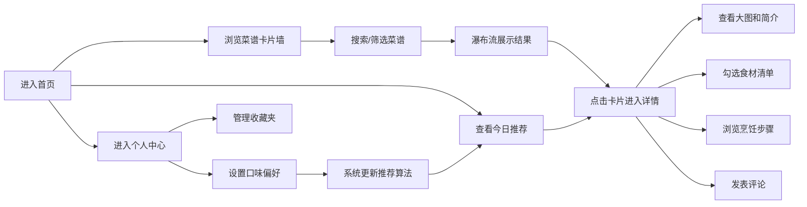

## 1. 产品概述

RecipeVault 是一款面向家庭烹饪爱好者的菜谱管理应用，采用代码库式的管理理念，让用户能够高效地组织、筛选和发现菜谱。通过智能推荐系统，根据家庭成员的口味偏好自动生成每日菜单，比传统纸质菜谱或浏览器收藏夹更加高效和有趣。

- 核心目标用户：家庭烹饪爱好者、需要管理日常菜谱的家庭主厨
- 核心价值：高效的菜谱管理、智能的个性化推荐、优雅的交互体验

## 2. 核心功能

### 2.1 用户角色
| 角色 | 注册方式 | 核心权限 |
|------|----------|----------|
| 普通用户 | 本地使用（无需注册） | 浏览菜谱、管理收藏、设置口味偏好、查看推荐 |

### 2.2 功能模块
1. **首页**：菜谱卡片墙、今日推荐区、搜索筛选、顶部导航
2. **菜谱详情页**：大图展示、食材清单、烹饪步骤、评论区
3. **个人中心**：侧边栏抽屉、收藏管理、口味偏好设置（可拖拽标签）

### 2.3 页面详情
| 页面名称 | 模块名称 | 功能描述 |
|----------|----------|----------|
| 首页 | 菜谱卡片墙 | 瀑布流布局展示所有菜谱卡片，支持按标签筛选、关键词搜索 |
| 首页 | 今日推荐区 | 横排3张大卡片，根据用户口味偏好智能推荐，带火焰图标动画 |
| 首页 | 顶部导航 | 毛玻璃效果固定导航，左侧Logo、右侧搜索框和个人中心入口 |
| 详情页 | 菜谱信息区 | 左图右文布局，展示菜名、简介、评分、基础信息 |
| 详情页 | 食材清单 | 带勾选功能，点击后文字添加删除线动画效果 |
| 详情页 | 烹饪步骤 | 带序号圆点，逐条淡入动画展示 |
| 详情页 | 评论区 | 支持发送文本评论，集成emoji选择器 |
| 个人中心 | 收藏管理 | 查看和管理已收藏的菜谱 |
| 个人中心 | 口味偏好 | 可拖拽标签设置辣度、菜系、食材偏好 |

## 3. 核心流程

用户主要流程：进入首页后可以浏览所有菜谱或查看系统推荐，通过搜索和标签筛选快速定位目标菜谱，点击卡片查看详情，可勾选食材、浏览步骤、发表评论。在个人中心中管理收藏和设置口味偏好，系统根据偏好每天更新推荐内容。

## 4. 界面设计

### 4.1 设计风格
- **主色调**：
  - 背景色 `#fafafa`（首页）、`#f9fafb`（详情页）
  - 卡片背景 `#ffffff`
  - 主文字 `#1f2937`，次要文字 `#4b5563`
  - 强调色/评分星星 `#fbbf24`（暖黄色）
  - 边框和分隔线 `#e5e7eb`
  - 标签背景 `#f3f4f6`
- **字体**：系统无衬线字体，菜名字号20px加粗，标签文字12px-14px
- **按钮和标签**：圆角设计（卡片16px，搜索框24px，标签20px）
- **图标风格**：简洁线性图标，评分使用星星图标，推荐区使用火焰图标
- **视觉特效**：毛玻璃导航栏、骨架屏加载、pulse动画、淡入过渡动画

### 4.2 页面设计概述
| 页面名称 | 模块名称 | UI元素 |
|----------|----------|--------|
| 首页 | 导航栏 | 固定顶部，backdrop-filter毛玻璃效果，左侧Logo"RecipeVault"，右侧圆角搜索框+放大镜图标，个人中心入口 |
| 首页 | 今日推荐区 | "今日推荐"标题，淡入到全屏入场动画，横排3张400px宽大卡片，封面图左上角火焰图标动画 |
| 首页 | 菜谱卡片 | 320×400px，圆角16px，顶部浅灰渐变封面占位（#e5e7eb→#d1d5db）带pulse动画，菜名20px加粗，标签行（浅色圆角标签），评分星星（hover放大1.2倍，0.2s过渡） |
| 首页 | 搜索筛选 | 0.3秒防抖搜索，实时过滤，瀑布流4列布局，空状态带弯曲线条动画 |
| 详情页 | 布局 | 左图右文，左侧480×600px圆角24px大图，右侧内容区带浅阴影 |
| 详情页 | 食材清单 | 复选框，勾选后文字添加删除线动画 |
| 详情页 | 烹饪步骤 | 序号圆点，逐条淡入动画 |
| 详情页 | 评论区 | 输入框+emoji选择器，评论列表 |
| 详情页 | 加载状态 | 骨架屏渐变色块动画 |
| 个人中心 | 侧边栏 | 右侧滑入360px宽，背景白色，0.3秒ease-out动画 |
| 个人中心 | 口味偏好 | 可拖拽标签组件，设置辣度/菜系/食材偏好 |

### 4.3 响应式设计
- **桌面端**（>1024px）：瀑布流4列布局，详情页左右分栏
- **平板端**（768px-1024px）：瀑布流2列布局，详情页保持左右分栏但缩小尺寸
- **移动端**（<768px）：单列布局，详情页改为上下布局，侧边栏全屏展示

### 4.4 动效与交互细节
- **页面入场**：今日推荐区从淡入到全屏动画
- **卡片交互**：hover时轻微上浮+阴影加深，评分星星hover放大1.2倍
- **侧边栏**：0.3秒ease-out滑入滑出动画
- **加载状态**：pulse动画用于图片占位，骨架屏渐变色块动画用于详情页
- **食材勾选**：删除线动画效果，0.3秒过渡
- **步骤展示**：逐条淡入，带animation-delay错峰显示
- **火焰图标**：轻微跳动动画，营造"热门推荐"氛围
