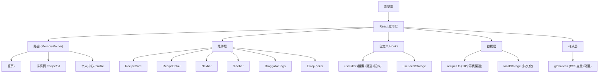

## 1. 架构设计



## 2. 技术选型

- **前端框架**：React 18 + TypeScript
- **构建工具**：Vite 5 + @vitejs/plugin-react
- **路由管理**：react-router-dom v6 (MemoryRouter)
- **状态管理**：React Hooks (useState, useEffect, useMemo, useCallback)
- **数据持久化**：localStorage (浏览器本地存储)
- **数据生成**：uuid (唯一ID生成), faker (测试数据生成)
- **样式方案**：原生CSS + CSS Variables + CSS Animations
- **初始化方式**：手动创建项目结构

**技术栈特点**：
- 纯前端单页应用，无后端依赖
- 数据全部内存预加载，搜索响应 < 200ms
- 使用MemoryRouter实现路由，无需服务端配置
- CSS-only动画，确保60FPS性能

## 3. 目录结构

```
RecipeVault/
├── .trae/documents/
│   ├── PRD-RecipeVault.md
│   └── TechArch-RecipeVault.md
├── package.json
├── index.html
├── vite.config.js
├── tsconfig.json
└── src/
    ├── main.tsx              # React入口
    ├── App.tsx               # 路由配置+页面组装
    ├── types.ts              # TypeScript类型定义
    ├── data/
    │   └── recipes.ts        # 10个示例菜谱数据
    ├── hooks/
    │   └── useFilter.ts      # 搜索筛选防抖hook
    ├── components/
    │   ├── RecipeCard.tsx    # 菜谱卡片组件
    │   ├── RecipeDetail.tsx  # 菜谱详情组件
    │   ├── Navbar.tsx        # 顶部导航组件
    │   ├── Sidebar.tsx       # 个人中心侧边栏
    │   ├── DraggableTags.tsx # 可拖拽标签组件
    │   ├── EmojiPicker.tsx   # Emoji选择器
    │   └── Skeleton.tsx      # 骨架屏组件
    └── styles/
        └── global.css        # 全局样式+CSS变量
```

## 4. 路由定义

| 路由 | 页面 | 说明 |
|------|------|------|
| `/` | 首页 | 菜谱卡片墙、今日推荐、搜索筛选 |
| `/recipe/:id` | 详情页 | 单个菜谱完整信息展示 |
| `/profile` | 个人中心 | 侧边栏展开，收藏管理+偏好设置 |

**路由实现**：使用 `react-router-dom` 的 `MemoryRouter`，在 `App.tsx` 中配置 `Routes` 和 `Route`，通过 `useParams` 获取菜谱ID。

## 5. 类型定义 (types.ts)

```typescript
interface Recipe {
  id: string;
  name: string;
  cuisine: string;        // 菜系：川菜、粤菜、日料等
  ingredients: Ingredient[];
  steps: string[];
  rating: number;         // 1-5星
  imageUrl: string;
  prepTime: number;       // 分钟
  difficulty: 'easy' | 'medium' | 'hard';
  tags: string[];         // 如：辣、下饭、素食等
  description: string;
  comments: Comment[];
  createdAt: string;
}

interface Ingredient {
  id: string;
  name: string;
  amount: string;
  checked: boolean;
}

interface Comment {
  id: string;
  author: string;
  content: string;
  createdAt: string;
}

interface UserPreferences {
  id: string;
  cuisines: string[];     // 偏好菜系
  spiceLevel: string[];   // 辣度偏好：不辣/微辣/中辣/特辣
  ingredients: string[];  // 偏好食材
  favorites: string[];    // 收藏菜谱ID
}

interface FilterState {
  searchQuery: string;
  selectedTags: string[];
  selectedCuisine: string | null;
  selectedDifficulty: string | null;
}
```

## 6. 数据模型

### 6.1 初始数据 (recipes.ts)

内置10个示例菜谱，覆盖不同菜系（川菜、粤菜、湘菜、日料、西餐等）、不同难度、不同辣度。每个菜谱包含完整的食材清单（5-10种食材）和烹饪步骤（3-8步）。

### 6.2 localStorage 结构

- `recipevault_recipes`: 菜谱数据（可扩展用户自定义菜谱）
- `recipevault_preferences`: 用户口味偏好和收藏
- `recipevault_comments`: 评论数据（按菜谱ID分组）

**初始化逻辑**：应用启动时检查localStorage，若无数据则写入初始10个示例菜谱和默认偏好设置。

## 7. 性能优化策略

### 7.1 搜索性能
- **防抖处理**：useFilter hook中使用300ms防抖，避免频繁触发搜索
- **内存搜索**：所有数据预加载到内存，不发起网络请求，搜索响应 < 200ms
- **useMemo优化**：过滤结果使用useMemo缓存，依赖变更时才重新计算

### 7.2 渲染性能
- **CSS-only动画**：所有动画使用CSS transforms和opacity，避免触发重排重绘
- **图片懒加载**：封面图使用loading="lazy"，进入视口才加载
- **骨架屏**：数据加载时显示骨架屏，提升感知性能
- **瀑布流布局**：使用CSS columns实现，无需JavaScript计算

### 7.3 FPS 保障
- 避免在动画中使用会触发layout的属性（width, height, top, left）
- 使用 will-change 和 transform: translateZ(0) 开启硬件加速
- 控制同时运行的动画数量，避免过度绘制

## 8. 关键组件实现要点

### 8.1 useFilter Hook
- 管理searchQuery和selectedTags状态
- 300ms防抖包装搜索逻辑
- 支持多维度筛选：关键词、标签、菜系、难度
- 返回过滤后的菜谱列表

### 8.2 RecipeCard 组件
- 图片加载前显示pulse动画渐变占位
- 评分星星支持hover放大交互
- 点击跳转详情页，使用react-router的Link组件
- 支持"推荐卡片"变体（宽度400px，带火焰图标）

### 8.3 RecipeDetail 组件
- 左图右文布局，响应式自动切换为上下布局
- 食材勾选状态管理，动画显示删除线
- 步骤逐条淡入，使用CSS animation-delay
- 评论输入+emoji选择器
- 骨架屏加载状态

### 8.4 DraggableTags 组件
- 实现HTML5 Drag and Drop API
- 支持从"可选标签"拖拽到"已选标签"
- 支持标签排序
- 数据实时同步到localStorage
