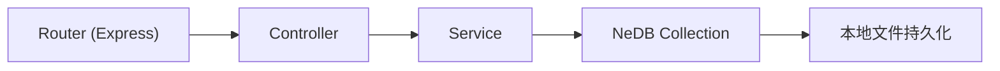
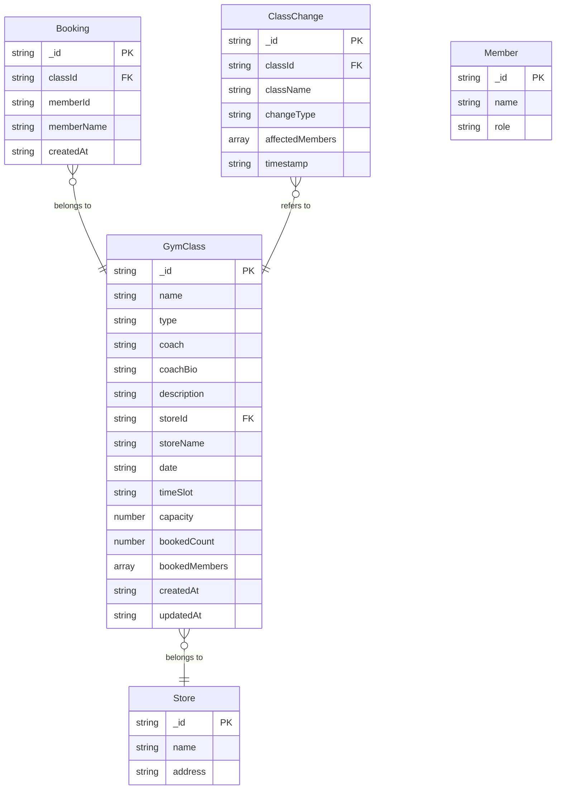

## 1. 架构设计

```mermaid
flowchart TB
    subgraph "前端 (React + Vite)"
        A["App.tsx (路由+Context)"]
        B["Dashboard.tsx (热力图)"]
        C["Calendar.tsx (课程日历)"]
        D["Sidebar (导航)"]
        E["CourseModal (详情弹窗)"]
        F["zustand Store (状态管理)"]
    end

    subgraph "后端 (Express + NeDB)"
        G["index.ts (服务器入口)"]
        H["/api/classes (课程CRUD)"]
        I["/api/stats (统计聚合)"]
        J["/api/bookings (预约管理)"]
        K["NeDB数据文件"]
    end

    A --> B
    A --> C
    A --> D
    C --> E
    B --> F
    C --> F
    E --> F

    B -- "GET /api/stats" --> I
    C -- "GET /api/classes" --> H
    E -- "POST/DELETE /api/bookings" --> J
    H --> K
    I --> K
    J --> K
```



## 2. 技术说明

- **前端**：React@18 + TypeScript + Vite + Tailwind CSS + zustand
- **初始化工具**：vite-init (react-express-ts模板)
- **后端**：Express@4 + TypeScript + nedb-promises
- **数据库**：NeDB（本地文件持久化）
- **通知**：react-hot-toast（前端toast）+ 轮询机制（检测课程变更）
- **HTTP客户端**：axios

## 3. 路由定义

| 路由 | 用途 |
|------|------|
| /dashboard | 管理员仪表板，热力图+课程管理 |
| /calendar | 会员课程日历，7天时间轴+预约 |

## 4. API定义

### 4.1 课程接口 /api/classes

```typescript
interface GymClass {
  _id: string;
  name: string;
  type: "yoga" | "strength" | "cycling" | "pilates";
  coach: string;
  coachBio: string;
  description: string;
  storeId: string;
  storeName: string;
  date: string;
  timeSlot: string;
  capacity: number;
  bookedCount: number;
  bookedMembers: string[];
  createdAt: string;
  updatedAt: string;
}

// GET /api/classes?startDate=&endDate=&storeIds=
// GET /api/classes/:id
// POST /api/classes
// PUT /api/classes/:id
// DELETE /api/classes/:id
```

### 4.2 预约接口 /api/bookings

```typescript
interface Booking {
  _id: string;
  classId: string;
  memberId: string;
  memberName: string;
  createdAt: string;
}

// POST /api/bookings { classId, memberId, memberName }
// DELETE /api/bookings/:classId/:memberId
```

### 4.3 统计接口 /api/stats

```typescript
interface StoreStats {
  storeId: string;
  storeName: string;
  timeSlots: {
    timeSlot: string;
    totalCapacity: number;
    totalBooked: number;
    fillRate: number;
    classes: GymClass[];
  }[];
}

// GET /api/stats?startDate=&endDate=
```

### 4.4 变更通知接口 /api/changes

```typescript
interface ClassChange {
  _id: string;
  classId: string;
  className: string;
  changeType: "updated" | "cancelled";
  affectedMembers: string[];
  timestamp: string;
}

// GET /api/changes?since=&memberId=
```

## 5. 服务器架构图



## 6. 数据模型

### 6.1 数据模型定义



### 6.2 初始化数据

系统预置7个门店、4种课程类型、示例课程数据和测试会员账号，确保仪表板和日历页面开箱可用。

## 7. 数据流向说明

1. **课程日历数据流**：Calendar组件 → axios GET /api/classes → Express路由 → NeDB查询 → 返回课程列表 → 组件渲染卡片
2. **预约操作数据流**：课程详情弹窗 → axios POST/DELETE /api/bookings → Express更新课程bookedCount → 返回结果 → zustand更新状态 → 卡片实时刷新
3. **热力图数据流**：Dashboard组件 → axios GET /api/stats → Express聚合查询 → NeDB统计 → 返回门店时段满员率 → Canvas绘制色块
4. **变更通知数据流**：管理员修改/删除课程 → Express写入ClassChange → 会员端轮询GET /api/changes → 检测到新变更 → react-hot-toast弹出🔔通知
5. **搜索过滤数据流**：搜索框输入 → 前端内存过滤课程列表 → 0.3s淡入淡出渲染匹配卡片
