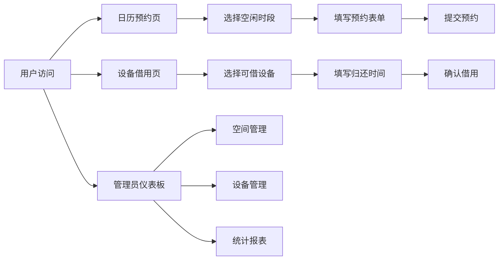

## 1. 产品概述

社区共享空间管理系统是一款面向小型社区共享空间（联合办公区、小区活动室等）的预约管理应用，解决管理员手动登记纸质表格容易冲突超订、用户无法实时确认设备可用状态的问题。

- 核心目标：实现活动室预约和设备借用的数字化管理，提升空间利用率和用户体验
- 目标用户：社区居民、联合办公会员、空间管理员

## 2. 核心功能

### 2.1 用户角色
| 角色 | 权限说明 |
|------|----------|
| 普通用户 | 查看活动室日历、提交预约申请、查看设备清单、申请设备借用 |
| 管理员 | 空间上下架管理、设备管理、查看统计报表、全部预约和设备数据管理 |

### 2.2 功能模块
1. **日历预约页**：7天时间轴视图、预约表单、预约状态展示
2. **设备借用页**：设备清单卡片、借用确认、归还倒计时
3. **管理员仪表板**：空间管理、设备管理、统计报表

### 2.3 页面详情
| 页面名称 | 模块名称 | 功能描述 |
|-----------|-------------|---------------------|
| 日历预约页 | 7天时间轴 | 展示未来7天活动室状态，按07:00-22:00时间轴排列，单元格高60px |
| 日历预约页 | 预约表单 | 空间选择、日期时间、使用人数、设备勾选、备注，弹窗形式 |
| 设备借用页 | 设备卡片列表 | 设备名、状态、预计归还时间，卡片宽220px高150px |
| 设备借用页 | 借用确认对话框 | 半透明遮罩+居中卡片，填写预计归还时间 |
| 管理员仪表板 | 侧边导航 | 空间管理、设备管理、统计报表三个导航项 |
| 管理员仪表板 | 空间管理 | 活动室列表、今日预约数、总容量、上下架操作 |
| 管理员仪表板 | 设备管理 | 设备列表、状态管理 |
| 管理员仪表板 | 统计报表 | 本周预约柱状图、设备借用饼图 |

## 3. 核心流程

### 3.1 活动室预约流程
用户进入日历页 → 查看未来7天各时段状态 → 点击空闲时段 → 弹出预约表单 → 填写信息提交 → 预约成功，时段变为已预约状态

### 3.2 设备借用流程
用户进入设备页 → 查看设备清单及状态 → 点击可借用设备的"借用"按钮 → 弹出确认对话框 → 填写预计归还时间 → 提交成功，设备变为已借出状态

### 3.3 管理员管理流程
管理员进入仪表板 → 选择空间/设备管理 → 查看列表 → 执行上下架/状态变更操作 → 数据实时更新

## 4. 用户界面设计

### 4.1 设计风格
- **主色调**：深蓝 #1e3a5f、浅灰 #f1f5f9
- **强调色**：橙色 #f97316、蓝色 #3b82f6
- **状态色**：已预约浅黄 #fef3c7、可预约浅绿 #d1fae5、维护中浅灰 #e5e7eb
- **圆角**：按钮、卡片、输入框统一 12px 圆角
- **悬停效果**：向上平移 4px + 加深阴影，0.3s transition
- **输入框聚焦**：边框变蓝 + 微放大 1.02 倍
- **字体**：'Segoe UI', sans-serif

### 4.2 页面设计概述
| 页面名称 | 模块名称 | UI 元素 |
|-----------|-------------|-------------|
| 日历预约页 | 时间轴网格 | 7列布局，每列24个时段单元格，背景色区分状态 |
| 日历预约页 | 预约弹窗 | 白色背景 #ffffff，圆角 16px，阴影效果 |
| 设备借用页 | 设备卡片 | 深蓝背景 #1e3a5f，白色文字，圆角 12px，宽220px高150px |
| 设备借用页 | 确认对话框 | 半透明遮罩 + 居中圆角卡片 |
| 管理员仪表板 | 侧边栏 | 宽 240px，深灰背景 #1f2937 |
| 管理员仪表板 | 统计图表 | ECharts 柱状图和饼图 |

### 4.3 响应式设计
- 桌面端（≥768px）：标准布局，侧边栏展开
- 移动端（<768px）：
  - 日历时间轴单元格高 50px
  - 设备卡片改为两列布局
  - 左侧菜单收起为汉堡图标
  - 触控优化

### 4.4 性能指标
- 页面初始加载时间 ≤ 2秒
- ECharts 渲染延迟 ≤ 300ms
- 表单提交响应时间 ≤ 800ms
