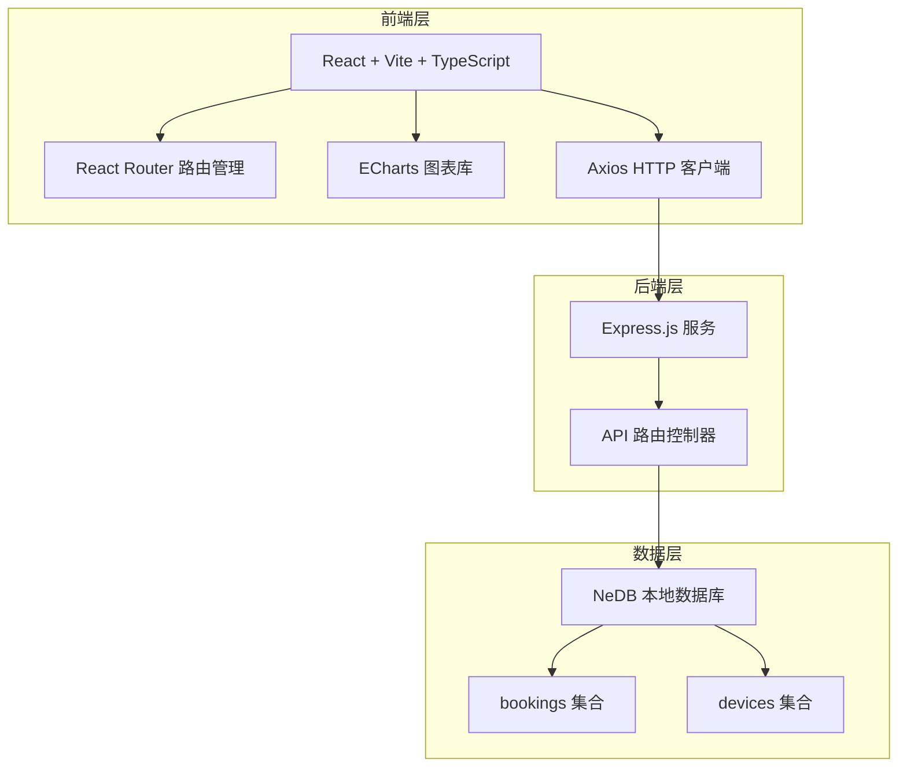
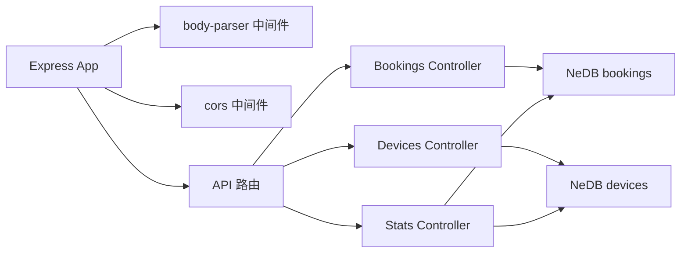

## 1. 架构设计



## 2. 技术选型

- **前端框架**：React 18 + TypeScript
- **构建工具**：Vite
- **路由管理**：React Router DOM
- **HTTP 客户端**：Axios
- **图表库**：ECharts + echarts-for-react
- **后端框架**：Express.js 4
- **数据库**：NeDB (nedb-promises)
- **工具库**：uuid
- **开发工具**：concurrently (前后端并行启动)

## 3. 项目结构

```
project-root/
├── package.json          # 根项目配置，concurrently 启动脚本
├── client/               # 前端项目
│   ├── index.html
│   ├── vite.config.js
│   ├── tsconfig.json
│   └── src/
│       ├── App.tsx       # 根组件，路由配置
│       ├── components/
│       │   ├── Calendar.tsx     # 日历预约组件
│       │   └── DeviceList.tsx   # 设备清单组件
│       └── pages/
│           └── Dashboard.tsx    # 管理员仪表板
└── server/               # 后端项目
    └── server.js         # Express 应用入口
```

## 4. 路由定义

| 前端路由 | 页面 | 说明 |
|-----------|------|------|
| / | 日历预约页 | 默认首页，活动室预约日历 |
| /devices | 设备借用页 | 设备清单和借用功能 |
| /dashboard | 管理员仪表板 | 空间管理、设备管理、统计报表 |

## 5. API 接口定义

### 5.1 预约相关 API

| 方法 | 路径 | 说明 | 请求体 | 响应 |
|------|------|------|--------|------|
| GET | /api/bookings | 获取预约列表 | - | Booking[] |
| POST | /api/bookings | 创建预约 | {spaceId, spaceName, date, startTime, endTime, peopleCount, devices, notes} | Booking |

### 5.2 设备相关 API

| 方法 | 路径 | 说明 | 请求体 | 响应 |
|------|------|------|--------|------|
| GET | /api/devices | 获取设备列表 | - | Device[] |
| POST | /api/devices/borrow | 借用设备 | {deviceId, expectedReturnTime} | Device |
| POST | /api/devices/return | 归还设备 | {deviceId} | Device |

### 5.3 统计相关 API

| 方法 | 路径 | 说明 | 请求体 | 响应 |
|------|------|------|--------|------|
| GET | /api/stats/bookings | 获取预约统计 | - | {spaceName, count}[] |
| GET | /api/stats/devices | 获取设备借用统计 | - | {deviceName, count}[] |

### 5.4 TypeScript 类型定义

```typescript
interface Booking {
  _id: string;
  spaceId: string;
  spaceName: string;
  date: string;
  startTime: string;
  endTime: string;
  peopleCount: number;
  devices: string[];
  notes: string;
  createdAt: string;
}

interface Device {
  _id: string;
  name: string;
  status: 'available' | 'borrowed' | 'maintenance';
  expectedReturnTime?: string;
  borrowCount: number;
}
```

## 6. 数据模型

### 6.1 bookings 集合

| 字段 | 类型 | 说明 |
|------|------|------|
| _id | string | 主键，uuid |
| spaceId | string | 活动室 ID |
| spaceName | string | 活动室名称 |
| date | string | 预约日期 (YYYY-MM-DD) |
| startTime | string | 开始时间 (HH:mm) |
| endTime | string | 结束时间 (HH:mm) |
| peopleCount | number | 使用人数 |
| devices | string[] | 借用设备列表 |
| notes | string | 备注 |
| createdAt | string | 创建时间 |

### 6.2 devices 集合

| 字段 | 类型 | 说明 |
|------|------|------|
| _id | string | 主键，uuid |
| name | string | 设备名称 |
| status | string | 状态：available/borrowed/maintenance |
| expectedReturnTime | string | 预计归还时间 |
| borrowCount | number | 累计借用次数 |
| description | string | 设备描述 |

## 7. 服务端架构



## 8. 初始化数据

系统启动时自动初始化以下数据：

### 活动室（3个）
- 多功能活动室（容量50人）
- 会议室（容量20人）
- 图书阅览室（容量30人）

### 设备（4个）
- 投影仪
- 白板
- 音响系统
- 移动白板支架
