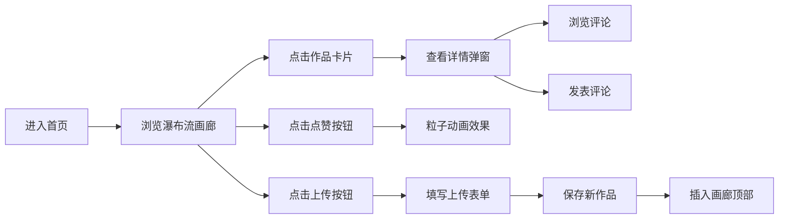

# GradientGallery 产品需求文档

## 1. 产品概述

GradientGallery 是一个面向艺术爱好者和设计师的渐变配色作品展示平台，用户可以像逛虚拟画廊一样浏览、上传、点赞和评论渐变配色作品，提供比社交媒体更专注和沉浸的视觉体验。

- **核心价值**：为创意人群提供一个专门的渐变配色灵感社区，专注于色彩美学的展示与交流
- **目标用户**：设计师、艺术爱好者、前端开发者、配色方案创作者

## 2. 核心功能

### 2.1 用户角色

| 角色 | 注册方式 | 核心权限 |
|------|----------|----------|
| 访客用户 | 无需注册 | 浏览画廊、查看作品详情、点赞作品、发表评论、上传作品 |

### 2.2 功能模块

1. **画廊首页**：瀑布流布局展示渐变作品卡片，支持搜索筛选
2. **作品详情**：弹窗展示大尺寸渐变预览和评论区
3. **作品上传**：表单提交自定义渐变配色作品
4. **互动系统**：点赞（带粒子动画）、评论功能

### 2.3 页面详情

| 页面名称 | 模块名称 | 功能描述 |
|----------|----------|----------|
| 画廊首页 | 导航栏 | 渐变 Logo、搜索框、上传按钮、滚动阴影效果 |
| 画廊首页 | 瀑布流画廊 | 渐变卡片网格、入场动画、点赞按钮 |
| 画廊首页 | 渐变卡片 | CSS 渐变色块、色值展示、点赞按钮、点击进入详情 |
| 详情弹窗 | 大预览区 | 大尺寸渐变色块展示、渐变色值 |
| 详情弹窗 | 评论区 | 评论列表、新评论输入框 |
| 上传表单 | 色值选择 | 两个原生颜色选择器并排展示 |
| 上传表单 | 方向选择 | 0-360 度角度下拉选择，默认 135 度 |
| 上传表单 | 标签输入 | 支持 autocomplete 建议已有标签 |
| 上传表单 | 作品名称 | 作品名称输入框 |

## 3. 核心流程

### 3.1 用户浏览作品流程

用户进入首页 → 查看瀑布流渐变画廊 → 滚动浏览作品 → 点击卡片查看详情 → 浏览评论 → 关闭弹窗返回画廊

### 3.2 用户上传作品流程

用户点击上传按钮 → 弹出上传表单 → 选择两个颜色 → 选择渐变角度 → 输入作品名称 → 添加标签 → 点击保存 → 新作品插入画廊顶部

### 3.3 用户互动流程

浏览作品 → 点击点赞按钮（触发粒子动画）→ 点赞数即时更新 → 点击进入详情 → 输入评论 → 提交评论 → 评论列表即时更新

## 4. 用户界面设计

### 4.1 设计风格

- **整体风格**：极简精致、沉浸式画廊体验
- **主色调**：浅米白背景 `#faf8f5`，深色导航栏 `#111827e0`
- **强调色**：
  - Logo 渐变：`#667eea` 到 `#764ba2`
  - 上传按钮渐变：`#34d399` 到 `#10b981`
  - 点赞红色：`#ef4444`
  - 文本色：`#4b5563`
- **字体**：Google Font Inter
- **按钮样式**：圆角设计，悬停放大效果，平滑过渡
- **布局风格**：卡片式瀑布流布局，顶部导航栏
- **动效**：卡片入场动画（上浮+淡入）、点赞粒子爆炸动画、平滑过渡效果

### 4.2 页面设计概述

| 页面/组件 | 模块名称 | UI 元素 |
|-----------|----------|---------|
| 画廊首页 | 导航栏 | 深色半透明背景、渐变 Logo 文字、搜索框（带放大镜图标）、上传按钮（绿色渐变）、滚动底部阴影 |
| 画廊首页 | 渐变卡片 | 320px 宽、16px 圆角、400px 高渐变色块、色值标签（8px 圆角）、右下角点赞按钮、hover 效果 |
| 画廊首页 | 瀑布流布局 | 网格布局、卡片间间距、入场动画（逐卡延迟 0.05s） |
| 详情弹窗 | 遮罩层 | 半透明黑色 `#00000044` |
| 详情弹窗 | 弹窗主体 | 720px × 540px、白色背景、24px 圆角、大渐变色块、评论区 |
| 上传表单 | 表单容器 | 红色调半透明毛玻璃背景 |
| 上传表单 | 颜色选择器 | 两个 120px 方块并排、8px 圆角 |
| 上传表单 | 角度选择 | 下拉选择框、0-360 度 |
| 上传表单 | 标签输入 | autocomplete 建议已有标签 |
| 上传表单 | 保存按钮 | 提交后生成预览卡片 |

### 4.3 响应式设计

- **设计方式**：桌面端优先
- **移动端适配**：卡片宽度自适应，弹窗宽度适配屏幕
- **触摸优化**：按钮和交互元素尺寸适合触摸操作

### 4.4 性能要求

- 画廊滚动流畅不卡顿
- 点赞和评论即时更新，无需刷新页面
- 卡片入场动画性能优化，使用 CSS transform 和 opacity

