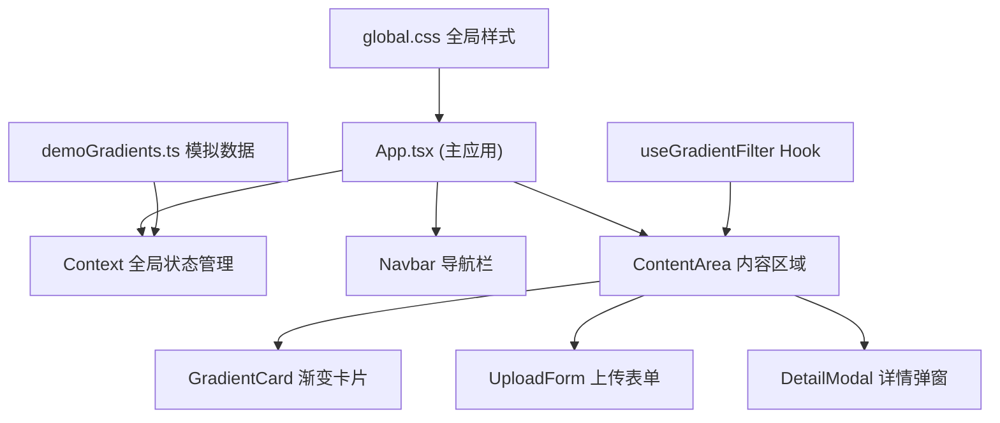

# GradientGallery 技术架构文档

## 1. 架构设计



## 2. 技术描述

- **前端框架**：React 18 + TypeScript
- **构建工具**：Vite
- **状态管理**：React Context API（内存状态，刷新即重置）
- **样式方案**：原生 CSS + CSS Modules/全局样式
- **字体**：Google Font Inter
- **数据存储**：纯前端内存存储，无后端，刷新页面数据重置

## 3. 文件结构

```
├── package.json          # 项目依赖和脚本
├── index.html            # HTML 入口文件
├── vite.config.ts        # Vite 配置
├── tsconfig.json         # TypeScript 配置
└── src/
    ├── App.tsx           # 主应用组件，包含 Context 和路由逻辑
    ├── components/
    │   ├── Navbar.tsx      # 导航栏组件
    │   ├── GradientCard.tsx  # 渐变卡片组件
    │   ├── UploadForm.tsx   # 上传表单组件
    │   └── DetailModal.tsx  # 详情弹窗组件
    ├── data/
    │   └── demoGradients.ts  # 模拟数据（10个预置作品）
    ├── hooks/
    │   └── useGradientFilter.ts  # 过滤筛选自定义 Hook
    └── styles/
        └── global.css       # 全局样式
```

## 4. 数据模型

### 4.1 渐变作品数据类型

```typescript
interface Comment {
  id: string;
  text: string;
  createdAt: number;
}

interface Gradient {
  id: string;
  name: string;
  color1: string;
  color2: string;
  angle: number;
  tags: string[];
  likes: number;
  liked: boolean;
  comments: Comment[];
}
```

### 4.2 Context 状态类型

```typescript
interface AppState {
  gradients: Gradient[];
  addGradient: (gradient: Omit<Gradient, 'id' | 'likes' | 'liked' | 'comments'>) => void;
  toggleLike: (id: string) => void;
  addComment: (gradientId: string, text: string) => void;
}
```

## 5. 核心功能实现要点

### 5.1 瀑布流布局

- 使用 CSS Grid 实现响应式多列布局
- 卡片固定宽度 320px，高度由内容决定
- 卡片入场动画：从底部上浮 30px + 淡入，持续 0.4s，逐卡延迟 0.05s

### 5.2 点赞动画

- 点赞状态切换：灰色 `#9ca3af` → 红色 `#ef4444`
- 粒子爆炸动画：0.5 秒持续时间，多个小圆点从中心向外扩散
- 使用 CSS keyframes 实现动画效果

### 5.3 详情弹窗

- 半透明遮罩：`rgba(0, 0, 0, 0.27)`（即 `#00000044`）
- 弹窗尺寸：720px × 540px，圆角 24px
- 点击遮罩或关闭按钮关闭弹窗
- ESC 键关闭弹窗

### 5.4 搜索过滤

- 自定义 Hook `useGradientFilter` 实现
- 支持按作品名称和标签搜索
- 实时过滤，无需刷新

### 5.5 性能优化

- 使用 CSS transform 和 opacity 实现动画，触发 GPU 加速
- 点赞和评论状态即时更新，React 响应式更新
- 卡片组件尽可能轻量化

## 6. 依赖清单

| 依赖 | 版本 | 用途 |
|------|------|------|
| react | ^18.x | UI 框架 |
| react-dom | ^18.x | React DOM 渲染 |
| vite | ^5.x | 构建工具 |
| @vitejs/plugin-react | ^4.x | Vite React 插件 |
| typescript | ^5.x | 类型系统 |
| @types/react | ^18.x | React 类型定义 |
| @types/react-dom | ^18.x | React DOM 类型定义 |

## 7. 脚本命令

| 命令 | 说明 |
|------|------|
| `npm run dev` | 启动开发服务器 |
| `npm run build` | 构建生产版本 |
| `npm run preview` | 预览生产构建 |

