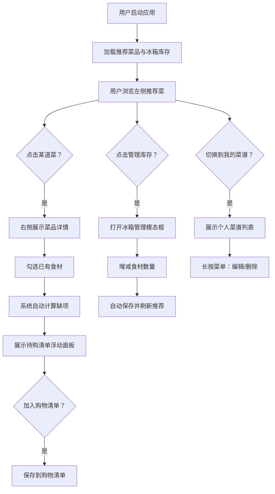

## 1. 产品概述

Reciptify 是一款面向家庭用户的智能食材管理与菜谱推荐应用，解决每周做饭时手忙脚乱翻冰箱、翻菜谱的痛点。用户只需录入周末采买的食材和想吃的菜品，系统即可自动计算调料缺口、生成购物清单，并基于冰箱剩余食材智能推荐可做菜品。

- 目标用户：忙碌的家庭主妇/主夫、年轻上班族、热爱做饭但不擅长规划的人群
- 核心价值：将"想做什么菜→缺什么→买什么"的复杂流程自动化，大幅降低每周做饭的心智负担

## 2. 核心功能

### 2.1 用户角色

| 角色 | 注册方式 | 核心权限 |
|------|---------|---------|
| 普通用户 | 本地启动即用 | 浏览菜谱、管理库存、生成购物清单、管理个人菜谱 |

### 2.2 功能模块

1. **首页主布局**：左右分栏，左侧导航+推荐+库存，右侧详情展示
2. **推荐菜品模块**：本周推荐 3 道菜，点击查看详情
3. **冰箱库存模块**：展示当前食材列表、数量、过期倒计时
4. **菜谱详情模块**：食材清单、烹饪步骤、一键加入购物车
5. **智能待购清单**：浮动面板，区分必缺项和可选补货项，支持复制
6. **冰箱管理模态框**：全食材网格管理，支持增减数量
7. **我的菜谱模块**：页签切换，展示/编辑/删除用户个人菜谱

### 2.3 页面详情

| 页面名称 | 模块名称 | 功能描述 |
|---------|---------|---------|
| 首页 | 左侧推荐菜品区 | 3 张圆角卡片，含圆形缩略图、菜名、耗时，点击高亮 |
| 首页 | 左侧库存列表 | 卡片式食材列表，显示名称/数量/过期倒计时，过期标红 |
| 首页 | 右侧菜品详情 | 顶部宽幅美食图 + 食材勾选清单 + 编号步骤 + 加入购物清单按钮 |
| 首页 | 待购清单浮动面板 | 固定定位，毛玻璃背景，必缺项/可选补货项分段，一键复制 |
| 首页 | 底部操作栏 | 管理库存按钮、"推荐/我的菜谱"页签切换 |
| 冰箱管理模态框 | 食材网格 | 每行 4 张卡片 (120x140px)，emoji 图标、名称、数量、增减按钮 |
| 我的菜谱页 | 个人菜谱列表 | 每行一张卡片，风格与推荐菜一致，长按出现操作菜单（编辑/删除） |

## 3. 核心流程

**主用户流程：**
用户打开应用 → 系统加载本周推荐菜品和冰箱库存 → 用户浏览或点击某道菜 → 右侧展示食材清单和步骤 → 勾选已有食材 → 系统自动计算缺项并展示待购清单 → 用户点击"管理库存"增减食材数量 → 切换到"我的菜谱"查看/编辑/删除个人菜谱

## 4. 用户界面设计

### 4.1 设计风格

- **主题色系**：自然绿色调，主色 `#4ade80`（清新嫩绿），辅助色 `#22c55e`（深绿）
- **背景色系**：左侧栏 `#f8f9fa`（浅灰），右侧 `#ffffff`（纯白），过期警示 `#ef4444`
- **按钮风格**：圆角 8px，主按钮实心主题色，悬停下移 2px + 浅绿色阴影
- **卡片风格**：小卡片圆角 12px，大卡片圆角 16px，悬停轻微阴影 + 上浮 2px
- **字体**：Inter 无衬线字体，清晰现代
- **图标风格**：食材使用 emoji 表示（🥚🍅🥛🥕🧅🥔🥬），自然亲和
- **动画**：过渡 0.2s ease-out，选中态 0.3s 淡入，悬停效果流畅

### 4.2 页面设计概览

| 页面/模块 | 模块名称 | UI 元素 |
|----------|---------|---------|
| 首页主布局 | 左右分栏 | 左 35% `#f8f9fa` + 右 65% `#ffffff`，响应式平板 2 列、手机抽屉式 |
| 推荐菜品卡片 | 卡片组件 | 160x90px 圆形缩略图 + 菜名 + 预计耗时，圆角 12px，选中主题色边框 |
| 冰箱库存列表 | 库存卡片 | 名称 + 数量 + 过期倒计时，过期红色 `#ef4444` 标注 |
| 菜品详情 | 顶部大图 | 宽幅美食图高 220px，覆盖全宽 |
| 菜品详情 | 操作面板 | 食材勾选清单（已勾选灰化+删除线）、编号步骤 1.2.3. |
| 菜品详情 | 操作按钮 | 一键批量加入购物清单，圆角 10px，悬停阴影 |
| 待购清单 | 浮动面板 | 固定定位 320px 宽，右距 20px，底距 40px，毛玻璃 rgba(255,255,255,0.85) |
| 冰箱管理 | 模态框 | 半透明遮罩 `#0005`，全屏覆盖，网格每行 4 项 |
| 食材卡片 | 管理卡片 | 120x140px，上部 emoji，下名+数量+32px 圆形增减按钮 |
| 我的菜谱 | 页签切换 | 底部 Tab，列表卡片风格同推荐菜，长按弹出操作菜单 |

### 4.3 响应式设计

- **桌面端**（>1024px）：左右分栏 35%/65%，冰箱网格每行 4 项
- **平板端**（768px-1024px）：自适应布局，网格每行 2 列
- **移动端**（<768px）：左侧栏折叠为抽屉式导航，点击汉堡菜单展开，全宽度详情展示

### 4.4 性能指标

- 首次加载到可交互时间：≤ 1.5s
- 用户操作交互动画：60fps 流畅无卡顿
- 后端 API 响应时间：≤ 300ms
- 过渡动画：0.2s ease-out 平滑过渡
