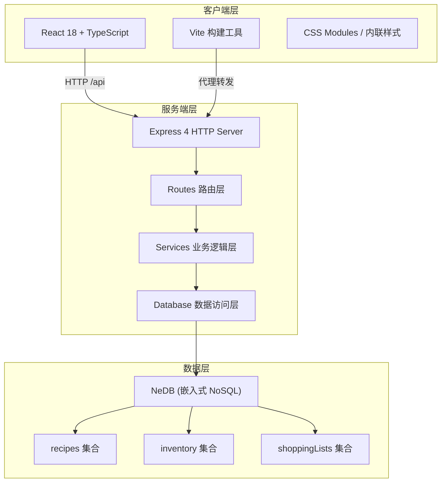
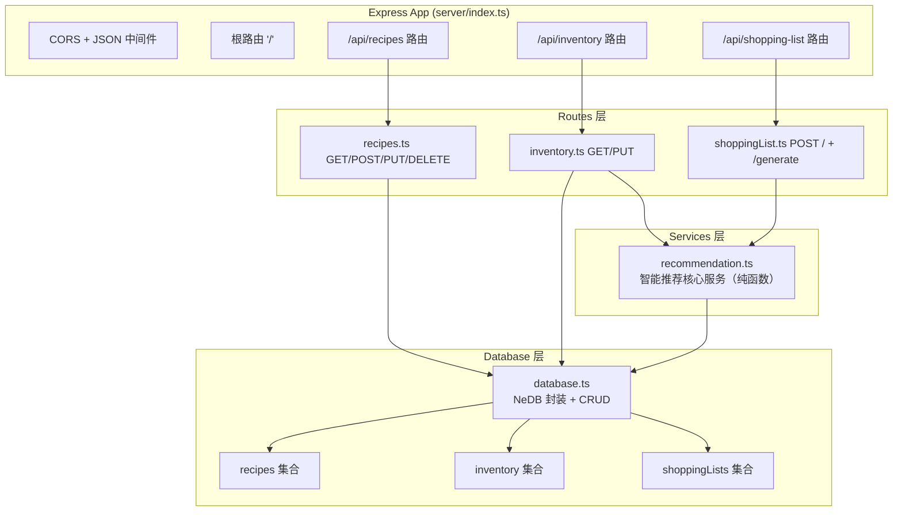
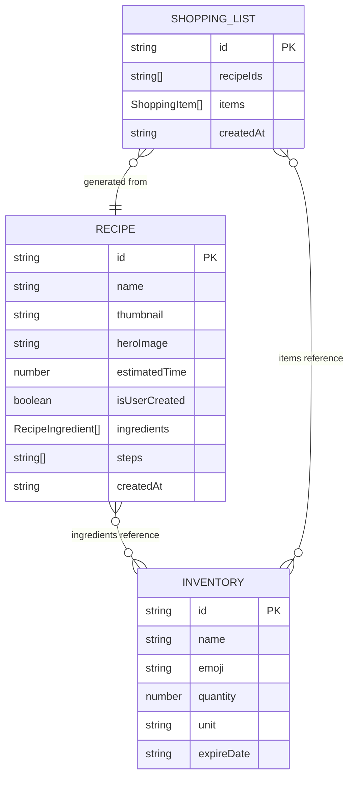

## 1. 架构设计



## 2. 技术栈描述

- **前端框架**：React@18 + TypeScript（严格模式）
- **构建工具**：Vite@5 + @vitejs/plugin-react
- **前端路由**：单页应用 (SPA)，组件内部状态切换模拟路由
- **状态管理**：React useState + useEffect（轻量场景，无需 Redux）
- **后端框架**：Express@4
- **数据库**：NeDB (nedb-promises) —— 轻量级嵌入式 NoSQL
- **辅助库**：uuid（ID 生成）、date-fns（日期计算）
- **启动脚本**：`npm run dev` 使用 concurrently 同时启动前后端
- **前端开发服务器端口**：5173
- **后端 API 端口**：3001

## 3. 路由/页面定义

| 组件路由（逻辑） | 对应文件 | 功能 |
|----------------|---------|------|
| `/`（根） | `src/App.tsx` | 主布局，左右分栏容器，全局状态管理 |
| 推荐菜列表 | `src/components/Sidebar.tsx` | 左侧栏，推荐菜品/库存/页签切换 |
| 菜谱详情 | `src/components/RecipeDetail.tsx` | 右侧主区域，食材清单+步骤+操作 |
| 待购清单 | `src/components/ShoppingList.tsx` | 浮动面板，必缺项/可选补货/复制 |
| 冰箱管理 | `src/components/InventoryModal.tsx` | 模态框，网格管理食材增减 |
| 我的菜谱 | `src/components/Sidebar.tsx` 内页签 | 切换显示个人菜谱列表 |

## 4. API 定义

### 4.1 TypeScript 核心类型

```typescript
// 食材
interface Ingredient {
  id: string;
  name: string;
  emoji: string;
  quantity: number;
  unit: string;
  expireDate: string; // ISO date
}

// 菜谱中的食材条目
interface RecipeIngredient {
  ingredientId: string;
  name: string;
  emoji: string;
  requiredQuantity: number;
  unit: string;
}

// 菜谱
interface Recipe {
  id: string;
  name: string;
  thumbnail: string; // 图片 URL
  heroImage: string; // 详情大图 URL
  estimatedTime: number; // 分钟
  isUserCreated: boolean;
  ingredients: RecipeIngredient[];
  steps: string[];
  createdAt: string;
}

// 购物清单项
interface ShoppingItem {
  ingredientId: string;
  name: string;
  emoji: string;
  quantity: number;
  unit: string;
  isRequired: boolean; // true=必缺, false=可选补货
}

// 推荐结果
interface RecommendationResult {
  recipeId: string;
  recipeName: string;
  missingItems: ShoppingItem[]; // 完全没有的
  lowStockItems: ShoppingItem[]; // 量不足的
  completeness: number; // 0-100 完整度百分比
}
```

### 4.2 RESTful API 列表

| 方法 | 路径 | 描述 | 请求体 | 响应体 |
|-----|------|------|--------|--------|
| GET | `/` | 服务连通性检测 | - | `{ status: "ok", timestamp }` |
| GET | `/api/recipes` | 获取全部菜谱（含系统推荐和用户创建） | - | `Recipe[]` |
| POST | `/api/recipes` | 创建新菜谱（我的菜谱） | `Omit<Recipe, 'id' \| 'createdAt'>` | `Recipe` |
| PUT | `/api/recipes/:id` | 更新菜谱 | `Partial<Recipe>` | `Recipe` |
| DELETE | `/api/recipes/:id` | 删除菜谱 | - | `{ success: true }` |
| GET | `/api/inventory` | 获取冰箱全部库存 | - | `Ingredient[]` |
| PUT | `/api/inventory/:id` | 更新食材数量（增减） | `{ quantity: number }` | `Ingredient` |
| POST | `/api/shopping-list` | 将选中菜谱缺项加入购物清单 | `{ recipeIds: string[], checkedIngredientIds: string[] }` | `{ items: ShoppingItem[] }` |
| POST | `/api/shopping-list/generate` | 智能计算所有菜谱的缺项和补货建议 | `{ inventory: Ingredient[], recipes: Recipe[] }` 或不传用当前数据 | `{ recommendations: RecommendationResult[], allMissing: ShoppingItem[], allLowStock: ShoppingItem[] }` |

## 5. 服务端架构图



## 6. 数据模型

### 6.1 ER 图



### 6.2 初始数据（Seed Data）

**推荐菜谱（3 道）：**
1. 番茄炒蛋 —— 15分钟，食材：鸡蛋、番茄、葱、盐、糖
2. 红烧土豆牛肉 —— 60分钟，食材：牛肉、土豆、洋葱、生抽、老抽、冰糖
3. 蒜蓉生菜 —— 10分钟，食材：生菜、大蒜、蚝油、食用油

**初始冰箱库存：**
- 🥚 鸡蛋 x 6（3天后过期）
- 🍅 番茄 x 2（2天后过期）
- 🥔 土豆 x 4（7天后过期）
- 🥬 生菜 x 1（1天后过期）
- 🧅 洋葱 x 3（5天后过期）
- 🥩 牛肉 x 500g（4天后过期）
- 🧄 大蒜 x 10（10天后过期）
- 🧂 盐 x 1瓶（365天）
- 🍶 生抽 x 1瓶（180天）
- 🫙 老抽 x 1瓶（180天）
- 🍬 冰糖 x 适量（365天）
- 🥢 蚝油 x 1瓶（90天）

## 7. 文件结构

```
auto5/
├── package.json
├── index.html
├── vite.config.ts
├── tsconfig.json
├── src/
│   ├── main.tsx
│   ├── App.tsx
│   ├── styles/
│   │   └── global.css
│   └── components/
│       ├── Sidebar.tsx
│       ├── RecipeDetail.tsx
│       ├── InventoryModal.tsx
│       └── ShoppingList.tsx
├── server/
│   ├── index.ts
│   ├── database.ts
│   ├── services/
│   │   └── recommendation.ts
│   └── routes/
│       ├── recipes.ts
│       ├── inventory.ts
│       └── shoppingList.ts
└── .trae/
    └── documents/
        ├── PRD.md
        └── Technical-Architecture.md
```
