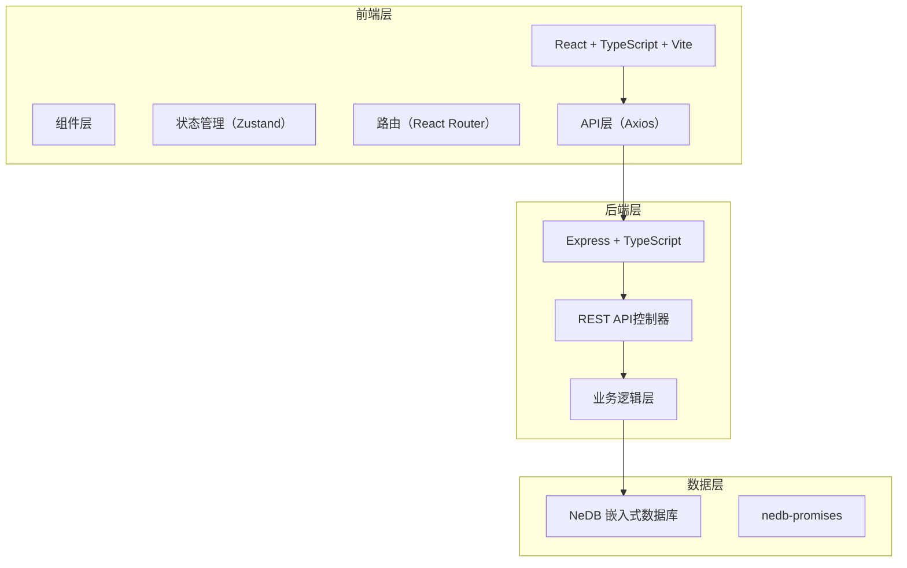
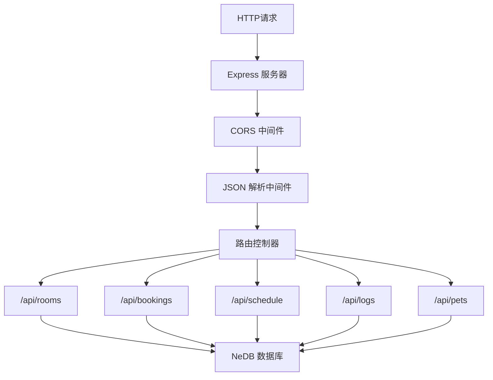
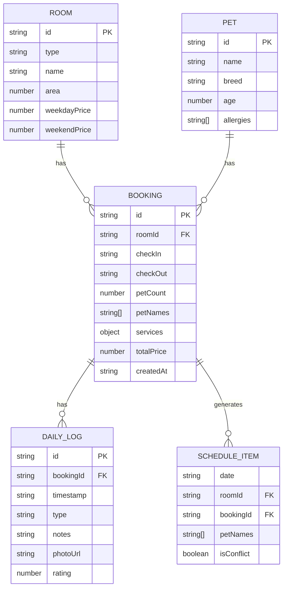

## 1. 架构设计



## 2. 技术描述

- **前端技术栈**：React 18 + TypeScript + Vite 5
- **后端技术栈**：Express 4 + TypeScript + tsx
- **数据库**：NeDB 嵌入式数据库（nedb-promises）
- **状态管理**：Zustand 4
- **路由管理**：React Router 6
- **HTTP客户端**：Axios
- **ID生成**：uuid
- **开发工具**：concurrently（前后端并行启动）
- **初始化工具**：vite-init react-express-ts 模板

## 3. 项目结构

```
.
├── package.json
├── index.html
├── vite.config.js
├── tsconfig.json
├── src/
│   ├── App.tsx
│   ├── main.tsx
│   ├── index.css
│   ├── components/
│   │   ├── BookingForm.tsx
│   │   ├── DailyLog.tsx
│   │   ├── RoomCard.tsx
│   │   ├── ScheduleCalendar.tsx
│   │   ├── PetCard.tsx
│   │   └── Navbar.tsx
│   ├── pages/
│   │   ├── HomePage.tsx
│   │   ├── BookingPage.tsx
│   │   ├── OrderDetailPage.tsx
│   │   ├── PetProfilePage.tsx
│   │   ├── SchedulePage.tsx
│   │   └── DailyLogPage.tsx
│   ├── store/
│   │   └── useStore.ts
│   ├── types/
│   │   └── index.ts
│   ├── utils/
│   │   └── api.ts
│   └── hooks/
├── server/
│   ├── src/
│   │   ├── server.ts
│   │   ├── types.ts
│   │   └── db.ts
│   └── data/
└── .trae/
    └── documents/
```

## 4. 路由定义

| Route | 页面 | 用途 |
|-------|------|------|
| `/` | 首页 | 房间列表展示 |
| `/booking` | 预订页 | 两步式预订表单 |
| `/order/:id` | 订单详情页 | 订单信息和日程表 |
| `/pets` | 宠物档案页 | 宠物列表和详情 |
| `/schedule` | 日程看板页 | 14天房间入住日历 |
| `/logs/:bookingId` | 看护日志页 | 每日看护日志管理 |

## 5. API 定义

### 5.1 TypeScript 类型定义

```typescript
// 房间类型
interface Room {
  id: string;
  type: 'standard' | 'deluxe' | 'suite';
  name: string;
  area: number;
  weekdayPrice: number;
  weekendPrice: number;
  description: string;
}

// 预订
interface Booking {
  id: string;
  roomId: string;
  roomName: string;
  checkIn: string;
  checkOut: string;
  petCount: number;
  petNames: string[];
  services: {
    feeding: boolean;
    walking: number;
    bathing: number;
  };
  totalPrice: number;
  createdAt: string;
}

// 日程项
interface ScheduleItem {
  date: string;
  roomId: string;
  bookingId: string;
  petNames: string[];
  isConflict: boolean;
}

// 看护日志
interface DailyLogEntry {
  id: string;
  bookingId: string;
  timestamp: string;
  type: 'feeding' | 'walking' | 'bathing' | 'medication';
  notes: string;
  photoUrl?: string;
  rating?: number;
}

// 宠物档案
interface Pet {
  id: string;
  name: string;
  breed: string;
  age: number;
  photoUrl?: string;
  allergies: string[];
  history: {
    checkIn: string;
    checkOut: string;
    roomName: string;
  }[];
}
```

### 5.2 REST API 接口

| 方法 | 路径 | 描述 | 请求 | 响应 |
|------|------|------|------|------|
| GET | `/api/rooms` | 获取所有房间类型 | - | `Room[]` |
| POST | `/api/bookings` | 创建预订 | `BookingCreateDTO` | `Booking` |
| GET | `/api/bookings` | 获取所有预订 | - | `Booking[]` |
| GET | `/api/bookings/:id/schedule` | 获取预订日程 | - | `ScheduleItem[]` |
| GET | `/api/schedule?days=14` | 获取日程看板 | - | `ScheduleItem[][]` |
| POST | `/api/logs` | 创建日志条目 | `DailyLogCreateDTO` | `DailyLogEntry` |
| GET | `/api/logs/:bookingId` | 获取预订的日志 | - | `DailyLogEntry[]` |
| GET | `/api/pets` | 获取宠物列表 | - | `Pet[]` |
| POST | `/api/pets` | 创建宠物档案 | `PetCreateDTO` | `Pet` |

## 6. 服务器架构



## 7. 数据模型

### 7.1 ER 图



### 7.2 数据库初始化

使用 nedb-promises 创建数据存储实例，在 server/src/db.ts 中初始化：

- rooms.db - 房间数据（初始种子数据：标准间、豪华房、套房）
- bookings.db - 预订数据
- logs.db - 看护日志数据
- pets.db - 宠物档案数据（初始种子数据：3-5个示例宠物）
