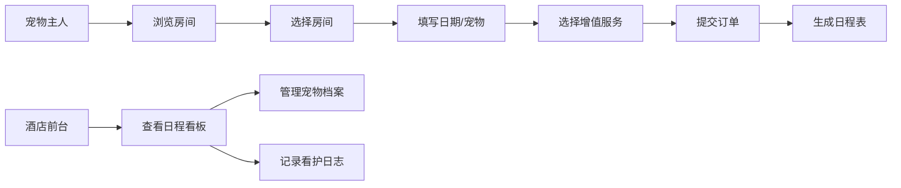

## 1. 产品概述

PetHotel是一款宠物酒店入住与日程管理应用，为宠物主人提供便捷的在线预订服务，为酒店前台提供高效的宠物档案管理和日常看护日志功能。

- **核心目标**：解决宠物酒店预订流程繁琐、日程管理混乱、看护记录不规范等问题
- **目标用户**：宠物主人（在线预订）、酒店前台（管理运营）
- **市场价值**：提升宠物酒店运营效率，改善用户预订体验，实现数字化管理

## 2. 核心功能

### 2.1 用户角色

| 角色 | 登录方式 | 核心权限 |
|------|----------|----------|
| 宠物主人 | 无需登录（访客模式） | 浏览房间、在线预订、查看订单详情 |
| 酒店前台 | 无需登录（管理模式） | 管理宠物档案、查看日程看板、记录每日看护日志 |

### 2.2 功能模块

1. **首页**：房间类型展示、价格计算、快速预订入口
2. **预订页面**：两步式预订表单、实时价格计算、增值服务选择
3. **订单详情页**：订单信息展示、入住日程表、服务明细
4. **宠物档案页**：宠物列表、宠物详情、历史入住记录
5. **日程看板页**：日历视图、房间入住情况、预订冲突检测
6. **每日看护日志页**：日志列表、新增日志、活动类型记录

### 2.3 页面详情

| 页面名称 | 模块名称 | 功能描述 |
|-----------|-------------|---------------------|
| 首页 | 房间卡片列表 | 展示3种房间类型（标准间、豪华房、套房），卡片悬停效果，节假日/工作日价格区分 |
| 预订页 | 两步式向导表单 | 第一步：日期选择、宠物数量、房间选择；第二步：增值服务勾选（喂食+30/天、遛狗+50/次、洗澡+80/次） |
| 订单详情页 | 入住日程表 | 自动生成入住期间的每日安排，显示服务明细和总价 |
| 宠物档案页 | 左右分栏布局 | 左侧宠物卡片列表（300px宽），右侧详情区展示宠物信息和历史入住表格 |
| 日程看板页 | 日历视图 | 14天房间入住情况，绿色色块标记预订，红色标记冲突，左右滚动查看 |
| 看护日志页 | 日志卡片列表 | 按时间倒序排列，左侧彩色竖条区分活动类型，支持照片上传占位 |

## 3. 核心流程

### 3.1 宠物主人预订流程

宠物主人浏览房间 → 选择房间点击预订 → 填写入住/离店日期和宠物数量 → 选择增值服务 → 提交订单 → 查看订单详情和日程表

### 3.2 前台管理流程

前台进入日程看板 → 查看房间入住情况 → 点击新增预订跳转预订页 → 进入宠物档案页管理宠物 → 进入看护日志页记录每日看护情况

## 4. 用户界面设计

### 4.1 设计风格

- **主色调**：温暖原木色背景 `#f5e6d3`，深棕文字边框 `#5c4033`
- **强调色**：橙黄主按钮 `#d97706`（悬停 `#b45309`），蓝色选中边框 `#3b82f6`
- **功能色**：喂食橙 `#f97316`，遛狗绿 `#22c55e`，洗澡蓝 `#3b82f6`，吃药红 `#ef4444`
- **卡片风格**：圆角设计（房间卡片16px，日志卡片12px），悬停上浮效果
- **按钮风格**：统一圆角8px，过渡动画0.2s
- **输入框**：圆角8px，边框色 `#d4c4a8`，聚焦变 `#d97706` 带浅阴影
- **字体**：使用Noto Sans SC + 装饰性字体搭配，温暖亲切
- **动画**：卡片加载pulse动画，页面切换过渡，悬停微交互

### 4.2 页面设计概述

| 页面名称 | 模块名称 | UI元素 |
|-----------|-------------|-------------|
| 首页 | 房间卡片 | 320px宽卡片，顶部200px浅灰渐变占位图，悬停上浮4px加深阴影，0.3s过渡 |
| 预订页 | 两步式弹窗 | 圆角12px，白色背景阴影，底部实时总价显示，步骤指示器 |
| 宠物档案页 | 左右分栏 | 左侧300px灰色卡片列表，选中卡片左侧蓝色边框，右侧详情区圆形照片占位 |
| 日程看板页 | 日历视图 | 960px宽白色背景圆角12px，绿色色块显示宠物名缩写，红色标记冲突 |
| 看护日志页 | 日志卡片 | 左侧彩色竖条区分活动类型，灰色虚线边框照片上传占位，时间倒序排列 |

### 4.3 响应式设计

- **桌面端（1024px以上）**：显示侧边栏（240px宽，深棕背景白色文字），主内容区自适应
- **平板端（768px-1024px）**：侧边栏折叠为顶部汉堡菜单，卡片网格2列布局
- **手机端（768px以下）**：单列全宽布局，卡片宽度填充屏幕，底部导航

### 4.4 性能指标

- 页面初始加载时间 ≤ 2秒
- 日历视图渲染20个房间14天色块 ≤ 200ms
- 日志列表滚动保持60fps无卡顿
- 使用虚拟列表处理长列表
- 图片懒加载，骨架屏预加载
