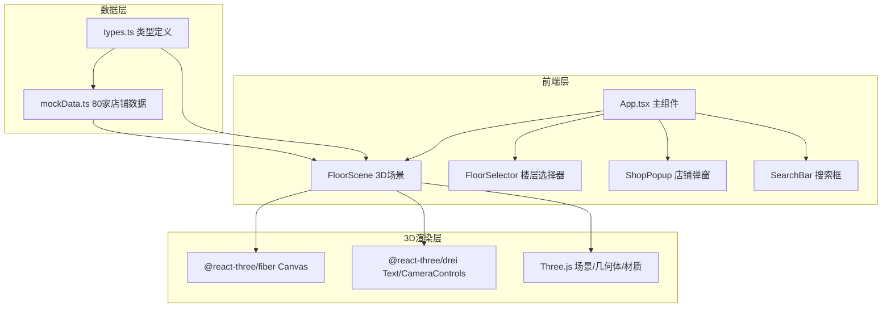
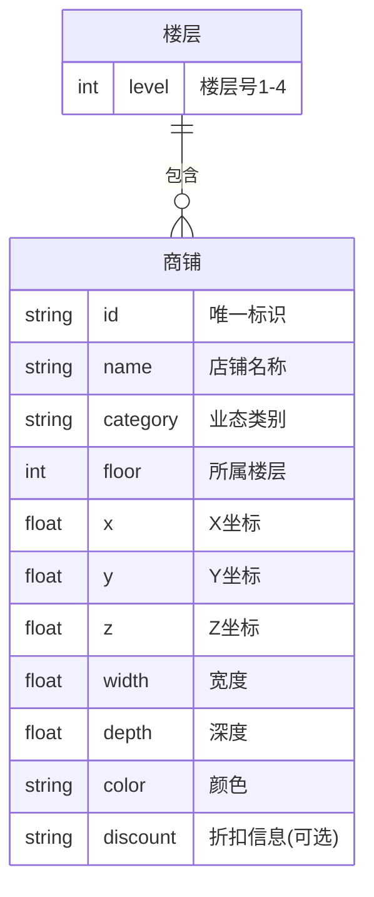

## 1. 架构设计



## 2. 技术说明

- 前端：React@18 + TypeScript + Vite
- 3D渲染：Three.js + @react-three/fiber + @react-three/drei
- 初始化工具：vite-init (react-ts模板)
- 后端：无（纯前端，Mock数据）
- 数据库：无（使用Mock数据模块）

## 3. 路由定义

| 路由 | 用途 |
|------|------|
| / | 3D导览主页面（单页应用，无路由切换） |

## 4. API定义

无后端API，所有数据来自本地Mock数据模块。

### 数据类型定义

```typescript
interface ShopInfo {
  id: string;
  name: string;
  category: '餐饮' | '零售' | '娱乐' | '服务';
  floor: number;
  x: number;
  y: number;
  z: number;
  width: number;
  depth: number;
  color: string;
  discount?: string;
}

interface FloorInfo {
  level: number;
  shops: ShopInfo[];
}

interface CameraState {
  position: [number, number, number];
  target: [number, number, number];
}
```

## 5. 服务器架构图

无后端服务器。

## 6. 数据模型

### 6.1 数据模型定义



### 6.2 数据定义

- 80家店铺数据，按4层分组（每层15-25家）
- 业态颜色映射：餐饮#f97316、零售#3b82f6、娱乐#a855f7、服务#22c55e
- 店铺位置坐标按实际比例缩放，地面为XZ平面，Y轴为高度

## 7. 文件结构

```
├── package.json
├── vite.config.js
├── tsconfig.json
├── index.html
├── src/
│   ├── types.ts
│   ├── data/
│   │   └── mockData.ts
│   ├── components/
│   │   ├── FloorScene.tsx
│   │   ├── FloorSelector.tsx
│   │   ├── ShopPopup.tsx
│   │   └── SearchBar.tsx
│   ├── App.tsx
│   ├── styles.css
│   └── main.tsx
```

## 8. 性能策略

- 首帧渲染 < 200ms：按楼层筛选渲染，仅渲染当前楼层商铺
- 帧率 ≥ 30fps：使用InstancedMesh优化同类几何体，控制面数
- 内存 < 200MB：轻量级Sprite文字，避免纹理堆积
- 动画使用requestAnimationFrame，避免重渲染
