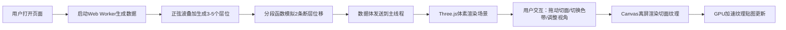

## 1. 产品概述
三维地震数据切片交互可视化工具，帮助地质学家和学生直观查看地下岩层与断层的三维空间分布，解决传统二维剖面图表现力不足、专业软件操作复杂且成本高昂的痛点。
- 核心用户：地质科研人员、高校地质专业学生、油气勘探工程师
- 产品价值：免费、轻量、基于浏览器的3D交互可视化，无需安装专业软件即可直观理解地下构造

## 2. 核心特性

### 2.1 用户角色
| 角色 | 使用方式 | 核心需求 |
|------|----------|----------|
| 地质学家 | 科研分析 | 清晰展示层位和断层空间关系、可调节透明度和色带 |
| 学生用户 | 教学学习 | 直观理解三维地质概念、响应式设计适配多种设备 |
| 工程师 | 快速预览 | 切片交互流畅、性能稳定、支持多视角观察 |

### 2.2 功能模块
1. **3D体素渲染模块**：100x100x50地震数据立方体，体素着色映射到热力色带
2. **正交切面控制模块**：XY/XZ/YZ三组可滑动切面，实时显示二维振幅切片
3. **视角控制模块**：俯视/侧视/自由旋转三种预设，迷你罗盘指示器
4. **色带切换模块**：热力/地质/光谱三种色带，0.5秒平滑过渡动画
5. **数据生成模块**：Web Worker后台生成含层位和断层的模拟数据

### 2.3 页面详情
| 页面名称 | 模块名称 | 功能描述 |
|---------|---------|----------|
| 主页面 | 3D场景容器 | 全屏深灰背景#0f172a，居中悬浮数据立方体 |
| 主页面 | 左侧控制面板 | 毛玻璃效果，包含三组切面滑块、透明度调节、色带选择器、视角预设按钮 |
| 主页面 | 迷你罗盘指示器 | 右上角80x80px，N标记红色三角形，点击重置视角 |
| 主页面 | 响应式工具栏 | 768px以下自动折叠为顶部工具栏，抽屉展开 |

## 3. 核心流程
用户打开页面 → Web Worker后台生成含层位和断层的地震数据体 → 数据生成完成后Three.js体素渲染场景 → 用户拖动切面滑块实时查看内部结构 → 切换色带查看不同渲染效果 → 调整视角或点击罗盘重置视角 → 移动端使用抽屉式控制面板

## 4. 用户界面设计

### 4.1 设计风格
- 主色调：深蓝#1e3a5f → 青#06b6d4 → 亮黄#fde047（热力色带）
- 背景：深灰#0f172a（专业地质可视化氛围）
- 控件：滑块轨道#334155，滑块头#3b82f6，切面边界#e5e7eb
- 字体：选择Space Grotesk作为显示字体，Inter作为正文字体
- 面板：半透明白色 + backdrop-filter: blur(8px) 毛玻璃效果，圆角16px

### 4.2 页面设计概述
| 页面名称 | 模块名称 | UI元素 |
|---------|---------|--------|
| 主页面 | 3D场景 | 居中悬浮立方体、体素半透明渲染、实时切片纹理、轨道控制器旋转缩放 |
| 主页面 | 左侧面板 | 切面滑块组（Z/Y/X轴各一个）、透明度滑块、色带选择按钮组、视角预设按钮组 |
| 主页面 | 罗盘指示器 | 圆形透明背景、红色N三角形、方向指示线、点击动效 |
| 主页面 | 移动端工具栏 | 固定顶部、图标按钮、抽屉滑入动画0.3秒ease-out |

### 4.3 响应式
- Desktop-first设计，断点768px
- 桌面端：左侧浮动面板280px宽，场景全屏
- 移动端：面板折叠为顶部64px工具栏，点击图标滑出抽屉
- 触控优化：滑块支持触摸拖动，双指缩放场景

### 4.4 3D场景指导
- 环境光强度0.6，平行光强度0.8，方向(1,1,1)
- 相机初始位置(120, 100, 120)，lookAt(0,0,0)，近裁剪面1，远裁剪面1000
- 体素尺寸1x1x1单位，立方体中心在原点
- 轨道控制器：启用阻尼，阻尼系数0.05，禁止平移
- 后处理：轻微Bloom效果增强边缘发光感，色调映射ACESFilmic
- 性能：顶点着色器处理颜色映射，1080p下稳定30FPS+
