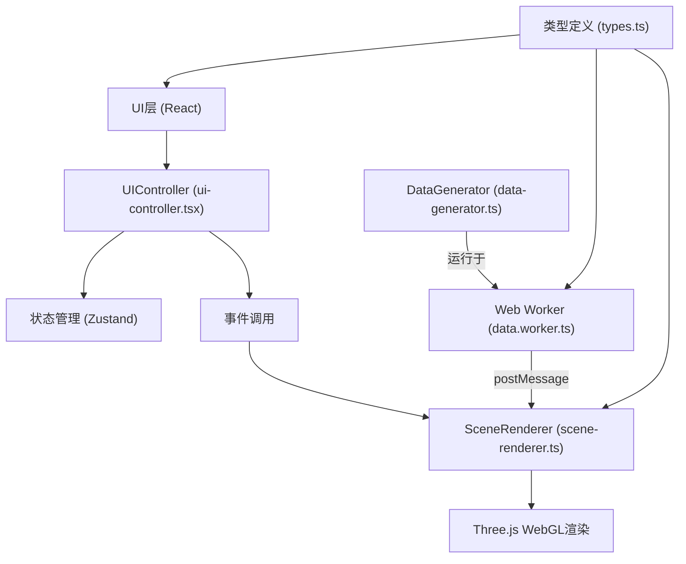

## 1. 架构设计



## 2. 技术选型
- 前端框架：React@18 + TypeScript@5
- 构建工具：Vite@5 + @vitejs/plugin-react@4
- 3D渲染：Three@0.160 + @react-three/fiber@8 + @react-three/drei@9
- 状态管理：Zustand@4
- 样式方案：原生CSS + CSS变量（无需Tailwind）
- 并发处理：Web Worker（数据生成不阻塞主线程）
- 性能优化：Canvas2D离屏渲染 + GPU纹理贴图

## 3. 文件结构
| 文件路径 | 职责说明 |
|---------|---------|
| `package.json` | 依赖管理、启动脚本 |
| `vite.config.js` | Vite配置、React插件、Worker支持 |
| `tsconfig.json` | TypeScript严格模式、ES2020目标 |
| `index.html` | 应用入口页面 |
| `src/types.ts` | 体素数据接口、切片配置、UI状态类型 |
| `src/data-generator.ts` | 正弦波层位模拟、分段函数断层位移、getSlice切片提取 |
| `src/data.worker.ts` | Web Worker入口，postMessage传递数据体 |
| `src/scene-renderer.ts` | Three.js场景管理、体素渲染、切片平面、色带动画 |
| `src/ui-controller.tsx` | 左侧面板、罗盘指示器、响应式布局、用户交互 |
| `src/main.tsx` | 应用入口、Worker启动、组件挂载 |

## 4. 核心数据结构

### 4.1 体素数据接口
```typescript
interface IVoxelData {
  dimensions: { width: number; height: number; depth: number };
  amplitudes: Uint8Array;  // 0-255振幅值，长度=width*height*depth
}
```

### 4.2 切片配置接口
```typescript
interface ISliceConfig {
  xy: number;  // Z轴位置 0-49
  xz: number;  // Y轴位置 0-99
  yz: number;  // X轴位置 0-99
  opacity: number;  // 体素透明度 0.3-0.8
}
```

### 4.3 UI状态类型
```typescript
interface IUIState {
  currentColorMap: 'thermal' | 'geological' | 'spectrum';
  viewMode: 'top' | 'side' | 'free';
  isMobile: boolean;
  drawerOpen: boolean;
  isLoading: boolean;
}
```

## 5. 关键技术实现方案

### 5.1 层位与断层模拟算法
```
层位生成：
- 3-5个正弦波叠加：z = A1*sin(f1*x + p1) + A2*sin(f2*y + p2) + ...
- 每层厚度5-15个体素，层间振幅值线性渐变
- 添加随机噪声模拟真实地震数据的不确定性

断层模拟：
- 2条倾斜断层面：ax + by + cz = d
- 分段函数：点在平面一侧时z坐标偏移±8-15个体素
- 断层附近振幅值梯度变化，模拟破碎带效果
```

### 5.2 切片纹理渲染流程
```
1. 滑块位置变化 → 调用getSlice获取二维振幅数组
2. 离屏Canvas (256x256) → putImageData绘制灰度图
3. Canvas2D滤镜/像素操作 → 应用热力色带映射
4. Three.js CanvasTexture → 贴到切片平面Mesh上
5. 纹理标记needsUpdate = true → GPU自动更新
```

### 5.3 色带动画插值
```
requestAnimationFrame循环：
- t = 0 → 1 (0.5秒时长)
- 每帧计算当前颜色 = colorA * (1-t) + colorB * t
- 更新体素材质的uniform渐变纹理
- Three.js自动重渲染，无需重建几何体
```

### 5.4 Web Worker通信协议
```
主线程 → Worker: { type: 'GENERATE_DATA' }
Worker → 主线程: { type: 'DATA_READY', payload: IVoxelData }
Worker → 主线程: { type: 'PROGRESS', payload: number }
主线程 → Worker: { type: 'GET_SLICE', payload: {axis, index} }
Worker → 主线程: { type: 'SLICE_READY', payload: number[][] }
```

## 6. 性能优化策略
1. **体素渲染优化**：使用BufferGeometry存储100x100x50=500,000个顶点，顶点着色器中计算颜色映射，避免CPU逐体素更新
2. **切片纹理复用**：三个切片平面各自持有一个CanvasTexture，位置变化时只更新纹理内容，不重建Mesh
3. **色带动画GPU化**：将色带渐变作为1D纹理uniform传入片元着色器，插值在GPU完成
4. **Web Worker数据生成**：500,000个体素计算在后台线程完成，主线程保持60FPS响应
5. **视锥体剔除**：Three.js内置frustum culling，离屏体素不参与渲染
6. **LOD策略**：移动端自动降采样数据体到50x50x25，平衡性能与效果
