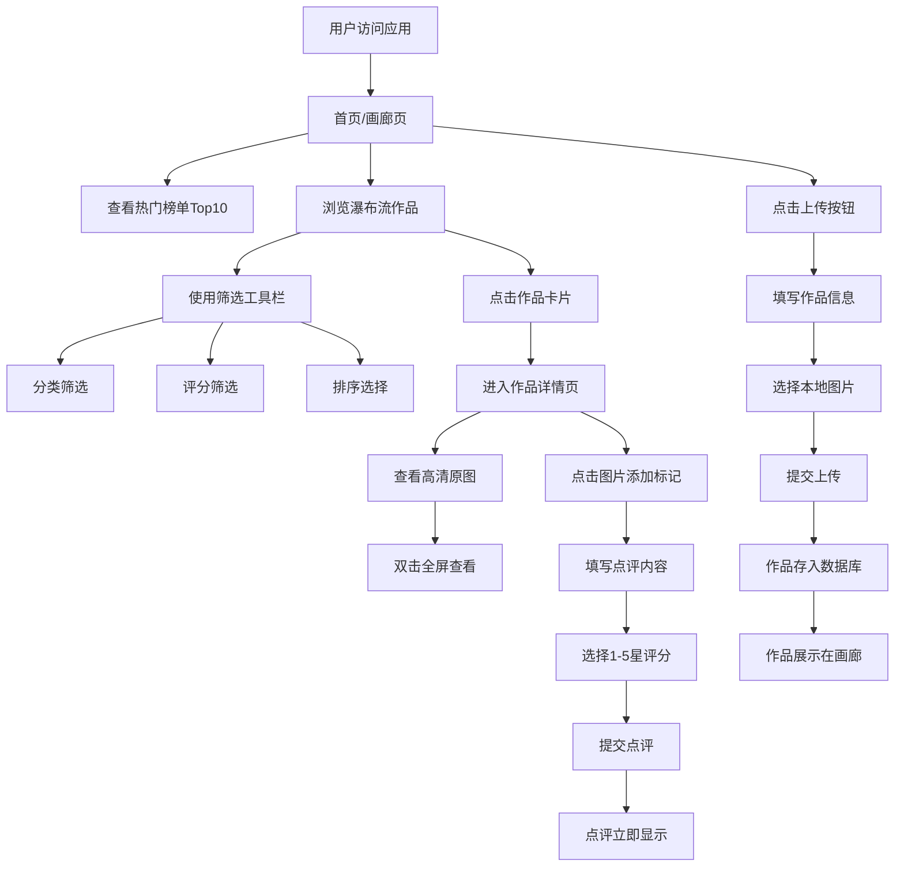

# Spotlight 摄影作品点评社区 - 产品需求文档 (PRD)

## 1. 产品概述

### 1.1 产品名称
**Spotlight** - 在线摄影作品点评社区

### 1.2 产品定位
为摄影师和摄影爱好者提供一个作品分享与专业点评的社区平台，摄影师可以上传作品获得反馈，点评者可以通过标记点评提供专业意见。

### 1.3 目标用户
- 摄影师：上传作品，获得专业点评反馈
- 摄影爱好者：浏览作品，提供专业点评
- 普通用户：浏览高质量摄影作品

---

## 2. 功能需求

### 2.1 作品上传功能

#### 2.1.1 功能描述
用户可以上传摄影作品，填写作品信息。

#### 2.1.2 功能详情
- 图片上传：本地文件读取转为Base64编码存入数据库
- 标题：最多30字限制
- 分类：人像/风光/街拍/静物四种可选，每个分类对应色标：
  - 人像：#f9a8d4
  - 风光：#6ee7b7
  - 街拍：#fcd34d
  - 静物：#c4b5fd
- 简短描述
- 上传按钮：渐变色#6366f1到#8b5cf6，圆角8px，点击时按钮缩小至95%再恢复的微动效

### 2.2 作品画廊展示

#### 2.2.1 功能描述
展示所有作品的缩略图瀑布流布局。

#### 2.2.2 功能详情
- 三列瀑布流布局（响应式适配）：
  - >1200px：三列
  - 768-1200px：两列
  - <768px：一列
- 每张卡片：宽320px，圆角12px，背景白色#ffffff，阴影0 4px 16px rgba(0,0,0,0.08)
- 悬停效果：阴影加深至0 8px 24px rgba(0,0,0,0.15)并上移4px，过渡0.3s ease
- 卡片内容：作品缩略图（高度自适应裁剪），标题（白底黑字），作者昵称（灰色#6b7280），平均评分（星形图标颜色根据评分变化）
- 无限滚动加载：每次加载10幅作品，使用虚拟列表思想只渲染可视区域卡片

### 2.3 作品详情页

#### 2.3.1 功能描述
展示作品高清原图和点评区域。

#### 2.3.2 功能详情
- 左侧：高清原图最大宽800px
- 支持缩放查看，双击全屏
- 在图片上点击任意位置放置标记点（直径12px红色圆点#ef4444带白色内圆#ffffff直径6px）
- 添加标记时从点击位置弹出气泡式输入框（背景白色圆角8px阴影，内嵌文本区）
- 右侧：垂直排列点评列表
- 每条点评卡片：宽100%，圆角8px，背景#f3f4f6
- 点评内容：点评者头像（40px圆形，边框#d1d5db 1px实线）、文本内容、1-5星评分（星星使用金黄色#fbbf24实心星）、标记坐标红点（直径8px显示在图片缩略图上）

### 2.4 热门榜单

#### 2.4.1 功能描述
根据综合评分展示Top10热门作品。

#### 2.4.2 功能详情
- 综合评分计算公式：平均分 * 点评数量 / 100
- 榜单卡片：宽200px，高280px，圆角12px
- 排名边框：
  - 第1名：金色边框#fbbf24 3px实线
  - 第2名：银色边框#d1d5db
  - 第3名：铜色边框#cd7f32
  - 其余：白色边框
- 悬停效果：放大1.05倍并显示详细评分数量的工具提示

### 2.5 筛选与排序

#### 2.5.1 功能描述
用户可以按分类和评分筛选作品，按多种方式排序。

#### 2.5.2 功能详情
- 分类筛选：人像/风光/街拍/静物
- 最低评分滑条：轨道浅灰#e5e7eb，滑块头紫色#8b5cf6直径20px，拖动时显示实时数值气泡在滑块上方
- 排序方式：最新/最热/评分最高

### 2.6 点评功能

#### 2.6.1 功能描述
用户可以对作品进行带标记的详细点评和星评。

#### 2.6.2 功能详情
- 点评文本：最多200字
- 星评：1-5星
- 标记点：点击图片确定位置
- 提交后标记点和点评立即出现在右侧点评列表

---

## 3. 界面设计

### 3.1 整体主题
- 深色主题：背景#1f2937，主文字#f9fafb

### 3.2 顶部导航栏
- 固定高56px
- 毛玻璃效果：背景rgba(31,41,55,0.8)，背滤模糊12px
- 左侧品牌Logo：渐变文字（从#6366f1到#a78bfa），脉动发光动画（2s infinite alternate）
- 右侧：上传按钮和用户头像

### 3.3 筛选工具栏
- 画廊页顶部：背景#374151，圆角12px，内边距12px

### 3.4 交互动画
- 所有交互操作均有平滑过渡动画
- hover：0.2s ease
- 页面切换：0.3s fade

---

## 4. 性能要求

### 4.1 加载性能
- 作品详情页加载全量数据（图片+前20条点评）时间不超过1.5秒
- 模拟时使用setTimeout 300ms延迟

### 4.2 滚动性能
- 画廊页无限滚动加载，不得有卡顿
- 使用虚拟列表思想，只渲染可视区域内的卡片

---

## 5. 功能流程图

