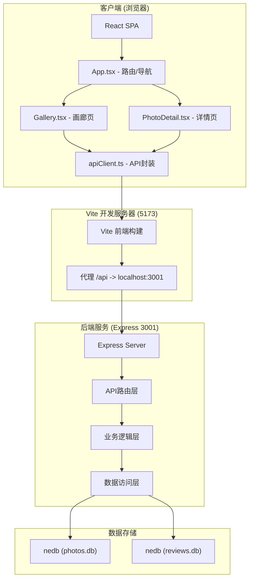

# Spotlight 摄影社区 - 技术架构文档

## 1. 技术选型

### 1.1 前端技术栈
- **框架**: React 18.x
- **构建工具**: Vite 5.x
- **语言**: TypeScript 5.x
- **路由**: React Router DOM 6.x
- **HTTP客户端**: Axios
- **开发服务器端口**: Vite默认5173

### 1.2 后端技术栈
- **框架**: Express 4.x
- **数据库**: nedb-promises (嵌入式文档数据库)
- **语言**: TypeScript
- **运行方式**: ts-node
- **服务端口**: 3001

### 1.3 依赖列表
```json
{
  "dependencies": [
    "react",
    "react-dom",
    "react-router-dom",
    "express",
    "nedb-promises",
    "uuid",
    "axios"
  ],
  "devDependencies": [
    "vite",
    "@vitejs/plugin-react",
    "typescript",
    "@types/react",
    "@types/react-dom",
    "ts-node",
    "@types/express",
    "@types/node",
    "@types/uuid",
    "@types/cors",
    "cors"
  ]
}
```

---

## 2. 项目结构

```
auto73/
├── .trae/
│   └── documents/
│       ├── PRD.md
│       └── TECH_ARCHITECTURE.md
├── src/
│   ├── server.ts              # 后端服务
│   ├── App.tsx                # 前端主组件
│   ├── apiClient.ts           # API客户端封装
│   ├── pages/
│   │   ├── Gallery.tsx        # 画廊页面
│   │   └── PhotoDetail.tsx    # 作品详情页
│   └── types/                 # TypeScript类型定义 (可选)
├── package.json
├── index.html
├── vite.config.js
├── tsconfig.json
└── README.md
```

---

## 3. 数据模型

### 3.1 作品 (Photo)
```typescript
interface Photo {
  _id: string;           // 唯一标识，由nedb自动生成
  title: string;         // 标题，最多30字
  category: 'portrait' | 'landscape' | 'street' | 'still'; // 分类
  description: string;   // 描述
  imageBase64: string;   // 图片Base64编码
  author: string;        // 作者昵称
  authorAvatar: string;  // 作者头像
  createdAt: number;     // 创建时间戳
  averageRating: number; // 平均评分
  reviewCount: number;   // 点评数量
  compositeScore: number; // 综合评分 = avgRating * reviewCount / 100
}
```

### 3.2 点评 (Review)
```typescript
interface Review {
  _id: string;           // 唯一标识
  photoId: string;       // 关联作品ID
  reviewer: string;      // 点评者昵称
  reviewerAvatar: string; // 点评者头像
  content: string;       // 点评内容，最多200字
  rating: number;        // 评分，1-5星
  markerX: number;       // 标记点X坐标 (百分比0-100)
  markerY: number;       // 标记点Y坐标 (百分比0-100)
  createdAt: number;     // 创建时间戳
}
```

### 3.3 分类色标映射
```typescript
const categoryColors: Record<string, string> = {
  portrait: '#f9a8d4',   // 人像
  landscape: '#6ee7b7',  // 风光
  street: '#fcd34d',     // 街拍
  still: '#c4b5fd'       // 静物
};
```

---

## 4. API 接口设计

所有API接口前缀：`/api`

### 4.1 作品相关接口

#### GET /api/photos
获取作品列表（支持分页、筛选、排序）

**请求参数**:
- `page`: number (默认1)
- `limit`: number (默认10)
- `category`: string (可选，筛选分类)
- `minRating`: number (可选，最低评分筛选)
- `sortBy`: 'newest' | 'hottest' | 'topRated' (默认newest)

**响应**:
```json
{
  "photos": [Photo],
  "total": number,
  "hasMore": boolean
}
```

#### GET /api/photos/:id
获取作品详情及前20条点评

**响应**:
```json
{
  "photo": Photo,
  "reviews": [Review]
}
```

#### POST /api/photos
上传新作品

**请求体**:
```json
{
  "title": string,
  "category": string,
  "description": string,
  "imageBase64": string,
  "author": string,
  "authorAvatar": string
}
```

**响应**:
```json
{
  "success": true,
  "photo": Photo
}
```

#### PUT /api/photos/:id
更新作品信息（主要用于更新评分统计）

**请求体**:
```json
{
  "averageRating": number,
  "reviewCount": number,
  "compositeScore": number
}
```

### 4.2 点评相关接口

#### GET /api/photos/:id/reviews
获取作品点评列表

**请求参数**:
- `page`: number (默认1)
- `limit`: number (默认20)

**响应**:
```json
{
  "reviews": [Review],
  "total": number
}
```

#### POST /api/reviews
提交新点评

**请求体**:
```json
{
  "photoId": string,
  "reviewer": string,
  "reviewerAvatar": string,
  "content": string,
  "rating": number,
  "markerX": number,
  "markerY": number
}
```

**响应**:
```json
{
  "success": true,
  "review": Review
}
```

### 4.3 热门榜单接口

#### GET /api/hot
获取Top10热门作品

**响应**:
```json
{
  "photos": [Photo]
}
```

---

## 5. 系统架构图



---

## 6. 前端核心实现

### 6.1 瀑布流布局实现
- 使用CSS columns实现基础瀑布流
- 响应式断点：
  - `@media (min-width: 1200px)`: `column-count: 3`
  - `@media (min-width: 768px) and (max-width: 1199px)`: `column-count: 2`
  - `@media (max-width: 767px)`: `column-count: 1`

### 6.2 虚拟滚动实现
- 使用Intersection Observer API监听可见区域
- 维护`visibleItems`数组，只渲染视口内的卡片
- 卡片高度预估：350px（动态测量）
- 上下缓冲区：各200px

### 6.3 无限滚动加载
- 监听滚动事件，当滚动到底部500px时触发加载
- 使用`loading`和`hasMore`状态控制
- 每次加载10条数据

### 6.4 图片标记系统
- 点击图片获取相对于图片的百分比坐标
- 使用CSS绝对定位放置标记点
- 标记点样式：12px红色圆点+6px白色内圆
- 气泡输入框根据点击位置动态调整

### 6.5 星级评分组件
```typescript
// 星星颜色规则
const getStarColor = (rating: number, starIndex: number): string => {
  if (rating >= starIndex + 1) return '#fbbf24'; // 金色实心
  return '#d1d5db'; // 灰色
};

// 卡片评分颜色
const getRatingBadgeColor = (avgRating: number): string => {
  if (avgRating >= 4.5) return '#fbbf24'; // 金色
  if (avgRating >= 3.5) return '#d1d5db'; // 银色
  return '#9ca3af'; // 灰色
};
```

---

## 7. 后端核心实现

### 7.1 nedb 数据库初始化
```typescript
import Datastore from 'nedb-promises';
import path from 'path';

const db = {
  photos: Datastore.create({
    filename: path.join(__dirname, '../data/photos.db'),
    autoload: true
  }),
  reviews: Datastore.create({
    filename: path.join(__dirname, '../data/reviews.db'),
    autoload: true
  })
};
```

### 7.2 评分聚合逻辑
当新增点评后，需要重新计算作品的综合评分：
```typescript
async function updatePhotoRating(photoId: string) {
  const reviews = await db.reviews.find({ photoId });
  const reviewCount = reviews.length;
  const averageRating = reviewCount > 0
    ? reviews.reduce((sum, r) => sum + r.rating, 0) / reviewCount
    : 0;
  const compositeScore = (averageRating * reviewCount) / 100;

  await db.photos.update(
    { _id: photoId },
    { $set: { averageRating, reviewCount, compositeScore } }
  );
}
```

### 7.3 模拟延迟
```typescript
const simulateDelay = (ms: number = 300) =>
  new Promise(resolve => setTimeout(resolve, ms));
```

---

## 8. 样式系统

### 8.1 CSS 变量定义
```css
:root {
  --bg-primary: #1f2937;
  --bg-secondary: #374151;
  --text-primary: #f9fafb;
  --text-secondary: #6b7280;
  --accent-purple: #6366f1;
  --accent-purple-light: #8b5cf6;
  --accent-purple-lighter: #a78bfa;
  --gold: #fbbf24;
  --silver: #d1d5db;
  --bronze: #cd7f32;
  --danger: #ef4444;
  --category-portrait: #f9a8d4;
  --category-landscape: #6ee7b7;
  --category-street: #fcd34d;
  --category-still: #c4b5fd;
}
```

### 8.2 动画关键帧
```css
@keyframes pulse-glow {
  from {
    filter: drop-shadow(0 0 4px var(--accent-purple));
  }
  to {
    filter: drop-shadow(0 0 16px var(--accent-purple-lighter));
  }
}

@keyframes fadeIn {
  from { opacity: 0; }
  to { opacity: 1; }
}

@keyframes slideUp {
  from {
    opacity: 0;
    transform: translateY(20px);
  }
  to {
    opacity: 1;
    transform: translateY(0);
  }
}
```

---

## 9. 性能优化策略

### 9.1 前端优化
- 虚拟列表：只渲染可视区域DOM节点
- 图片懒加载：Intersection Observer
- Base64图片缓存：避免重复解码
- 防抖/节流：滚动事件、输入事件
- 路由懒加载：React Router lazy + Suspense

### 9.2 后端优化
- 数据库索引：为常用查询字段建立索引
- 分页查询：避免全表扫描
- 连接池：复用数据库连接

---

## 10. 部署与启动

### 10.1 启动脚本
```json
{
  "scripts": {
    "dev": "vite",
    "server": "ts-node server.ts"
  }
}
```

### 10.2 开发流程
1. 安装依赖：`npm install`
2. 启动后端服务：`npm run server` (端口3001)
3. 启动前端开发服务：`npm run dev` (端口5173)
4. 访问：`http://localhost:5173`

---

## 11. 目录结构规范

```
auto73/
├── data/                    # 数据库文件目录 (git忽略)
│   ├── photos.db
│   └── reviews.db
├── src/
│   ├── server.ts            # Express后端服务
│   ├── App.tsx              # React根组件，路由配置
│   ├── apiClient.ts         # Axios API封装
│   └── pages/
│       ├── Gallery.tsx      # 画廊页（瀑布流、筛选、虚拟滚动）
│       └── PhotoDetail.tsx  # 详情页（图片、点评、标记）
├── package.json
├── index.html
├── vite.config.js
├── tsconfig.json
└── .gitignore
```
