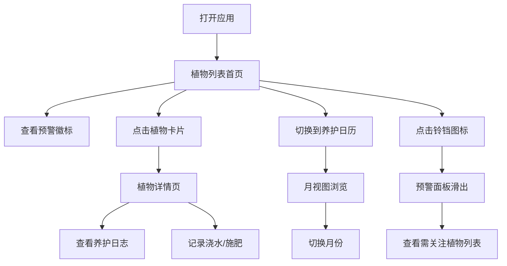

## 1. 产品概述

PlantMind是一款室内植物养护助手应用，帮助用户管理家中植物的浇水和施肥日程，提供智能健康预警和养护日历视图。目标用户为室内植物爱好者，解决"忘记浇水导致植物枯萎"的痛点。

## 2. 核心功能

### 2.1 功能模块
1. **我的植物首页**：植物卡片网格展示、添加植物、健康预警徽标
2. **植物详情页**：养护日志列表、快速记录浇水/施肥动作
3. **养护日历**：月视图展示所有植物的养护历史和计划
4. **预警面板**：右下角固定滑出面板，展示所有需关注的植物

### 2.2 页面详情
| 页面名称 | 模块名称 | 功能描述 |
|-----------|-------------|---------------------|
| 我的植物 | 植物卡片网格 | 响应式布局展示所有植物卡片，显示照片、名称、下次浇水倒计时、预警徽标 |
| 我的植物 | 添加植物表单 | 填写名称、品种、照片URL、浇水周期、施肥周期 |
| 植物详情 | 日志列表 | 按时间倒序显示浇水/施肥记录，含类型图标和时间戳 |
| 植物详情 | 快速操作按钮 | 一键记录浇水或施肥动作 |
| 养护日历 | 月视图表格 | 横轴日期、纵轴植物名，绿色圆点标记养护动作 |
| 预警面板 | 预警列表 | 列出所有需要浇水或施肥的植物及逾期天数 |

## 3. 核心流程

用户打开应用 → 浏览植物列表（查看预警状态）→ 点击植物查看详情 → 记录浇水/施肥动作
或
用户打开应用 → 切换到养护日历 → 查看月度养护安排 → 切换月份浏览
或
用户打开应用 → 点击右下角铃铛 → 查看预警面板 → 快速定位需关注的植物

## 4. 用户界面设计

### 4.1 设计风格
- **主色调**：#2e7d32（深绿色），辅助色：#a5d6a7（浅绿色），背景色：#f1f8e9（淡绿白色）
- **预警色**：#ef4444（红色紧急）、#f97316（橙色警告）
- **按钮风格**：圆角设计，点击时缩小至95%再回弹（0.2s ease微动效）
- **布局**：顶部固定64px导航栏，卡片式内容区
- **图标**：使用lucide-react图标库

### 4.2 页面设计概览
| 页面名称 | 模块名称 | UI元素 |
|-----------|-------------|-------------|
| 我的植物 | 导航栏 | 64px高#2e7d32背景，应用名+3个标签按钮，当前标签白色下划线 |
| 我的植物 | 植物卡片 | 280x360px，圆角16px，白色背景，悬停阴影加深+上移4px，0.3s过渡 |
| 我的植物 | 预警徽标 | 卡片右上角红色/橙色圆形徽标，顶部边框4px实线同色 |
| 养护日历 | 月视图表格 | 横轴1-31日期，纵轴植物名，绿色实心/空心圆点，hover背景#e8f5e9 |
| 预警面板 | 滑出面板 | 320x400px，背景#fff7ed，圆角12px，从右向左滑出动画 |

### 4.3 响应式
- Desktop-first设计
- 植物卡片Grid布局：>=1200px 4列，>=768px 3列，<768px 2列
- 预警面板在小屏幕上保持固定位置

### 4.4 性能要求
- 页面初次渲染及数据变更后完成时间 < 200ms
- 日历翻页动画帧率 >= 50fps
- 所有过渡动画流畅无卡顿
