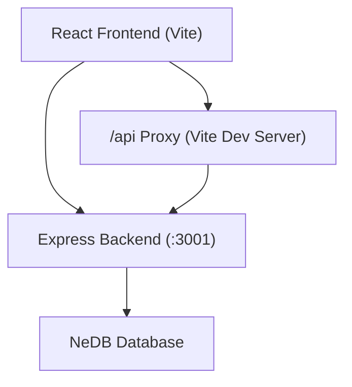
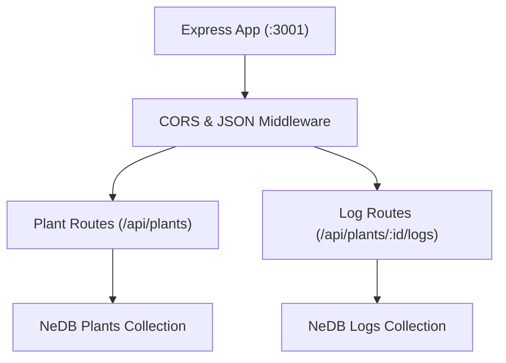
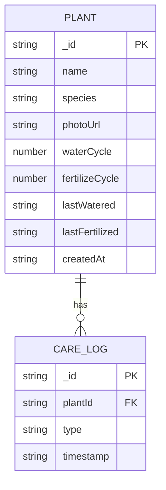

## 1. 架构设计



## 2. 技术说明
- **前端**：React 18 + TypeScript + Vite
- **路由**：react-router-dom
- **HTTP客户端**：axios
- **后端**：Express 4
- **数据库**：nedb-promises（嵌入式NoSQL数据库）
- **日期处理**：date-fns
- **ID生成**：uuid
- **状态管理**：React useState/useEffect（轻量场景，无需额外状态库）

## 3. 路由定义
| 路由 | 用途 |
|-------|---------|
| / | 我的植物首页（植物卡片列表+添加表单） |
| /plant/:id | 植物详情页（日志列表+快速操作） |
| /calendar | 养护日历（月视图） |

## 4. API定义

### 4.1 植物CRUD
```typescript
// Plant 数据模型
interface Plant {
  _id: string;
  name: string;
  species: string;
  photoUrl: string;
  waterCycle: number;      // 1-30天
  fertilizeCycle: number;  // 7-90天
  lastWatered: string | null;     // ISO日期
  lastFertilized: string | null;  // ISO日期
  createdAt: string;
}

// CareLog 数据模型
interface CareLog {
  _id: string;
  plantId: string;
  type: 'water' | 'fertilize';
  timestamp: string;
}
```

| 方法 | 路径 | 描述 |
|------|------|------|
| GET | /api/plants | 获取所有植物（按创建时间倒序） |
| GET | /api/plants/:id | 获取单个植物详情 |
| POST | /api/plants | 创建新植物 |
| PUT | /api/plants/:id | 更新植物信息 |
| DELETE | /api/plants/:id | 删除植物 |
| GET | /api/plants/:id/logs | 获取植物养护日志 |
| POST | /api/plants/:id/logs | 记录养护动作（浇水/施肥） |

## 5. 服务器架构



## 6. 数据模型

### 6.1 ER图



### 6.2 数据库存储
- 使用nedb-promises创建两个数据文件：
  - `server/data/plants.db` - 植物信息
  - `server/data/logs.db` - 养护日志

## 7. 项目文件结构
```
/
├── package.json
├── index.html
├── vite.config.js
├── tsconfig.json
├── server/
│   └── index.js
├── public/
│   └── css/
│       └── app.css
└── src/
    ├── App.tsx
    ├── PlantList.tsx
    ├── PlantDetail.tsx
    ├── AddPlantForm.tsx
    ├── Calendar.tsx
    └── AlertPanel.tsx
```
