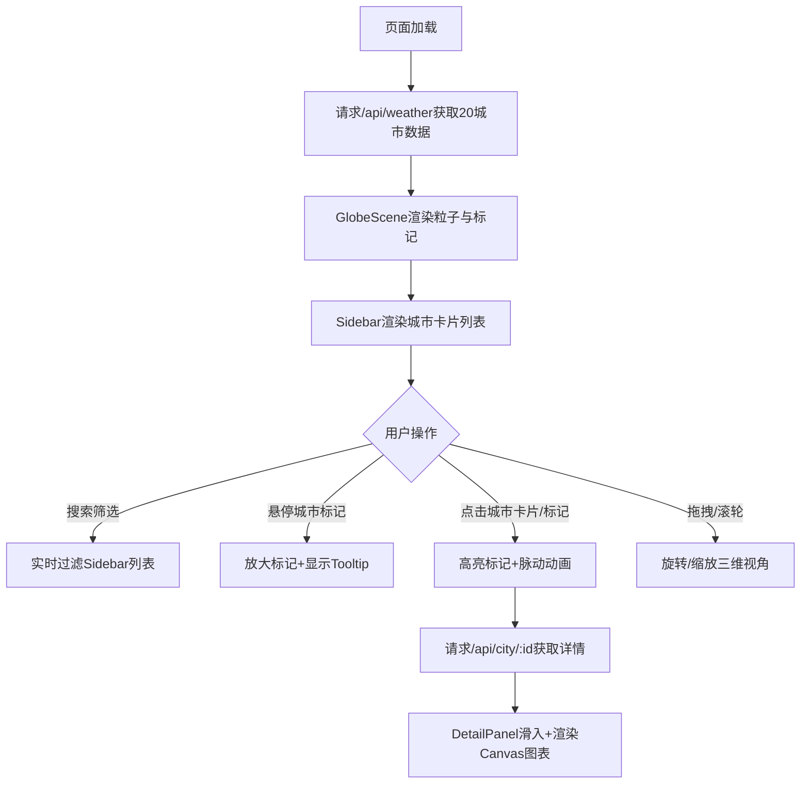

## 1. 产品概述

SkyViz是面向气象分析师的全球天气三维可视化平台，通过交互式三维地球展示全球主要城市未来72小时天气变化趋势，解决传统静态图表缺乏空间视角和动态感的痛点。

- 核心价值：以三维空间视角直观呈现冷暖气团运动、温度分布、降水带变化，辅助气象分析决策
- 目标用户：气象分析师、气候研究员、数据可视化从业者

---

## 2. 核心功能

### 2.1 用户角色
无需注册，单用户角色直接使用全部功能。

### 2.2 功能模块
1. **三维地球主场景**：自转地球、粒子系统（温度映射）、热力图层、城市标记
2. **城市列表面板**：城市卡片列表、实时搜索筛选、选中状态联动
3. **城市详情面板**：72小时温度折线图、降水柱状图、时序数据展示

### 2.3 页面详情

| 页面名称 | 模块名称 | 功能描述 |
|-----------|-------------|---------------------|
| 主页 | 三维地球场景 | 自动旋转球体、粒子系统温度映射、热力层、鼠标交互旋转缩放 |
| 主页 | 城市标记交互 | 悬停放大+Tooltip、点击高亮+脉动光环、详情面板触发 |
| 主页 | 左侧城市列表 | 搜索框实时过滤、温度色块指示、选中高亮联动 |
| 主页 | 右侧详情面板 | Canvas绘制温度折线+降水柱状、72小时12小时间隔标签 |

---

## 3. 核心流程

---

## 4. 用户界面设计

### 4.1 设计风格
- **主色调**：深空背景 #0a0a1a，深蓝面板 #0f172a（alpha 0.85~0.95）
- **强调色**：蓝色 #3b82f6（发光边框）、青色 #38bdf8（温度线）、蓝色 #60a5fa（降水柱）
- **温度映射色**：< -5°C深蓝 #1e3a5f → -5~5°C青 #06b6d4 → 5~20°C绿 #22c55e → >20°C橙 #f97316 → >35°C红 #ef4444
- **材质质感**：毛玻璃半透明（backdropBlur 8~12px）、微弱发光边框、UnrealBloom后处理
- **圆角规范**：面板16px，卡片/输入框8px
- **过渡动画**：面板滑入滑出 ease-out 0.3s

### 4.2 页面设计概述

| 页面名称 | 模块名称 | UI元素 |
|-----------|-------------|-------------|
| 主页 | 三维地球场景 | 半径400px球体、深蓝灰材质+噪点纹理、0.005rad/s自转、Bloom发光强度0.3 |
| 主页 | 粒子系统 | 3-6px发光粒子、温度色映射、降水概率控制透明度0.3-0.9、Y轴浮动±2px |
| 主页 | 城市标记 | 8px半球形标记、悬停12px+Tooltip、选中16px+1.5s脉动光环 |
| 主页 | 左侧Sidebar | 宽260px、距顶80px固定、圆角0 16 16 0、搜索框毛玻璃焦点蓝边、卡片60px高+分割线 |
| 主页 | 右侧DetailPanel | 宽420px、圆角16 0 0 16、阴影-4px 0 20px、Canvas折线2px+渐变填充、柱宽8px |

### 4.3 响应式设计
- Desktop优先（≥1024px）：左侧Sidebar + 中央3D场景 + 右侧DetailPanel
- Tablet（768~1023px）：保持三栏布局，适当缩窄面板宽度
- Mobile（<768px）：Sidebar和DetailPanel变为底部全宽抽屉，3D场景占满视口

### 4.4 3D场景指引
- **环境**：深空黑色背景 #0a0a1a，无额外HDRI，球体自发光模拟星空地球
- **光照**：AmbientLight强度0.4 + DirectionalLight强度0.8模拟太阳方向光照
- **相机**：PerspectiveCamera，初始距离600，FOV 60°，缩放范围200~800
- **交互**：OrbitControls，阻尼0.95，自动旋转可被用户交互中断
- **后处理**：UnrealBloomPass强度0.3，仅作用于粒子和标记发光层
- **性能**：粒子上限8000，渲染循环数据更新≤15fps，目标1080p≥45FPS
