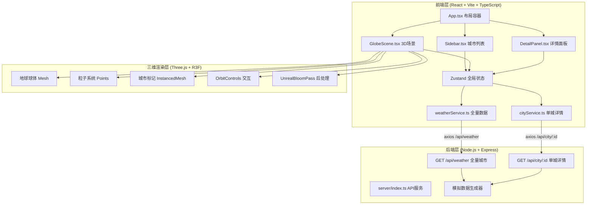
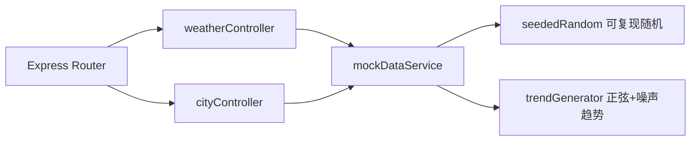

## 1. 架构设计



---

## 2. 技术描述

| 层级 | 技术栈 | 版本/说明 |
|------|--------|-----------|
| 前端框架 | React 18 + TypeScript 5 | Vite 5 构建 |
| 三维渲染 | Three.js 0.160 + @react-three/fiber 8 + @react-three/drei 9 + @react-three/postprocessing 2 | R3F声明式Three.js |
| 状态管理 | Zustand 4 | 轻量全局store，管理选中城市、数据缓存 |
| HTTP客户端 | Axios 1.6 | 前后端通信 |
| UI样式 | 原生CSS + CSS变量 | 无Tailwind，精确控制毛玻璃与发光效果 |
| 后端服务 | Node.js + Express 4 | TypeScript编写，tsx运行时执行 |
| 数据模拟 | 纯函数随机算法 | 带正弦趋势的温度/降水/风速生成 |
| 图表渲染 | 原生Canvas 2D API | 手写温度折线+降水柱，无图表库依赖 |

---

## 3. 路由定义

| 路由 | 用途 |
|-------|---------|
| / | 主页面（App.tsx），集成3D场景+双侧栏 |
| GET /api/weather | 获取20个城市72小时概览数据 |
| GET /api/city/:id | 获取指定城市72小时详细时序数据 |

---

## 4. API定义

### 类型定义

```typescript
// 城市坐标（经纬度）
interface Coordinate {
  lat: number;   // -90 ~ 90
  lng: number;   // -180 ~ 180
}

// 单个时间步天气数据
interface WeatherHour {
  timestamp: number;     // Unix毫秒
  temperature: number;   // °C, -20 ~ 45
  precipitation: number; // mm/h, 0 ~ 50
  windSpeed: number;     // m/s, 0 ~ 30
  precipitationProb: number; // 0 ~ 1
}

// 城市概览（/api/weather返回）
interface CityWeather {
  id: string;
  name: string;
  coordinate: Coordinate;
  current: {
    temperature: number;
    precipitation: number;
    windSpeed: number;
    precipitationProb: number;
  };
  timeline: WeatherHour[];  // 72个时间步
}

// 单城详情（/api/city/:id返回）
interface CityDetail {
  id: string;
  name: string;
  coordinate: Coordinate;
  country: string;
  timezone: string;
  updatedAt: number;
  timeline: WeatherHour[];  // 72个时间步
}
```

### 接口规范

**GET /api/weather**
- 响应：`{ cities: CityWeather[], generatedAt: number }`
- 大小约束：≤200KB，20城市×72小时

**GET /api/city/:id**
- 参数：URL路径 `id` - 城市唯一标识
- 响应：`CityDetail`
- 404：城市ID不存在时返回

---

## 5. 服务端架构



- 控制器层：参数校验、响应格式包装
- 服务层：20城市种子数据、带地理趋势的模拟算法（纬度影响温度基线）
- 无需持久化层，纯内存生成

---

## 6. 数据流向与调用关系

### 文件结构与职责

```
├── package.json                    # 依赖声明与启动脚本
├── vite.config.js                  # Vite构建 + /api代理到3001
├── tsconfig.json                   # TS严格模式配置
├── index.html                      # 入口 #0a0a1a全屏
├── server/
│   └── index.ts                    # Express服务 + 模拟API + 数据算法
└── src/
    ├── main.tsx                    # React入口
    ├── App.tsx                     # 布局容器 + 数据初始化 + 状态桥接
    ├── styles.css                  # 全局CSS变量 + 毛玻璃 + 动画keyframes
    ├── components/
    │   ├── GlobeScene.tsx          # 3D场景：地球/粒子/标记/交互/Bloom
    │   ├── Sidebar.tsx             # 左侧：搜索框 + 城市卡片列表
    │   └── DetailPanel.tsx         # 右侧：Canvas温度折线 + 降水柱状图
    ├── services/
    │   ├── weatherService.ts       # fetchWeather() → GET /api/weather
    │   └── cityService.ts          # fetchCity(id) → GET /api/city/:id
    ├── store/
    │   └── useAppStore.ts          # Zustand：cities/selectedId/loading
    ├── utils/
    │   ├── colorMaps.ts           # 温度→颜色映射函数
    │   └── geoMath.ts             # 经纬度→三维球面坐标转换
    └── types/
        └── weather.ts             # 全局TypeScript类型定义
```

### 数据流向链

1. **App初始化**：App.tsx → useEffect调用 weatherService.fetchWeather() → 返回CityWeather[] → useAppStore.setCities()
2. **3D渲染**：GlobeScene.tsx订阅store.cities → geoMath经纬度转球面坐标 → 粒子Points + 标记InstancedMesh渲染
3. **城市选中**：Sidebar卡片点击 / GlobeScene标记点击 → store.setSelectedId(id) → 双端高亮同步
4. **详情加载**：store.selectedId变化 → DetailPanel检测 → cityService.fetchCity(id) → 返回CityDetail → Canvas绘制
5. **交互反馈**：GlobeScene onPointerOver → 临时hoveredId → Tooltip显示 + 标记临时放大
