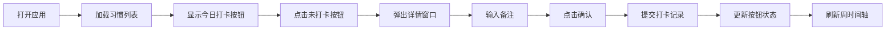

## 1. 产品概述

HabitFlow 是一款面向个人用户的习惯养成追踪工具，通过直观的可视化界面帮助用户每日记录、追踪和可视化习惯养成进度，比传统备忘录或Excel表格更具成就感和动力。

- 主要用途：每日习惯打卡、进度追踪、数据可视化
- 解决痛点：传统打卡方式缺乏直观反馈和成就感，难以坚持
- 目标用户：希望养成良好习惯的个人用户
- 产品价值：通过可视化进度和即时反馈，提升用户坚持习惯的动力

## 2. 核心功能

### 2.1 用户角色

| 角色 | 注册方式 | 核心权限 |
|------|----------|----------|
| 普通用户 | 无需注册（本地存储） | 创建习惯、每日打卡、查看统计数据 |

### 2.2 功能模块

1. **首页**：问候区域、今日日期、随机鼓励语、习惯打卡按钮组
2. **打卡弹窗**：习惯详情、目标频率、连续天数、备注输入
3. **周时间轴**：近7天打卡状态展示、迷你折线图统计

### 2.3 页面详情

| 页面名称 | 模块名称 | 功能描述 |
|-----------|-------------|---------------------|
| 首页 | 问候区域 | 浅绿到深绿渐变背景，显示今日日期和随机鼓励语 |
| 首页 | 打卡按钮组 | 圆形打卡按钮，支持点击动画，显示打卡状态 |
| 首页 | 打卡弹窗 | 居中弹窗，展示习惯详情，支持备注输入 |
| 首页 | 周时间轴 | 以周为单位展示打卡成功率，配迷你折线图 |

## 3. 核心流程

用户打开应用 → 查看今日待打卡习惯 → 点击未打卡习惯按钮 → 弹出详情窗口 → 输入备注（可选）→ 点击确认完成打卡 → 打卡按钮状态更新 → 周时间轴数据同步刷新

## 4. 用户界面设计

### 4.1 设计风格

- **主色调**：绿色系 #28a745，渐变 #d4edda → #28a745
- **辅助色**：灰色 #6c757d
- **背景色**：页面 #f8f9fa，卡片 #ffffff
- **按钮风格**：扁平圆角设计，8px 或 12px 圆角，过渡动画 0.2s ease
- **字体**：现代无衬线字体，清晰易读
- **布局风格**：卡片式布局，移动端单列，桌面端居中留白
- **动效**：打卡按钮 0.3s 弹性缩放动画，悬停平滑过渡

### 4.2 页面设计概述

| 页面名称 | 模块名称 | UI 元素 |
|-----------|-------------|-------------|
| 首页 | 问候区域 | 渐变背景、日期显示、鼓励语、圆角设计 |
| 首页 | 打卡按钮 | 48px 圆形、绿色对勾/灰色空心、弹性动画 |
| 首页 | 打卡弹窗 | 320px 宽、16px 圆角、白色背景、阴影 |
| 首页 | 周时间轴 | 12px 圆点、Canvas 折线图、2px 线宽 |

### 4.3 响应式

- **桌面端**：内容居中显示，左右留白，最大宽度限制
- **移动端**：单列布局，适配屏幕宽度，触摸优化
- **自适应**：使用 flex 布局，断点适配不同屏幕尺寸
